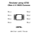
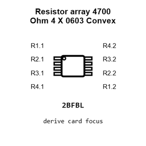
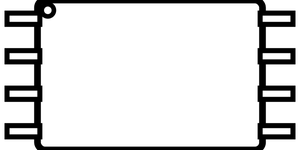
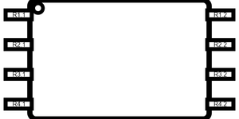
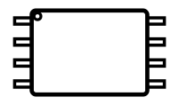
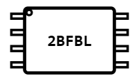
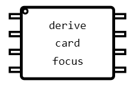
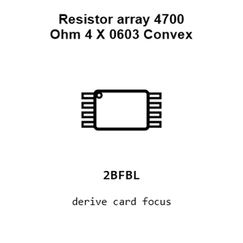
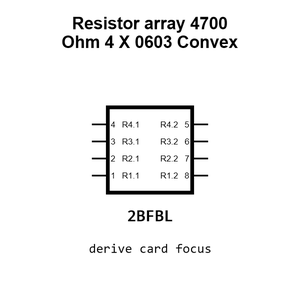
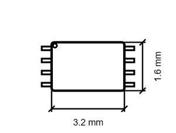

# Resistor array 4700 Ohm 4 X 0603 Convex

`electronic_resistor_array_4_x_0603_convex_4700_ohm_8_pin`

Resistor array 4700 Ohm 4 X 0603 Convex is an OOMP electronic resistor array definition. It uses the 4 x 0603 convex package or form factor. Its nominal drawing size is 3.2 &#x00D7; 1.6 mm. The definition includes 8 documented pins.

## At a glance

| Detail | Value |
| --- | --- |
| OOMP ID | `electronic_resistor_array_4_x_0603_convex_4700_ohm_8_pin` |
| Type | Resistor Array |
| Package / style | 4 x 0603 convex |
| Nominal size | 3.2 &#x00D7; 1.6 mm |
| Documented pins | 8 |

## Classification

| Level | Value |
| --- | --- |
| 1 | `electronic` |
| 2 | `resistor_array` |
| 3 | `4_x_0603_convex` |
| 4 | `4700_ohm` |
| 5 | `8_pin` |

## Nominal dimensions

| Measurement | Value |
| --- | ---: |
| Height | 0.5 mm |
| Length | 3.2 mm |
| Width | 1.6 mm |

## Identifiers

| Identifier | Value |
| --- | --- |
| Manufacturer part number | `4D03WGJ0472T5E` |
| LCSC | [`C1980`](https://www.lcsc.com/product-detail/C1980.html) |
| JLCPCB | [`C1980`](https://jlcpcb.com/partdetail/2332-4D03WGJ0472T5E/C1980) |

## Pins

| Pin | Name | Type |
| ---: | --- | --- |
| 1 | R1.1 | passive |
| 2 | R2.1 | passive |
| 3 | R3.1 | passive |
| 4 | R4.1 | passive |
| 5 | R4.2 | passive |
| 6 | R3.2 | passive |
| 7 | R2.2 | passive |
| 8 | R1.2 | passive |

## Datasheet

[View the datasheet](data/datasheet.pdf)

## Files

[KiCad symbol, machine-solder and hand-solder footprints](data/kicad/README.md) · [Availability and source masters](data/kicad/manifest.yaml)

[View this part on GitHub](https://github.com/oomlout/oomp_electronic_version_5/tree/main/parts/electronic_resistor_array_4_x_0603_convex_4700_ohm_8_pin)

[Browse this category](../../navigation/electronic/resistor_array/4_x_0603_convex/4700_ohm/README.md)

---

This page is generated from the OOMP part definition by a Roboclick Jinja template. Edit the source taxonomy or template rather than this generated file.