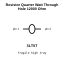
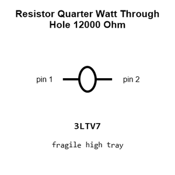
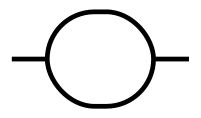
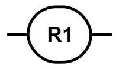
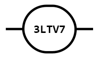
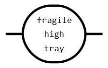
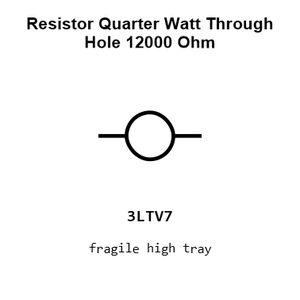
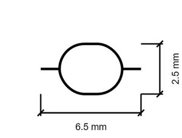
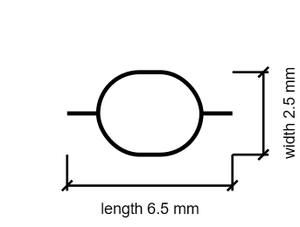

# Resistor 12000 Ohm QUARTER_WATT_THROUGH_HOLE

`electronic_resistor_quarter_watt_through_hole_12000_ohm`

Resistor 12000 Ohm QUARTER_WATT_THROUGH_HOLE is an OOMP electronic resistor definition. It uses the quarter watt through hole package or form factor. Its nominal drawing size is 6.5 &#x00D7; 2.5 mm.

## At a glance

| Detail | Value |
| --- | --- |
| OOMP ID | `electronic_resistor_quarter_watt_through_hole_12000_ohm` |
| Type | Resistor |
| Package / style | quarter watt through hole |
| Nominal size | 6.5 &#x00D7; 2.5 mm |

## Classification

| Level | Value |
| --- | --- |
| 1 | `electronic` |
| 2 | `resistor` |
| 3 | `quarter_watt_through_hole` |
| 4 | `12000_ohm` |

## Nominal dimensions

| Measurement | Value |
| --- | ---: |
| Length | 6.5 mm |
| Width | 2.5 mm |

## Files

[View this part on GitHub](https://github.com/oomlout/oomp_electronic_version_5/tree/main/parts/electronic_resistor_quarter_watt_through_hole_12000_ohm)

[Browse this category](../../navigation/electronic/resistor/quarter_watt_through_hole/README.md)

---

This page is generated from the OOMP part definition by a Roboclick Jinja template. Edit the source taxonomy or template rather than this generated file.