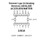
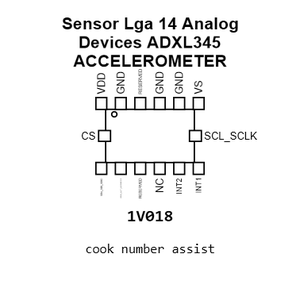
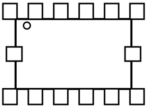
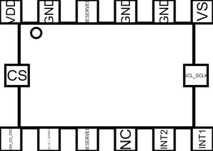
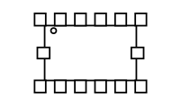
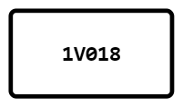
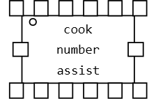
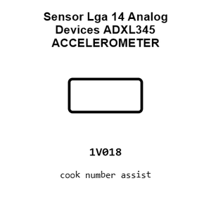
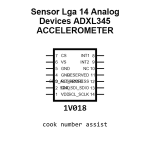
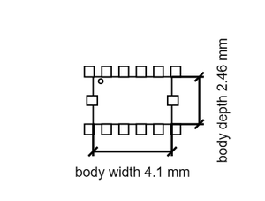

# Sensor Lga 14 Analog Devices ADXL345 ACCELEROMETER

`electronic_sensor_accelerometer_lga_14_analog_devices_adxl345`

Sensor Lga 14 Analog Devices ADXL345 ACCELEROMETER is an OOMP electronic sensor definition. It uses the accelerometer package or form factor. Its nominal drawing size is 5.0 &#x00D7; 3.0 mm. The definition includes 14 documented pins.

## At a glance

| Detail | Value |
| --- | --- |
| OOMP ID | `electronic_sensor_accelerometer_lga_14_analog_devices_adxl345` |
| Type | Sensor |
| Package / style | accelerometer |
| Nominal size | 5.0 &#x00D7; 3.0 mm |
| Documented pins | 14 |

## Classification

| Level | Value |
| --- | --- |
| 1 | `electronic` |
| 2 | `sensor` |
| 3 | `accelerometer` |
| 4 | `lga_14` |
| 14 | `analog_devices` |
| 15 | `adxl345` |

## Nominal dimensions

| Measurement | Value |
| --- | ---: |
| Length | 5.0 mm |
| Width | 3.0 mm |

## Pins

| Pin | Name | Type |
| ---: | --- | --- |
| 1 | VDD | power |
| 2 | GND | gnd |
| 3 | ST1 | signal |
| 4 | GND | gnd |
| 5 | VDDIO | signal |
| 6 | NC | no_connect |
| 7 | NC | no_connect |
| 8 | INT2 | signal |
| 9 | INT1 | signal |
| 10 | GND | gnd |
| 11 | RES | signal |
| 12 | SCL_SCLK | signal |
| 13 | SDA_SDI | signal |
| 14 | SDO | signal |

## Files

[KiCad symbol, machine-solder and hand-solder footprints](data/kicad/README.md) · [Availability and source masters](data/kicad/manifest.yaml)

[View this part on GitHub](https://github.com/oomlout/oomp_electronic_version_5/tree/main/parts/electronic_sensor_accelerometer_lga_14_analog_devices_adxl345)

[Browse this category](../../navigation/electronic/sensor/accelerometer/lga_14/analog_devices/README.md)

---

This page is generated from the OOMP part definition by a Roboclick Jinja template. Edit the source taxonomy or template rather than this generated file.