# Sensor Lga 16 St LIS3DHTR ACCELEROMETER

`electronic_sensor_accelerometer_lga_16_st_lis3dhtr`

Sensor Lga 16 St LIS3DHTR ACCELEROMETER is an OOMP electronic sensor definition. It uses the accelerometer package or form factor. Its nominal drawing size is 3.0 &#x00D7; 3.0 mm. The definition includes 16 documented pins.

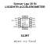

## At a glance

| Detail | Value |
| --- | --- |
| OOMP ID | `electronic_sensor_accelerometer_lga_16_st_lis3dhtr` |
| Type | Sensor |
| Package / style | accelerometer |
| Nominal size | 3.0 &#x00D7; 3.0 mm |
| Documented pins | 16 |

## Classification

| Level | Value |
| --- | --- |
| 1 | `electronic` |
| 2 | `sensor` |
| 3 | `accelerometer` |
| 4 | `lga_16` |
| 14 | `st` |
| 15 | `lis3dhtr` |

## Nominal dimensions

| Measurement | Value |
| --- | ---: |
| Length | 3.0 mm |
| Width | 3.0 mm |

## Pins

| Pin | Name | Type |
| ---: | --- | --- |
| 1 | VDDIO | signal |
| 2 | NC | no_connect |
| 3 | NC | no_connect |
| 4 | SCL_SPC | signal |
| 5 | GND | gnd |
| 6 | SDA_SDI_SDO | signal |
| 7 | SDO_SA0 | signal |
| 8 | CS | signal |
| 9 | INT2 | signal |
| 10 | RES | signal |
| 11 | INT1 | signal |
| 12 | GND | gnd |
| 13 | ADC3 | signal |
| 14 | VDD | power |
| 15 | ADC2 | signal |
| 16 | ADC1 | signal |

## Used in projects

| Project | Quantity | References | Explore |
| --- | ---: | --- | --- |
| [Project adafruit/Adafruit-LIS3DH-Breakout-PCB LIS3DH Breakout current](https://github.com/adafruit/Adafruit-LIS3DH-Breakout-PCB/blob/master/Adafruit%20LIS3DH.brd) | 1 | U1 | [Board explorer](https://oomlout.github.io/oomp_electronic_version_5/parts/oomp_project_github_adafruit_adafruit_lis3_dh_breakout_pcb_lis3dh_breakout_current/board_explorer.html) · [OOMP project](https://github.com/oomlout/oomp_electronic_version_5/tree/main/parts/oomp_project_github_adafruit_adafruit_lis3_dh_breakout_pcb_lis3dh_breakout_current) |
| [Project sparkfun/SparkFun_Triple_Axis_Acclerometer-LIS3DH LIS3DH Qwiic 1x1 current](https://github.com/sparkfun/SparkFun_Triple_Axis_Acclerometer-LIS3DH/tree/main/Hardware/Qwiic%201x1) | 1 | U1 | [Board explorer](https://oomlout.github.io/oomp_electronic_version_5/parts/oomp_project_github_sparkfun_spark_fun_triple_axis_acclerometer_lis3_dh_lis3dh_qwiic_1x1_current/board_explorer.html) · [OOMP project](https://github.com/oomlout/oomp_electronic_version_5/tree/main/parts/oomp_project_github_sparkfun_spark_fun_triple_axis_acclerometer_lis3_dh_lis3dh_qwiic_1x1_current) |
| [Project sparkfun/SparkFun_Triple_Axis_Acclerometer-LIS3DH LIS3DH Qwiic Micro current](https://github.com/sparkfun/SparkFun_Triple_Axis_Acclerometer-LIS3DH/tree/main/Hardware/Micro) | 1 | U1 | [Board explorer](https://oomlout.github.io/oomp_electronic_version_5/parts/oomp_project_github_sparkfun_spark_fun_triple_axis_acclerometer_lis3_dh_lis3dh_qwiic_micro_current/board_explorer.html) · [OOMP project](https://github.com/oomlout/oomp_electronic_version_5/tree/main/parts/oomp_project_github_sparkfun_spark_fun_triple_axis_acclerometer_lis3_dh_lis3dh_qwiic_micro_current) |

## Files

[KiCad symbol, machine-solder and hand-solder footprints](data/kicad/README.md) · [Availability and source masters](data/kicad/manifest.yaml)

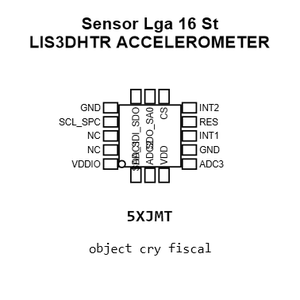

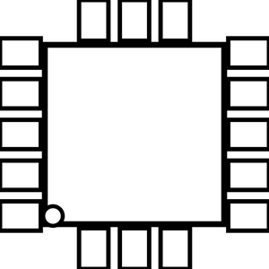

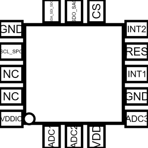

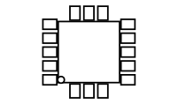

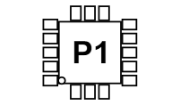

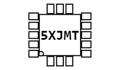

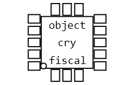

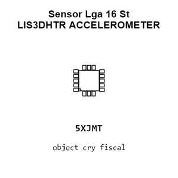

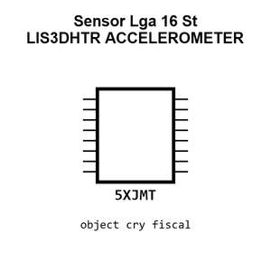

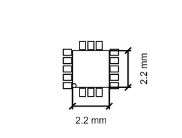

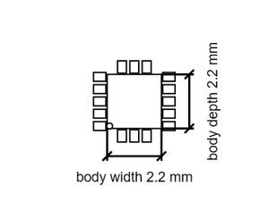

[View this part on GitHub](https://github.com/oomlout/oomp_electronic_version_5/tree/main/parts/electronic_sensor_accelerometer_lga_16_st_lis3dhtr)

[Browse this category](../../navigation/electronic/sensor/accelerometer/lga_16/st/README.md)

---

This page is generated from the OOMP part definition by a Roboclick Jinja template. Edit the source taxonomy or template rather than this generated file.