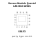
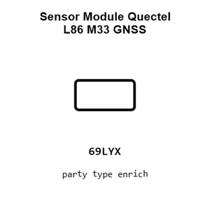
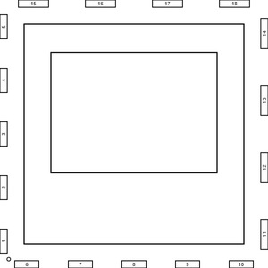
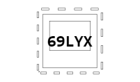
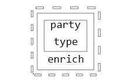
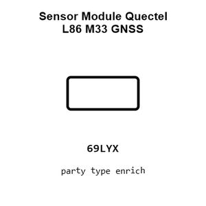
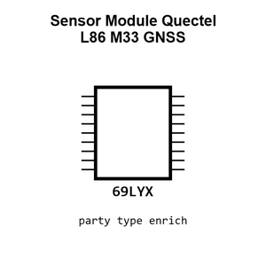
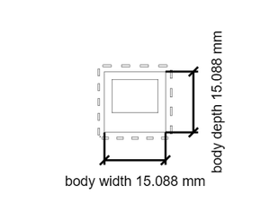

# Sensor Module Quectel L86 M33 GNSS

`electronic_sensor_gnss_module_quectel_l86_m33`

Sensor Module Quectel L86 M33 GNSS is an OOMP electronic sensor definition. It uses the gnss package or form factor. Its nominal drawing size is 18.4 &#x00D7; 18.4 mm. The definition includes 18 documented pins.

## At a glance

| Detail | Value |
| --- | --- |
| OOMP ID | `electronic_sensor_gnss_module_quectel_l86_m33` |
| Type | Sensor |
| Package / style | gnss |
| Nominal size | 18.4 &#x00D7; 18.4 mm |
| Documented pins | 18 |

## Classification

| Level | Value |
| --- | --- |
| 1 | `electronic` |
| 2 | `sensor` |
| 3 | `gnss` |
| 4 | `module` |
| 14 | `quectel` |
| 15 | `l86_m33` |

## Nominal dimensions

| Measurement | Value |
| --- | ---: |
| Length | 18.4 mm |
| Width | 18.4 mm |

## Pins

| Pin | Name | Type |
| ---: | --- | --- |
| 1 | 1 | signal |
| 2 | 2 | signal |
| 3 | 3 | signal |
| 4 | 4 | signal |
| 5 | 5 | signal |
| 6 | 6 | signal |
| 7 | 7 | signal |
| 8 | 8 | signal |
| 9 | 9 | signal |
| 10 | 10 | signal |
| 11 | 11 | signal |
| 12 | 12 | signal |
| 13 | 13 | signal |
| 14 | 14 | signal |
| 15 | 15 | signal |
| 16 | 16 | signal |
| 17 | 17 | signal |
| 18 | 18 | signal |

## Files

[KiCad symbol, machine-solder and hand-solder footprints](data/kicad/README.md) · [Availability and source masters](data/kicad/manifest.yaml)

[View this part on GitHub](https://github.com/oomlout/oomp_electronic_version_5/tree/main/parts/electronic_sensor_gnss_module_quectel_l86_m33)

[Browse this category](../../navigation/electronic/sensor/gnss/module/quectel/README.md)

---

This page is generated from the OOMP part definition by a Roboclick Jinja template. Edit the source taxonomy or template rather than this generated file.