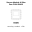
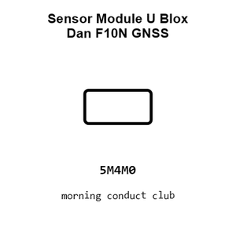
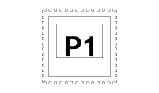
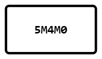
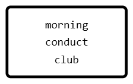
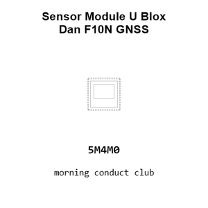
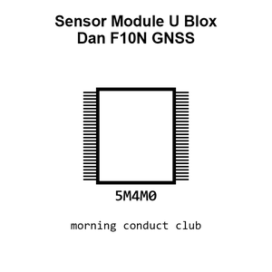
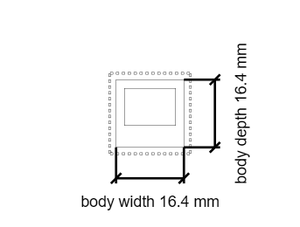

# Sensor Module U Blox Dan F10N GNSS

`electronic_sensor_gnss_module_u_blox_dan_f10n`

Sensor Module U Blox Dan F10N GNSS is an OOMP electronic sensor definition. It uses the gnss package or form factor. Its nominal drawing size is 20.0 &#x00D7; 20.0 mm. The definition includes 56 documented pins.

## At a glance

| Detail | Value |
| --- | --- |
| OOMP ID | `electronic_sensor_gnss_module_u_blox_dan_f10n` |
| Type | Sensor |
| Package / style | gnss |
| Nominal size | 20.0 &#x00D7; 20.0 mm |
| Documented pins | 56 |

## Classification

| Level | Value |
| --- | --- |
| 1 | `electronic` |
| 2 | `sensor` |
| 3 | `gnss` |
| 4 | `module` |
| 14 | `u_blox` |
| 15 | `dan_f10n` |

## Nominal dimensions

| Measurement | Value |
| --- | ---: |
| Length | 20.0 mm |
| Width | 20.0 mm |

## Pins

| Pin | Name | Type |
| ---: | --- | --- |
| 1 | 1 | signal |
| 2 | 2 | signal |
| 3 | 3 | signal |
| 4 | 4 | signal |
| 5 | 5 | signal |
| 6 | 6 | signal |
| 7 | 7 | signal |
| 8 | 8 | signal |
| 9 | 9 | signal |
| 10 | 10 | signal |
| 11 | 11 | signal |
| 12 | 12 | signal |
| 13 | 13 | signal |
| 14 | 14 | signal |
| 15 | 15 | signal |
| 16 | 16 | signal |
| 17 | 17 | signal |
| 18 | 18 | signal |
| 19 | 19 | signal |
| 20 | 20 | signal |
| 21 | 21 | signal |
| 22 | 22 | signal |
| 23 | 23 | signal |
| 24 | 24 | signal |
| 25 | 25 | signal |
| 26 | 26 | signal |
| 27 | 27 | signal |
| 28 | 28 | signal |
| 29 | 29 | signal |
| 30 | 30 | signal |
| 31 | 31 | signal |
| 32 | 32 | signal |
| 33 | 33 | signal |
| 34 | 34 | signal |
| 35 | 35 | signal |
| 36 | 36 | signal |
| 37 | 37 | signal |
| 38 | 38 | signal |
| 39 | 39 | signal |
| 40 | 40 | signal |
| 41 | 41 | signal |
| 42 | 42 | signal |
| 43 | 43 | signal |
| 44 | 44 | signal |
| 45 | 45 | signal |
| 46 | 46 | signal |
| 47 | 47 | signal |
| 48 | 48 | signal |
| 49 | 49 | signal |
| 50 | 50 | signal |
| 51 | 51 | signal |
| 52 | 52 | signal |
| 53 | 53 | signal |
| 54 | 54 | signal |
| 55 | 55 | signal |
| 56 | 56 | signal |

## Files

[KiCad symbol, machine-solder and hand-solder footprints](data/kicad/README.md) · [Availability and source masters](data/kicad/manifest.yaml)

[View this part on GitHub](https://github.com/oomlout/oomp_electronic_version_5/tree/main/parts/electronic_sensor_gnss_module_u_blox_dan_f10n)

[Browse this category](../../navigation/electronic/sensor/gnss/module/u_blox/README.md)

---

This page is generated from the OOMP part definition by a Roboclick Jinja template. Edit the source taxonomy or template rather than this generated file.