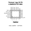
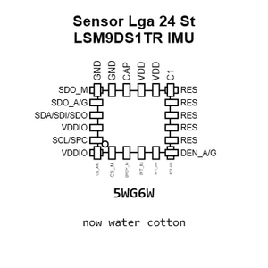
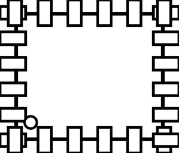
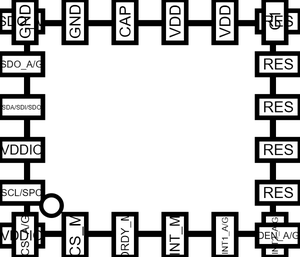
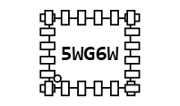
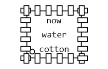
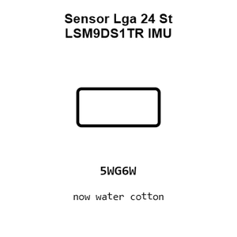
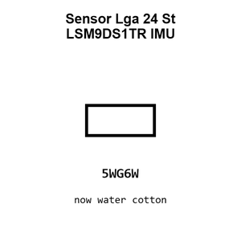
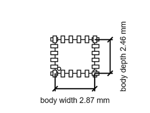

# Sensor Lga 24 St LSM9DS1TR IMU

`electronic_sensor_imu_lga_24_st_lsm9ds1tr`

Sensor Lga 24 St LSM9DS1TR IMU is an OOMP electronic sensor definition. It uses the imu package or form factor. Its nominal drawing size is 3.5 &#x00D7; 3.0 mm. The definition includes 24 documented pins.

## At a glance

| Detail | Value |
| --- | --- |
| OOMP ID | `electronic_sensor_imu_lga_24_st_lsm9ds1tr` |
| Type | Sensor |
| Package / style | imu |
| Nominal size | 3.5 &#x00D7; 3.0 mm |
| Documented pins | 24 |

## Classification

| Level | Value |
| --- | --- |
| 1 | `electronic` |
| 2 | `sensor` |
| 3 | `imu` |
| 4 | `lga_24` |
| 14 | `st` |
| 15 | `lsm9ds1tr` |

## Nominal dimensions

| Measurement | Value |
| --- | ---: |
| Length | 3.5 mm |
| Width | 3.0 mm |

## Pins

| Pin | Name | Type |
| ---: | --- | --- |
| 1 | VDDIO | signal |
| 2 | SCL/SPC | signal |
| 3 | VDDIO | signal |
| 4 | SDA/SDI/SDO | signal |
| 5 | SDO_A/G | signal |
| 6 | SDO_M | signal |
| 7 | CS_A/G | signal |
| 8 | CS_M | signal |
| 9 | DRDY_M | signal |
| 10 | INT_M | signal |
| 11 | INT1_A/G | signal |
| 12 | INT2_A/G | signal |
| 13 | DEN_A/G | signal |
| 14 | RES | signal |
| 15 | RES | signal |
| 16 | RES | signal |
| 17 | RES | signal |
| 18 | RES | signal |
| 19 | GND | gnd |
| 20 | GND | gnd |
| 21 | CAP | signal |
| 22 | VDD | power |
| 23 | VDD | power |
| 24 | C1 | signal |

## Used in projects

| Project | Quantity | References | Explore |
| --- | ---: | --- | --- |
| [Project soldered_electronics/Accelerometer---Gyroscope---Magnetometer-LSM9DS1TR-breakout-hardware-design LSM9DS1TR IMU current](https://github.com/SolderedElectronics/Accelerometer---Gyroscope---Magnetometer-LSM9DS1TR-breakout-hardware-design) | 1 | U2 | [Board explorer](https://oomlout.github.io/oomp_electronic_version_5/parts/oomp_project_github_soldered_electronics_accelerometer_gyroscope_magnetometer_lsm9_ds1_tr_breakout_hardware_design_sensor_imu_lsm9ds1tr_current/board_explorer.html) · [OOMP project](https://github.com/oomlout/oomp_electronic_version_5/tree/main/parts/oomp_project_github_soldered_electronics_accelerometer_gyroscope_magnetometer_lsm9_ds1_tr_breakout_hardware_design_sensor_imu_lsm9ds1tr_current) |

## Files

[KiCad symbol, machine-solder and hand-solder footprints](data/kicad/README.md) · [Availability and source masters](data/kicad/manifest.yaml)

[View this part on GitHub](https://github.com/oomlout/oomp_electronic_version_5/tree/main/parts/electronic_sensor_imu_lga_24_st_lsm9ds1tr)

[Browse this category](../../navigation/electronic/sensor/imu/lga_24/st/README.md)

---

This page is generated from the OOMP part definition by a Roboclick Jinja template. Edit the source taxonomy or template rather than this generated file.