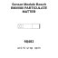
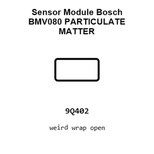
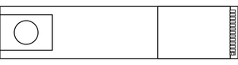
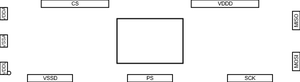
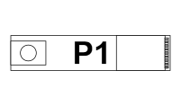
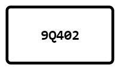
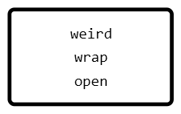
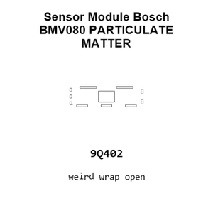
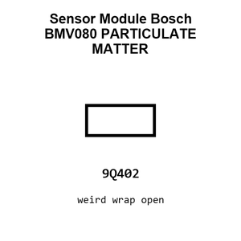
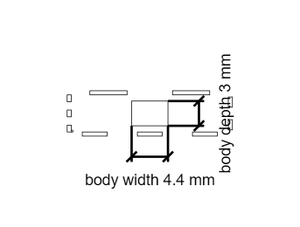

# Sensor Module Bosch BMV080 PARTICULATE MATTER

`electronic_sensor_particulate_matter_module_bosch_bmv080`

Sensor Module Bosch BMV080 PARTICULATE MATTER is an OOMP electronic sensor definition. It uses the particulate matter package or form factor. Its nominal drawing size is 20.0 &#x00D7; 5.5 mm. The definition includes 13 documented pins.

## At a glance

| Detail | Value |
| --- | --- |
| OOMP ID | `electronic_sensor_particulate_matter_module_bosch_bmv080` |
| Type | Sensor |
| Package / style | particulate matter |
| Nominal size | 20.0 &#x00D7; 5.5 mm |
| Documented pins | 13 |

## Classification

| Level | Value |
| --- | --- |
| 1 | `electronic` |
| 2 | `sensor` |
| 3 | `particulate_matter` |
| 4 | `module` |
| 14 | `bosch` |
| 15 | `bmv080` |

## Nominal dimensions

| Measurement | Value |
| --- | ---: |
| Length | 20.0 mm |
| Width | 5.5 mm |

## Pins

| Pin | Name | Type |
| ---: | --- | --- |
| 1 | VDDL | power |
| 2 | VSSA | gnd |
| 3 | VDDA | power |
| 4 | CSB | signal |
| 5 | MOSI | signal |
| 6 | SCK | signal |
| 7 | PS | signal |
| 8 | VDDIO | signal |
| 9 | VSSD | gnd |
| 10 | VDDD | power |
| 11 | MISO | signal |
| 12 | IRQ | signal |
| 13 | NC | no_connect |

## Used in projects

| Project | Quantity | References | Explore |
| --- | ---: | --- | --- |
| [Project sparkfun/SparkFun_Particulate_Matter_Sensor_Breakout_BMV080 Particulate Matter Sensor BMV080 current](https://github.com/sparkfun/SparkFun_Particulate_Matter_Sensor_Breakout_BMV080) | 1 | U1 | [Board explorer](https://oomlout.github.io/oomp_electronic_version_5/parts/oomp_project_github_sparkfun_spark_fun_particulate_matter_sensor_breakout_bmv080_particulate_matter_bmv080_current/board_explorer.html) · [OOMP project](https://github.com/oomlout/oomp_electronic_version_5/tree/main/parts/oomp_project_github_sparkfun_spark_fun_particulate_matter_sensor_breakout_bmv080_particulate_matter_bmv080_current) |

## Files

[KiCad symbol, machine-solder and hand-solder footprints](data/kicad/README.md) · [Availability and source masters](data/kicad/manifest.yaml)

[View this part on GitHub](https://github.com/oomlout/oomp_electronic_version_5/tree/main/parts/electronic_sensor_particulate_matter_module_bosch_bmv080)

[Browse this category](../../navigation/electronic/sensor/particulate_matter/module/bosch/README.md)

---

This page is generated from the OOMP part definition by a Roboclick Jinja template. Edit the source taxonomy or template rather than this generated file.