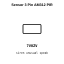
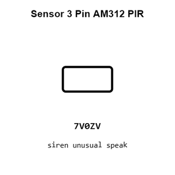
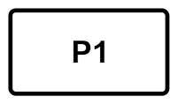
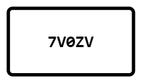
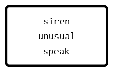
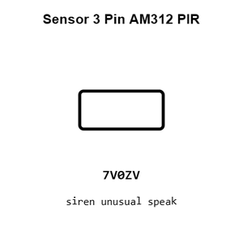
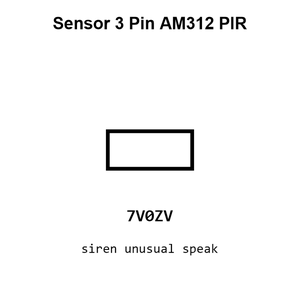

# Sensor 3 Pin AM312 PIR

`electronic_sensor_pir_3_pin_am312`

Sensor 3 Pin AM312 PIR is an OOMP electronic sensor definition. It uses the pir package or form factor. Its nominal drawing size is 10.0 &#x00D7; 5.0 mm.

## At a glance

| Detail | Value |
| --- | --- |
| OOMP ID | `electronic_sensor_pir_3_pin_am312` |
| Type | Sensor |
| Package / style | pir |
| Nominal size | 10.0 &#x00D7; 5.0 mm |

## Classification

| Level | Value |
| --- | --- |
| 1 | `electronic` |
| 2 | `sensor` |
| 3 | `pir` |
| 4 | `3_pin` |
| 15 | `am312` |

## Nominal dimensions

| Measurement | Value |
| --- | ---: |
| Length | 10.0 mm |
| Width | 5.0 mm |

## Used in projects

| Project | Quantity | References | Explore |
| --- | ---: | --- | --- |
| [Project soldered_electronics/PIR-Movement-sensor-board-hardware-design PIR Movement Sensor current](https://github.com/SolderedElectronics/PIR-Movement-sensor-board-hardware-design) | 1 | U1 | [Board explorer](https://oomlout.github.io/oomp_electronic_version_5/parts/oomp_project_github_soldered_electronics_pir_movement_sensor_board_hardware_design_sensor_pir_movement_current/board_explorer.html) · [OOMP project](https://github.com/oomlout/oomp_electronic_version_5/tree/main/parts/oomp_project_github_soldered_electronics_pir_movement_sensor_board_hardware_design_sensor_pir_movement_current) |
| [Project soldered_electronics/PIR-Movement-sensor-board-qwiic-hardware-design PIR Movement Sensor qwiic current](https://github.com/SolderedElectronics/PIR-Movement-sensor-board-qwiic-hardware-design) | 1 | U2 | [Board explorer](https://oomlout.github.io/oomp_electronic_version_5/parts/oomp_project_github_soldered_electronics_pir_movement_sensor_board_qwiic_hardware_design_sensor_pir_movement_qwiic_current/board_explorer.html) · [OOMP project](https://github.com/oomlout/oomp_electronic_version_5/tree/main/parts/oomp_project_github_soldered_electronics_pir_movement_sensor_board_qwiic_hardware_design_sensor_pir_movement_qwiic_current) |
| [Project soldered_electronics/PIR-Movement-sensor-board-with-easyC-hardware-design PIR Movement Sensor easyC current](https://github.com/SolderedElectronics/PIR-Movement-sensor-board-with-easyC-hardware-design) | 1 | U2 | [Board explorer](https://oomlout.github.io/oomp_electronic_version_5/parts/oomp_project_github_soldered_electronics_pir_movement_sensor_board_with_easy_c_hardware_design_sensor_pir_movement_easyc_current/board_explorer.html) · [OOMP project](https://github.com/oomlout/oomp_electronic_version_5/tree/main/parts/oomp_project_github_soldered_electronics_pir_movement_sensor_board_with_easy_c_hardware_design_sensor_pir_movement_easyc_current) |

## Files

[KiCad symbol, machine-solder and hand-solder footprints](data/kicad/README.md) · [Availability and source masters](data/kicad/manifest.yaml)

[View this part on GitHub](https://github.com/oomlout/oomp_electronic_version_5/tree/main/parts/electronic_sensor_pir_3_pin_am312)

[Browse this category](../../navigation/electronic/sensor/pir/3_pin/README.md)

---

This page is generated from the OOMP part definition by a Roboclick Jinja template. Edit the source taxonomy or template rather than this generated file.