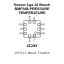
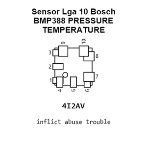
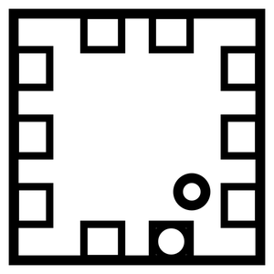
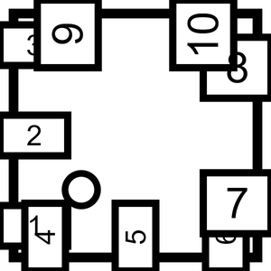
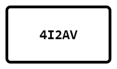
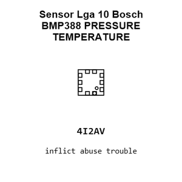
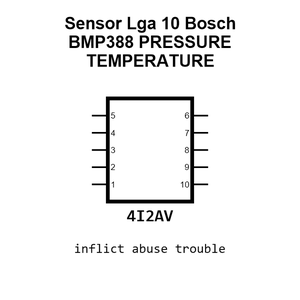
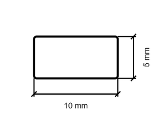
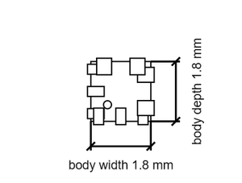

# Sensor Lga 10 Bosch BMP388 PRESSURE TEMPERATURE

`electronic_sensor_pressure_temperature_lga_10_bosch_bmp388`

Sensor Lga 10 Bosch BMP388 PRESSURE TEMPERATURE is an OOMP electronic sensor definition. It uses the pressure temperature package or form factor. Its nominal drawing size is 2.0 &#x00D7; 2.0 mm. The definition includes 10 documented pins.

## At a glance

| Detail | Value |
| --- | --- |
| OOMP ID | `electronic_sensor_pressure_temperature_lga_10_bosch_bmp388` |
| Type | Sensor |
| Package / style | pressure temperature |
| Nominal size | 2.0 &#x00D7; 2.0 mm |
| Documented pins | 10 |

## Classification

| Level | Value |
| --- | --- |
| 1 | `electronic` |
| 2 | `sensor` |
| 3 | `pressure_temperature` |
| 4 | `lga_10` |
| 14 | `bosch` |
| 15 | `bmp388` |

## Nominal dimensions

| Measurement | Value |
| --- | ---: |
| Length | 2.0 mm |
| Width | 2.0 mm |

## Pins

| Pin | Name | Type |
| ---: | --- | --- |
| 1 | VDDIO | signal |
| 2 | SCK | signal |
| 3 | VSS | gnd |
| 4 | SDI | signal |
| 5 | SDO | signal |
| 6 | CSB | signal |
| 7 | INT | signal |
| 8 | VSS | gnd |
| 9 | VSS | gnd |
| 10 | VDD | power |

## Used in projects

| Project | Quantity | References | Explore |
| --- | ---: | --- | --- |
| [Project soldered_electronics/Pressure---temperature-sensor-BMP388-breakout-hardware-design BMP388 Breakout current](https://github.com/SolderedElectronics/Pressure---temperature-sensor-BMP388-breakout-hardware-design) | 1 | U1 | [Board explorer](https://oomlout.github.io/oomp_electronic_version_5/parts/oomp_project_github_soldered_electronics_pressure_temperature_sensor_bmp388_breakout_hardware_design_sensor_pressure_temp_bmp388_current/board_explorer.html) · [OOMP project](https://github.com/oomlout/oomp_electronic_version_5/tree/main/parts/oomp_project_github_soldered_electronics_pressure_temperature_sensor_bmp388_breakout_hardware_design_sensor_pressure_temp_bmp388_current) |

## Files

[KiCad symbol, machine-solder and hand-solder footprints](data/kicad/README.md) · [Availability and source masters](data/kicad/manifest.yaml)

[View this part on GitHub](https://github.com/oomlout/oomp_electronic_version_5/tree/main/parts/electronic_sensor_pressure_temperature_lga_10_bosch_bmp388)

[Browse this category](../../navigation/electronic/sensor/pressure_temperature/lga_10/bosch/README.md)

---

This page is generated from the OOMP part definition by a Roboclick Jinja template. Edit the source taxonomy or template rather than this generated file.