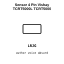
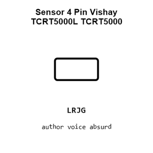
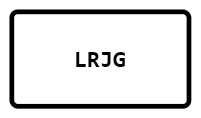
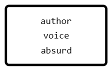
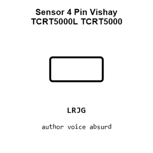
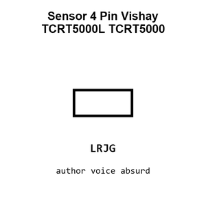
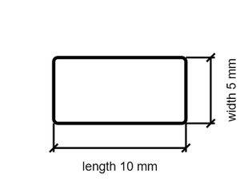

# Sensor 4 Pin Vishay TCRT5000L TCRT5000

`electronic_sensor_tcrt5000_4_pin_vishay_tcrt5000l`

Sensor 4 Pin Vishay TCRT5000L TCRT5000 is an OOMP electronic sensor definition. It uses the tcrt5000 package or form factor. Its nominal drawing size is 10.0 &#x00D7; 5.0 mm.

## At a glance

| Detail | Value |
| --- | --- |
| OOMP ID | `electronic_sensor_tcrt5000_4_pin_vishay_tcrt5000l` |
| Type | Sensor |
| Package / style | tcrt5000 |
| Nominal size | 10.0 &#x00D7; 5.0 mm |

## Classification

| Level | Value |
| --- | --- |
| 1 | `electronic` |
| 2 | `sensor` |
| 3 | `tcrt5000` |
| 4 | `4_pin` |
| 14 | `vishay` |
| 15 | `tcrt5000l` |

## Nominal dimensions

| Measurement | Value |
| --- | ---: |
| Length | 10.0 mm |
| Width | 5.0 mm |

## Used in projects

| Project | Quantity | References | Explore |
| --- | ---: | --- | --- |
| [Project soldered_electronics/Obstacle-sensor-qwiic-hardware-design Obstacle Sensor qwiic current](https://github.com/SolderedElectronics/Obstacle-sensor-qwiic-hardware-design) | 1 | U1 | [Board explorer](https://oomlout.github.io/oomp_electronic_version_5/parts/oomp_project_github_soldered_electronics_obstacle_sensor_qwiic_hardware_design_sensor_obstacle_qwiic_current/board_explorer.html) · [OOMP project](https://github.com/oomlout/oomp_electronic_version_5/tree/main/parts/oomp_project_github_soldered_electronics_obstacle_sensor_qwiic_hardware_design_sensor_obstacle_qwiic_current) |
| [Project soldered_electronics/Obstacle-sensor-TCRT5000-breakout-hardware-design Obstacle Sensor TCRT5000 current](https://github.com/SolderedElectronics/Obstacle-sensor-TCRT5000-breakout-hardware-design) | 1 | U1 | [Board explorer](https://oomlout.github.io/oomp_electronic_version_5/parts/oomp_project_github_soldered_electronics_obstacle_sensor_tcrt5000_breakout_hardware_design_sensor_obstacle_tcrt5000_current/board_explorer.html) · [OOMP project](https://github.com/oomlout/oomp_electronic_version_5/tree/main/parts/oomp_project_github_soldered_electronics_obstacle_sensor_tcrt5000_breakout_hardware_design_sensor_obstacle_tcrt5000_current) |
| [Project soldered_electronics/Obstacle-sensor-with-easyC-hardware-design Obstacle Sensor easyC current](https://github.com/SolderedElectronics/Obstacle-sensor-with-easyC-hardware-design) | 1 | U1 | [Board explorer](https://oomlout.github.io/oomp_electronic_version_5/parts/oomp_project_github_soldered_electronics_obstacle_sensor_with_easy_c_hardware_design_sensor_obstacle_easyc_current/board_explorer.html) · [OOMP project](https://github.com/oomlout/oomp_electronic_version_5/tree/main/parts/oomp_project_github_soldered_electronics_obstacle_sensor_with_easy_c_hardware_design_sensor_obstacle_easyc_current) |

## Files

[KiCad symbol, machine-solder and hand-solder footprints](data/kicad/README.md) · [Availability and source masters](data/kicad/manifest.yaml)

[View this part on GitHub](https://github.com/oomlout/oomp_electronic_version_5/tree/main/parts/electronic_sensor_tcrt5000_4_pin_vishay_tcrt5000l)

[Browse this category](../../navigation/electronic/sensor/tcrt5000/4_pin/vishay/README.md)

---

This page is generated from the OOMP part definition by a Roboclick Jinja template. Edit the source taxonomy or template rather than this generated file.