# Switch Surface Mount 9 9 Mm NAVIGATION

`electronic_switch_navigation_surface_mount_9_9_mm`

Switch Surface Mount 9 9 Mm NAVIGATION is an OOMP electronic switch definition. It uses the navigation package or form factor. Its nominal drawing size is 9.9 &#x00D7; 9.9 mm. The definition includes 5 documented pins.

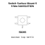

## At a glance

| Detail | Value |
| --- | --- |
| OOMP ID | `electronic_switch_navigation_surface_mount_9_9_mm` |
| Type | Switch |
| Package / style | navigation |
| Nominal size | 9.9 &#x00D7; 9.9 mm |
| Documented pins | 5 |

## Classification

| Level | Value |
| --- | --- |
| 1 | `electronic` |
| 2 | `switch` |
| 3 | `navigation` |
| 4 | `surface_mount` |
| 5 | `9_9_mm` |

## Nominal dimensions

| Measurement | Value |
| --- | ---: |
| Length | 9.9 mm |
| Width | 9.9 mm |

## Pins

| Pin | Name | Type |
| ---: | --- | --- |
| 1 | 1 | signal |
| 2 | 2 | signal |
| 3 | 3 | signal |
| 4 | 4 | signal |
| 5 | 5 | signal |

## Used in projects

| Project | Quantity | References | Explore |
| --- | ---: | --- | --- |
| [Project sparkfun/SparkFun_Qwiic_Directional_Pad Qwiic Directional Pad current](https://github.com/sparkfun/SparkFun_Qwiic_Directional_Pad) | 1 | SW2 | [Board explorer](https://oomlout.github.io/oomp_electronic_version_5/parts/oomp_project_github_sparkfun_spark_fun_qwiic_directional_pad_qwiic_directional_pad_current/board_explorer.html) · [OOMP project](https://github.com/oomlout/oomp_electronic_version_5/tree/main/parts/oomp_project_github_sparkfun_spark_fun_qwiic_directional_pad_qwiic_directional_pad_current) |

## Files

[KiCad symbol, machine-solder and hand-solder footprints](data/kicad/README.md) · [Availability and source masters](data/kicad/manifest.yaml)

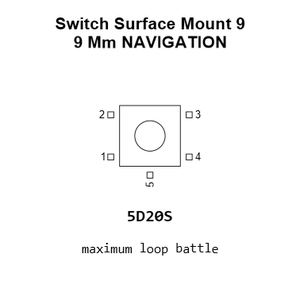

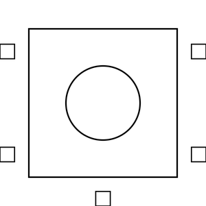

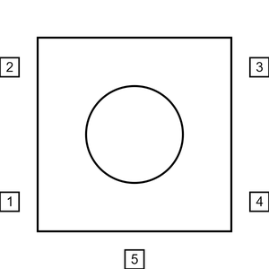

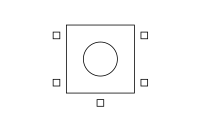

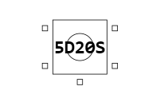

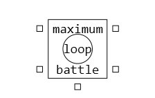

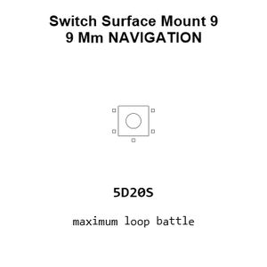

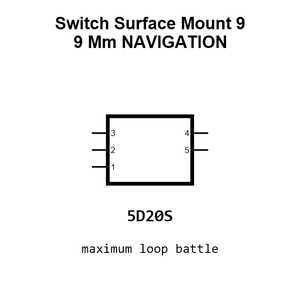

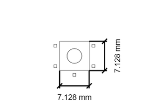

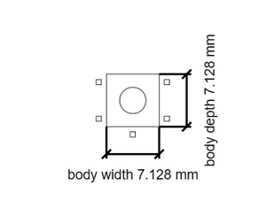

[View this part on GitHub](https://github.com/oomlout/oomp_electronic_version_5/tree/main/parts/electronic_switch_navigation_surface_mount_9_9_mm)

[Browse this category](../../navigation/electronic/switch/navigation/surface_mount/README.md)

---

This page is generated from the OOMP part definition by a Roboclick Jinja template. Edit the source taxonomy or template rather than this generated file.