# Switch IT-1109S TACTILE

`electronic_switch_tactile_surface_mount_switronic_it_1109s`

Switch IT-1109S TACTILE is an OOMP electronic switch definition. It uses the tactile package or form factor. Its nominal drawing size is 6.0 &#x00D7; 6.0 mm. The definition includes 4 documented pins.

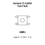

## At a glance

| Detail | Value |
| --- | --- |
| OOMP ID | `electronic_switch_tactile_surface_mount_switronic_it_1109s` |
| Type | Switch |
| Package / style | tactile |
| Nominal size | 6.0 &#x00D7; 6.0 mm |
| Documented pins | 4 |

## Classification

| Level | Value |
| --- | --- |
| 1 | `electronic` |
| 2 | `switch` |
| 3 | `tactile` |
| 4 | `surface_mount` |
| 14 | `switronic` |
| 15 | `it_1109s` |

## Nominal dimensions

| Measurement | Value |
| --- | ---: |
| Length | 6.0 mm |
| Width | 6.0 mm |

## Identifiers

| Identifier | Value |
| --- | --- |
| Manufacturer part number | `IT-1109S` |

## Pins

| Pin | Name | Type |
| ---: | --- | --- |
| 1 | 1 | signal |
| 2 | 2 | signal |
| 3 | 3 | signal |
| 4 | 4 | signal |

## Used in projects

| Project | Quantity | References | Explore |
| --- | ---: | --- | --- |
| [Project electrolama/TinyReflowController Tiny Reflow Controller current](https://github.com/electrolama/TinyReflowController/tree/master/hardware/Revision%20A1) | 2 | SW1, SW2 | [Board explorer](https://oomlout.github.io/oomp_electronic_version_5/parts/oomp_project_github_electrolama_tiny_reflow_controller_tiny_reflow_controller_current/board_explorer.html) · [OOMP project](https://github.com/oomlout/oomp_electronic_version_5/tree/main/parts/oomp_project_github_electrolama_tiny_reflow_controller_tiny_reflow_controller_current) |

## Files

[KiCad symbol, machine-solder and hand-solder footprints](data/kicad/README.md) · [Availability and source masters](data/kicad/manifest.yaml)

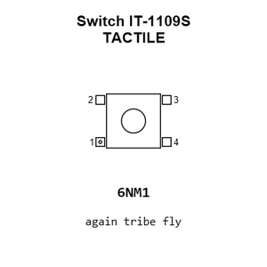

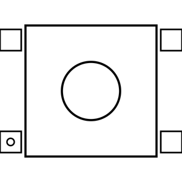

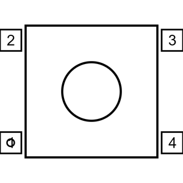

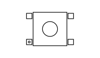

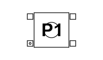

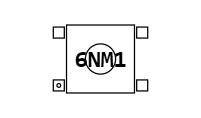

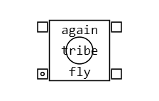

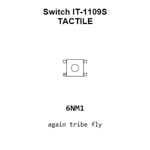

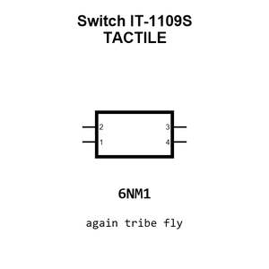

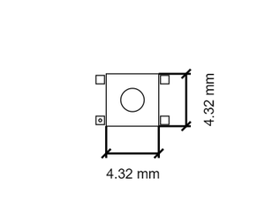

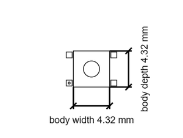

[View this part on GitHub](https://github.com/oomlout/oomp_electronic_version_5/tree/main/parts/electronic_switch_tactile_surface_mount_switronic_it_1109s)

[Browse this category](../../navigation/electronic/switch/tactile/surface_mount/switronic/README.md)

---

This page is generated from the OOMP part definition by a Roboclick Jinja template. Edit the source taxonomy or template rather than this generated file.