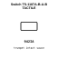
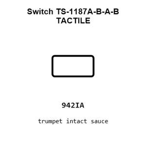
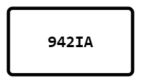
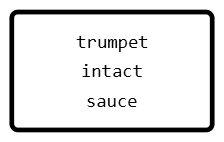
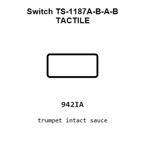
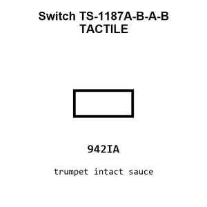
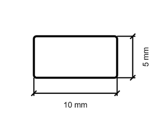
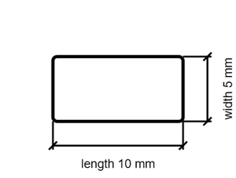

# Switch TS-1187A-B-A-B TACTILE

`electronic_switch_tactile_surface_mount_xkb_connection_ts_1187a_b_a_b`

Switch TS-1187A-B-A-B TACTILE is an OOMP electronic switch definition. It uses the tactile package or form factor. Its nominal drawing size is 10.0 &#x00D7; 5.0 mm.

## At a glance

| Detail | Value |
| --- | --- |
| OOMP ID | `electronic_switch_tactile_surface_mount_xkb_connection_ts_1187a_b_a_b` |
| Type | Switch |
| Package / style | tactile |
| Nominal size | 10.0 &#x00D7; 5.0 mm |

## Classification

| Level | Value |
| --- | --- |
| 1 | `electronic` |
| 2 | `switch` |
| 3 | `tactile` |
| 4 | `surface_mount` |
| 14 | `xkb_connection` |
| 15 | `ts_1187a_b_a_b` |

## Nominal dimensions

| Measurement | Value |
| --- | ---: |
| Length | 10.0 mm |
| Width | 5.0 mm |

## Identifiers

| Identifier | Value |
| --- | --- |
| Manufacturer part number | `TS-1187A-B-A-B` |
| LCSC | [`C318884`](https://www.lcsc.com/product-detail/C318884.html) |
| JLCPCB | [`C318884`](https://jlcpcb.com/partdetail/XKBConnection-TS_1187A_B_AB/C318884) |

## Files

[KiCad symbol, machine-solder and hand-solder footprints](data/kicad/README.md) · [Availability and source masters](data/kicad/manifest.yaml)

[View this part on GitHub](https://github.com/oomlout/oomp_electronic_version_5/tree/main/parts/electronic_switch_tactile_surface_mount_xkb_connection_ts_1187a_b_a_b)

[Browse this category](../../navigation/electronic/switch/tactile/surface_mount/xkb_connection/README.md)

---

This page is generated from the OOMP part definition by a Roboclick Jinja template. Edit the source taxonomy or template rather than this generated file.