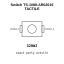
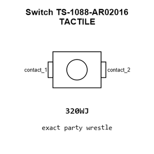
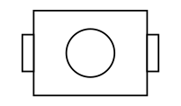
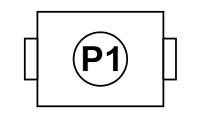
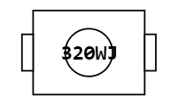
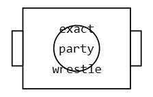
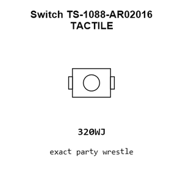
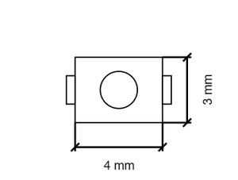
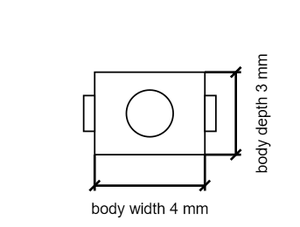

# Switch TS-1088-AR02016 TACTILE

`electronic_switch_tactile_surface_mount_xunpu_ts_1088_ar02016`

Switch TS-1088-AR02016 TACTILE is an OOMP electronic switch definition. It uses the tactile package or form factor. Its nominal drawing size is 4.8 &#x00D7; 3.0 mm. The definition includes 2 documented pins.

## At a glance

| Detail | Value |
| --- | --- |
| OOMP ID | `electronic_switch_tactile_surface_mount_xunpu_ts_1088_ar02016` |
| Type | Switch |
| Package / style | tactile |
| Nominal size | 4.8 &#x00D7; 3.0 mm |
| Documented pins | 2 |

## Classification

| Level | Value |
| --- | --- |
| 1 | `electronic` |
| 2 | `switch` |
| 3 | `tactile` |
| 4 | `surface_mount` |
| 14 | `xunpu` |
| 15 | `ts_1088_ar02016` |

## Nominal dimensions

| Measurement | Value |
| --- | ---: |
| Height | 2.0 mm |
| Length | 4.8 mm |
| Width | 3.0 mm |

## Identifiers

| Identifier | Value |
| --- | --- |
| Manufacturer part number | `TS-1088-AR02016` |
| LCSC | [`C720477`](https://www.lcsc.com/product-detail/C720477.html) |

## Pins

| Pin | Name | Type |
| ---: | --- | --- |
| 1 | contact_1 | passive |
| 2 | contact_2 | passive |

## Datasheet

[View the datasheet](data/datasheet.pdf)

## Used in projects

| Project | Quantity | References | Explore |
| --- | ---: | --- | --- |
| [Project hanqaqa/easyduino ESP32 current](https://github.com/Hanqaqa/Easyduino/tree/master/ESP32) | 2 | SW1, SW2 | [Board explorer](https://oomlout.github.io/oomp_electronic_version_5/parts/oomp_project_github_hanqaqa_easyduino_esp32_current/board_explorer.html) · [OOMP project](https://github.com/oomlout/oomp_electronic_version_5/tree/main/parts/oomp_project_github_hanqaqa_easyduino_esp32_current) |

## Files

[KiCad symbol, machine-solder and hand-solder footprints](data/kicad/README.md) · [Availability and source masters](data/kicad/manifest.yaml)

[View this part on GitHub](https://github.com/oomlout/oomp_electronic_version_5/tree/main/parts/electronic_switch_tactile_surface_mount_xunpu_ts_1088_ar02016)

[Browse this category](../../navigation/electronic/switch/tactile/surface_mount/xunpu/README.md)

---

This page is generated from the OOMP part definition by a Roboclick Jinja template. Edit the source taxonomy or template rather than this generated file.