# Transformer Usb Coilcraft RFCMF1220100M4T SURFACE MOUNT

`electronic_transformer_surface_mount_usb_coilcraft_rfcmf1220100m4t`

Transformer Usb Coilcraft RFCMF1220100M4T SURFACE MOUNT is an OOMP electronic transformer definition. It uses the surface mount package or form factor. Its nominal drawing size is 10.0 &#x00D7; 5.0 mm.

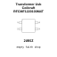

## At a glance

| Detail | Value |
| --- | --- |
| OOMP ID | `electronic_transformer_surface_mount_usb_coilcraft_rfcmf1220100m4t` |
| Type | Transformer |
| Package / style | surface mount |
| Nominal size | 10.0 &#x00D7; 5.0 mm |

## Classification

| Level | Value |
| --- | --- |
| 1 | `electronic` |
| 2 | `transformer` |
| 3 | `surface_mount` |
| 4 | `usb` |
| 14 | `coilcraft` |
| 15 | `rfcmf1220100m4t` |

## Nominal dimensions

| Measurement | Value |
| --- | ---: |
| Length | 10.0 mm |
| Width | 5.0 mm |

## Files

[KiCad symbol, machine-solder and hand-solder footprints](data/kicad/README.md) · [Availability and source masters](data/kicad/manifest.yaml)

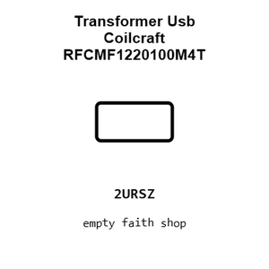

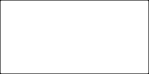

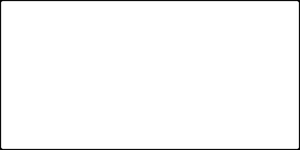

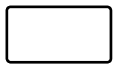

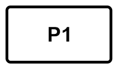

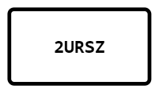

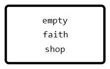

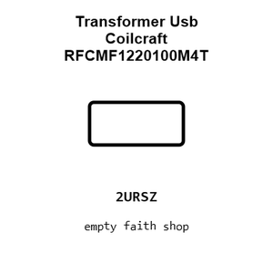

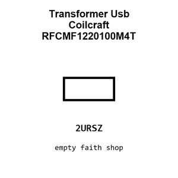

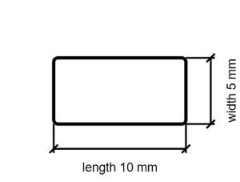

[View this part on GitHub](https://github.com/oomlout/oomp_electronic_version_5/tree/main/parts/electronic_transformer_surface_mount_usb_coilcraft_rfcmf1220100m4t)

[Browse this category](../../navigation/electronic/transformer/surface_mount/usb/coilcraft/README.md)

---

This page is generated from the OOMP part definition by a Roboclick Jinja template. Edit the source taxonomy or template rather than this generated file.