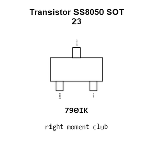
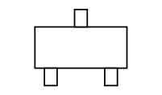
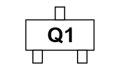
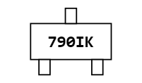
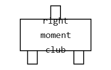
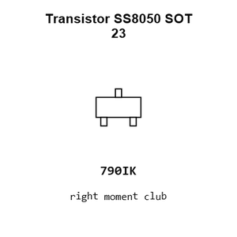
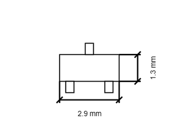
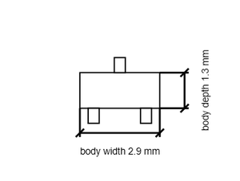

# Transistor SS8050 SOT 23

`electronic_transistor_sot_23_bipolar_npn_25_volt_1_5_amp_jsmsemi_ss8050`

Transistor SS8050 SOT 23 is an OOMP electronic transistor definition. It uses the sot 23 package or form factor. Its nominal drawing size is 2.9 &#x00D7; 2.4 mm. The definition includes 3 documented pins.

## At a glance

| Detail | Value |
| --- | --- |
| OOMP ID | `electronic_transistor_sot_23_bipolar_npn_25_volt_1_5_amp_jsmsemi_ss8050` |
| Type | Transistor |
| Package / style | sot 23 |
| Nominal size | 2.9 &#x00D7; 2.4 mm |
| Documented pins | 3 |

## Classification

| Level | Value |
| --- | --- |
| 1 | `electronic` |
| 2 | `transistor` |
| 3 | `sot_23` |
| 4 | `bipolar` |
| 5 | `npn` |
| 6 | `25_volt` |
| 7 | `1_5_amp` |
| 14 | `jsmsemi` |
| 15 | `ss8050` |

## Nominal dimensions

| Measurement | Value |
| --- | ---: |
| Length | 2.9 mm |
| Width | 2.4 mm |

## Identifiers

| Identifier | Value |
| --- | --- |
| Manufacturer part number | `SS8050` |
| LCSC | [`C916392`](https://www.lcsc.com/product-detail/C916392.html) |

## Pins

| Pin | Name | Type |
| ---: | --- | --- |
| 1 | base | signal |
| 2 | emitter | signal |
| 3 | collector | signal |

## Datasheet

[View the datasheet](data/datasheet.pdf)

## Used in projects

| Project | Quantity | References | Explore |
| --- | ---: | --- | --- |
| [Project hanqaqa/easyduino ESP32 current](https://github.com/Hanqaqa/Easyduino/tree/master/ESP32) | 2 | Q1, Q2 | [Board explorer](https://oomlout.github.io/oomp_electronic_version_5/parts/oomp_project_github_hanqaqa_easyduino_esp32_current/board_explorer.html) · [OOMP project](https://github.com/oomlout/oomp_electronic_version_5/tree/main/parts/oomp_project_github_hanqaqa_easyduino_esp32_current) |

## Files

[KiCad symbol, machine-solder and hand-solder footprints](data/kicad/README.md) · [Availability and source masters](data/kicad/manifest.yaml)

[View this part on GitHub](https://github.com/oomlout/oomp_electronic_version_5/tree/main/parts/electronic_transistor_sot_23_bipolar_npn_25_volt_1_5_amp_jsmsemi_ss8050)

[Browse this category](../../navigation/electronic/transistor/sot_23/bipolar/npn/25_volt/1_5_amp/jsmsemi/README.md)

---

This page is generated from the OOMP part definition by a Roboclick Jinja template. Edit the source taxonomy or template rather than this generated file.