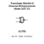
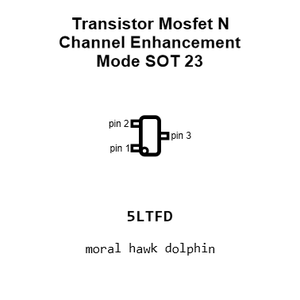
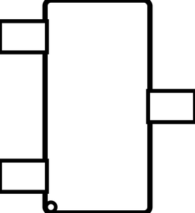
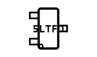
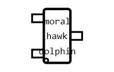
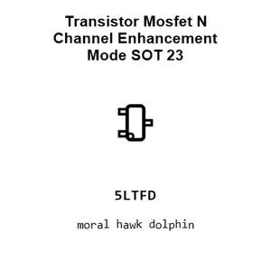
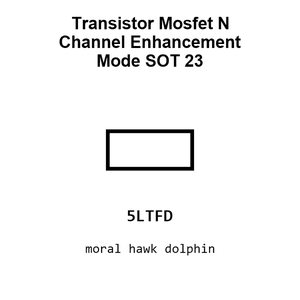
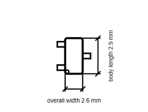

# Transistor Mosfet N Channel Enhancement Mode SOT 23

`electronic_transistor_sot_23_mosfet_n_channel_enhancement_mode`

Transistor Mosfet N Channel Enhancement Mode SOT 23 is an OOMP electronic transistor definition. It uses the sot 23 package or form factor. Its nominal drawing size is 2.9 &#x00D7; 2.6 mm.

## At a glance

| Detail | Value |
| --- | --- |
| OOMP ID | `electronic_transistor_sot_23_mosfet_n_channel_enhancement_mode` |
| Type | Transistor |
| Package / style | sot 23 |
| Nominal size | 2.9 &#x00D7; 2.6 mm |

## Classification

| Level | Value |
| --- | --- |
| 1 | `electronic` |
| 2 | `transistor` |
| 3 | `sot_23` |
| 4 | `mosfet` |
| 5 | `n_channel` |
| 6 | `enhancement_mode` |

## Nominal dimensions

| Measurement | Value |
| --- | ---: |
| Length | 2.9 mm |
| Width | 2.6 mm |

## Files

[KiCad symbol, machine-solder and hand-solder footprints](data/kicad/README.md) · [Availability and source masters](data/kicad/manifest.yaml)

[View this part on GitHub](https://github.com/oomlout/oomp_electronic_version_5/tree/main/parts/electronic_transistor_sot_23_mosfet_n_channel_enhancement_mode)

[Browse this category](../../navigation/electronic/transistor/sot_23/mosfet/n_channel/README.md)

---

This page is generated from the OOMP part definition by a Roboclick Jinja template. Edit the source taxonomy or template rather than this generated file.