# N-channel MOSFET BSS138 SOT-23

`electronic_transistor_sot_23_mosfet_n_channel_enhancement_mode_50_volt_220_milliamp_onsemi_bss138`

N-channel MOSFET BSS138 SOT-23 is an OOMP electronic transistor definition. It uses the sot 23 package or form factor. Its nominal drawing size is 2.9 &#x00D7; 2.4 mm. The definition includes 3 documented pins.

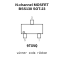

## At a glance

| Detail | Value |
| --- | --- |
| OOMP ID | `electronic_transistor_sot_23_mosfet_n_channel_enhancement_mode_50_volt_220_milliamp_onsemi_bss138` |
| Type | Transistor |
| Package / style | sot 23 |
| Nominal size | 2.9 &#x00D7; 2.4 mm |
| Documented pins | 3 |

## Classification

| Level | Value |
| --- | --- |
| 1 | `electronic` |
| 2 | `transistor` |
| 3 | `sot_23` |
| 4 | `mosfet` |
| 5 | `n_channel` |
| 6 | `enhancement_mode` |
| 7 | `50_volt` |
| 8 | `220_milliamp` |
| 14 | `onsemi` |
| 15 | `bss138` |

## Nominal dimensions

| Measurement | Value |
| --- | ---: |
| Length | 2.9 mm |
| Width | 2.4 mm |

## Identifiers

| Identifier | Value |
| --- | --- |
| Manufacturer part number | `BSS138` |
| LCSC | [`C52895`](https://www.lcsc.com/product-detail/C52895.html) |

## Pins

| Pin | Name | Type |
| ---: | --- | --- |
| 1 | gate | input |
| 2 | source | passive |
| 3 | drain | passive |

## Datasheet

[View the datasheet](data/datasheet.pdf)

## Used in projects

| Project | Quantity | References | Explore |
| --- | ---: | --- | --- |
| [Project sparkfun/SparkFun_Audio_Player_Breakout_MY1690X-16S Audio Player Breakout MY1690X-16S current](https://github.com/sparkfun/SparkFun_Audio_Player_Breakout_MY1690X-16S) | 1 | Q1 | [Board explorer](https://oomlout.github.io/oomp_electronic_version_5/parts/oomp_project_github_sparkfun_spark_fun_audio_player_breakout_my1690_x_16_s_audio_player_breakout_my1690x_16s_current/board_explorer.html) · [OOMP project](https://github.com/oomlout/oomp_electronic_version_5/tree/main/parts/oomp_project_github_sparkfun_spark_fun_audio_player_breakout_my1690_x_16_s_audio_player_breakout_my1690x_16s_current) |
| [Project sparkfun/SparkFun_u-blox_NEO-F10N u-blox NEO-F10N current](https://github.com/sparkfun/SparkFun_u-blox_NEO-F10N) | 1 | Q1 | [Board explorer](https://oomlout.github.io/oomp_electronic_version_5/parts/oomp_project_github_sparkfun_spark_fun_u_blox_neo_f10_n_ublox_neo_f10n_current/board_explorer.html) · [OOMP project](https://github.com/oomlout/oomp_electronic_version_5/tree/main/parts/oomp_project_github_sparkfun_spark_fun_u_blox_neo_f10_n_ublox_neo_f10n_current) |

## Files

[KiCad symbol, machine-solder and hand-solder footprints](data/kicad/README.md) · [Availability and source masters](data/kicad/manifest.yaml)

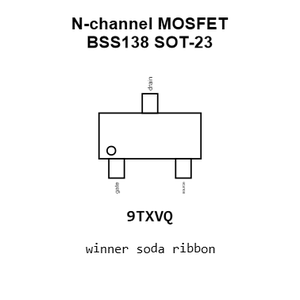

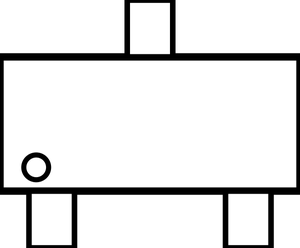

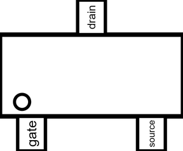

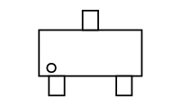

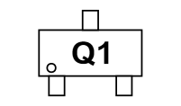

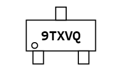

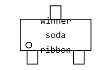

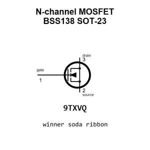

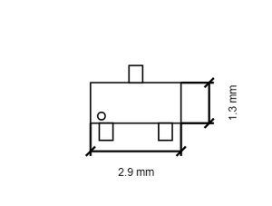

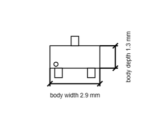

[View this part on GitHub](https://github.com/oomlout/oomp_electronic_version_5/tree/main/parts/electronic_transistor_sot_23_mosfet_n_channel_enhancement_mode_50_volt_220_milliamp_onsemi_bss138)

[Browse this category](../../navigation/electronic/transistor/sot_23/mosfet/n_channel/enhancement_mode/50_volt/220_milliamp/onsemi/README.md)

---

This page is generated from the OOMP part definition by a Roboclick Jinja template. Edit the source taxonomy or template rather than this generated file.