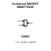
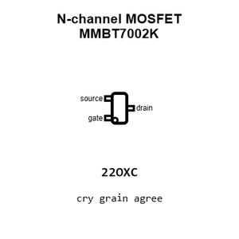
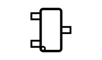
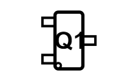
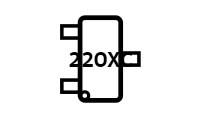
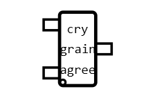
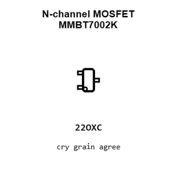
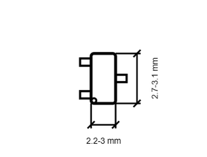
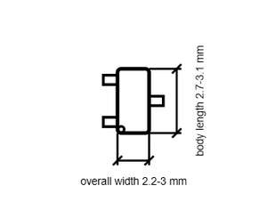

# N-channel MOSFET MMBT7002K

`electronic_transistor_sot_23_mosfet_n_channel_enhancement_mode_60_volt_300_milliamp_cbi_mmbt7002k`

N-channel MOSFET MMBT7002K is an OOMP electronic transistor definition. It uses the sot 23 package or form factor. Its nominal drawing size is 2.9 &#x00D7; 2.6 mm. The definition includes 3 documented pins.

## At a glance

| Detail | Value |
| --- | --- |
| OOMP ID | `electronic_transistor_sot_23_mosfet_n_channel_enhancement_mode_60_volt_300_milliamp_cbi_mmbt7002k` |
| Type | Transistor |
| Package / style | sot 23 |
| Nominal size | 2.9 &#x00D7; 2.6 mm |
| Documented pins | 3 |

## Classification

| Level | Value |
| --- | --- |
| 1 | `electronic` |
| 2 | `transistor` |
| 3 | `sot_23` |
| 4 | `mosfet` |
| 5 | `n_channel` |
| 6 | `enhancement_mode` |
| 7 | `60_volt` |
| 8 | `300_milliamp` |
| 14 | `cbi` |
| 15 | `mmbt7002k` |

## Nominal dimensions

| Measurement | Value |
| --- | ---: |
| Length | 2.9 mm |
| Width | 2.6 mm |

## Identifiers

| Identifier | Value |
| --- | --- |
| Manufacturer part number | `MMBT7002K` |
| LCSC | `C2879714` |

## Pins

| Pin | Name | Type |
| ---: | --- | --- |
| 1 | gate | input |
| 2 | source | passive |
| 3 | drain | passive |

## Datasheet

[View the datasheet](datasheet.pdf)

## Files

[View this part on GitHub](https://github.com/oomlout/oomp_electronic_version_5/tree/main/parts/electronic_transistor_sot_23_mosfet_n_channel_enhancement_mode_60_volt_300_milliamp_cbi_mmbt7002k)

---

This page is generated from the OOMP part definition by a Roboclick Jinja template. Edit the source taxonomy or template rather than this generated file.