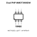
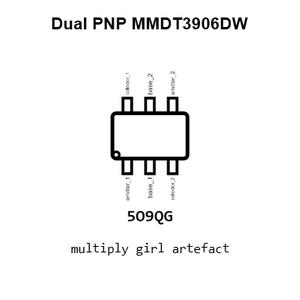
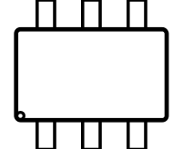
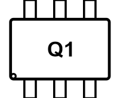
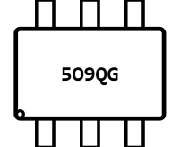
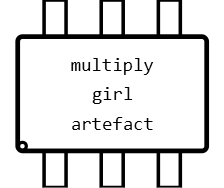
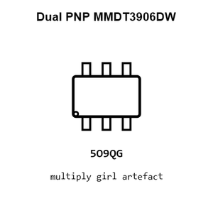
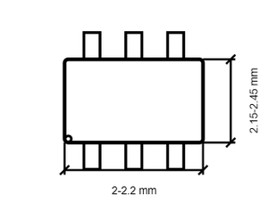
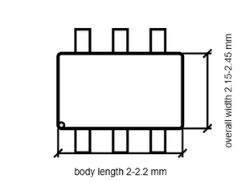

# Dual PNP MMDT3906DW

`electronic_transistor_sot_363_6_bipolar_pnp_dual_general_purpose_40_volt_200_milliamp_cbi_mmdt3906dw`

Dual PNP MMDT3906DW is an OOMP electronic transistor definition. It uses the sot 363 6 package or form factor. Its nominal drawing size is 2.1 &#x00D7; 2.3 mm. The definition includes 6 documented pins.

## At a glance

| Detail | Value |
| --- | --- |
| OOMP ID | `electronic_transistor_sot_363_6_bipolar_pnp_dual_general_purpose_40_volt_200_milliamp_cbi_mmdt3906dw` |
| Type | Transistor |
| Package / style | sot 363 6 |
| Nominal size | 2.1 &#x00D7; 2.3 mm |
| Documented pins | 6 |

## Classification

| Level | Value |
| --- | --- |
| 1 | `electronic` |
| 2 | `transistor` |
| 3 | `sot_363_6` |
| 4 | `bipolar` |
| 5 | `pnp` |
| 6 | `dual_general_purpose` |
| 7 | `40_volt` |
| 8 | `200_milliamp` |
| 14 | `cbi` |
| 15 | `mmdt3906dw` |

## Nominal dimensions

| Measurement | Value |
| --- | ---: |
| Length | 2.1 mm |
| Width | 2.3 mm |

## Identifiers

| Identifier | Value |
| --- | --- |
| Manufacturer part number | `MMDT3906DW` |
| LCSC | `C2836075` |

## Pins

| Pin | Name | Type |
| ---: | --- | --- |
| 1 | emitter_1 | passive |
| 2 | base_1 | input |
| 3 | collector_2 | passive |
| 4 | emitter_2 | passive |
| 5 | base_2 | input |
| 6 | collector_1 | passive |

## Datasheet

[View the datasheet](datasheet.pdf)

## Files

[View this part on GitHub](https://github.com/oomlout/oomp_electronic_version_5/tree/main/parts/electronic_transistor_sot_363_6_bipolar_pnp_dual_general_purpose_40_volt_200_milliamp_cbi_mmdt3906dw)

---

This page is generated from the OOMP part definition by a Roboclick Jinja template. Edit the source taxonomy or template rather than this generated file.