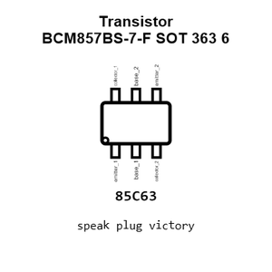
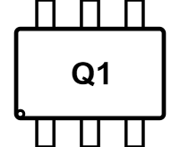
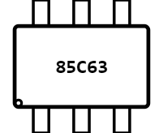
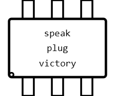
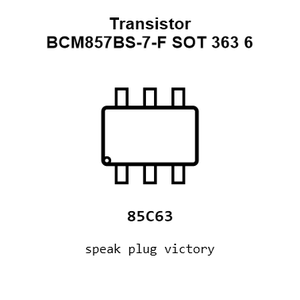
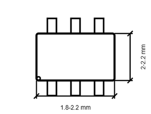
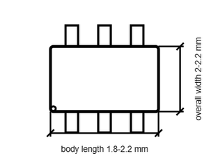

# Transistor BCM857BS-7-F SOT 363 6

`electronic_transistor_sot_363_6_bipolar_pnp_dual_matched_pair_45_volt_100_milliamp_diodes_incorporated_bcm857bs_7_f`

Transistor BCM857BS-7-F SOT 363 6 is an OOMP electronic transistor definition. It uses the sot 363 6 package or form factor. Its nominal drawing size is 2.15 &#x00D7; 2.1 mm. The definition includes 6 documented pins.

## At a glance

| Detail | Value |
| --- | --- |
| OOMP ID | `electronic_transistor_sot_363_6_bipolar_pnp_dual_matched_pair_45_volt_100_milliamp_diodes_incorporated_bcm857bs_7_f` |
| Type | Transistor |
| Package / style | sot 363 6 |
| Nominal size | 2.15 &#x00D7; 2.1 mm |
| Documented pins | 6 |

## Classification

| Level | Value |
| --- | --- |
| 1 | `electronic` |
| 2 | `transistor` |
| 3 | `sot_363_6` |
| 4 | `bipolar` |
| 5 | `pnp` |
| 6 | `dual_matched_pair` |
| 7 | `45_volt` |
| 8 | `100_milliamp` |
| 14 | `diodes_incorporated` |
| 15 | `bcm857bs_7_f` |

## Nominal dimensions

| Measurement | Value |
| --- | ---: |
| Length | 2.15 mm |
| Width | 2.1 mm |

## Identifiers

| Identifier | Value |
| --- | --- |
| Manufacturer part number | `BCM857BS-7-F` |
| LCSC | [`C105896`](https://www.lcsc.com/product-detail/C105896.html) |

## Pins

| Pin | Name | Type |
| ---: | --- | --- |
| 1 | emitter_1 | passive |
| 2 | base_1 | input |
| 3 | collector_2 | passive |
| 4 | emitter_2 | passive |
| 5 | base_2 | input |
| 6 | collector_1 | passive |

## Datasheet

[View the datasheet](data/datasheet.pdf)

## Used in projects

| Project | Quantity | References | Explore |
| --- | ---: | --- | --- |
| [Project dangerousprototypes/buspirate5_hardware 5_rev10a](https://github.com/DangerousPrototypes/BusPirate5-hardware) | 1 | Q401 | [Board explorer](https://oomlout.github.io/oomp_electronic_version_5/parts/oomp_project_github_dangerousprototypes_buspirate5_hardware_5_rev10a/board_explorer.html) · [OOMP project](https://github.com/oomlout/oomp_electronic_version_5/tree/main/parts/oomp_project_github_dangerousprototypes_buspirate5_hardware_5_rev10a) |

## Files

[KiCad symbol, machine-solder and hand-solder footprints](data/kicad/README.md) · [Availability and source masters](data/kicad/manifest.yaml)

[View this part on GitHub](https://github.com/oomlout/oomp_electronic_version_5/tree/main/parts/electronic_transistor_sot_363_6_bipolar_pnp_dual_matched_pair_45_volt_100_milliamp_diodes_incorporated_bcm857bs_7_f)

[Browse this category](../../navigation/electronic/transistor/sot_363_6/bipolar/pnp/dual_matched_pair/45_volt/100_milliamp/diodes_incorporated/README.md)

---

This page is generated from the OOMP part definition by a Roboclick Jinja template. Edit the source taxonomy or template rather than this generated file.