# Transistor Mosfet N Channel Dual SOT 363 6

`electronic_transistor_sot_363_6_mosfet_n_channel_dual`

Transistor Mosfet N Channel Dual SOT 363 6 is an OOMP electronic transistor definition. It uses the sot 363 6 package or form factor. Its nominal drawing size is 2.0 &#x00D7; 1.25 mm.

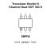

## At a glance

| Detail | Value |
| --- | --- |
| OOMP ID | `electronic_transistor_sot_363_6_mosfet_n_channel_dual` |
| Type | Transistor |
| Package / style | sot 363 6 |
| Nominal size | 2.0 &#x00D7; 1.25 mm |

## Classification

| Level | Value |
| --- | --- |
| 1 | `electronic` |
| 2 | `transistor` |
| 3 | `sot_363_6` |
| 4 | `mosfet` |
| 5 | `n_channel` |
| 6 | `dual` |

## Nominal dimensions

| Measurement | Value |
| --- | ---: |
| Height | 0.95 mm |
| Length | 2.0 mm |
| Width | 1.25 mm |

## Used in projects

| Project | Quantity | References | Explore |
| --- | ---: | --- | --- |
| [Project adafruit/Adafruit-128x32-I2C-OLED-Breakout-PCB Adafruit OLED 128x32 Mono I2 C STEMMA QT current](https://github.com/adafruit/Adafruit-128x32-I2C-OLED-Breakout-PCB/blob/master/Adafruit%20OLED%20128x32%20Mono%20I2C%20STEMMA%20QT%20rev%20B.brd) | 1 | Q2 | [Board explorer](https://oomlout.github.io/oomp_electronic_version_5/parts/oomp_project_github_adafruit_adafruit_128x32_i2_c_oled_breakout_pcb_adafruit_oled_128x32_mono_i2_c_stemma_qt_current/board_explorer.html) · [OOMP project](https://github.com/oomlout/oomp_electronic_version_5/tree/main/parts/oomp_project_github_adafruit_adafruit_128x32_i2_c_oled_breakout_pcb_adafruit_oled_128x32_mono_i2_c_stemma_qt_current) |
| [Project adafruit/Adafruit-128x64-Monochrome-OLED-PCB 0.96in 128x64 OLED STEMMA QT current](https://github.com/adafruit/Adafruit-128x64-Monochrome-OLED-PCB/blob/master/Adafruit%200.96in%20128x64%20OLED%20STEMMA%20QT.brd) | 1 | Q2 | [Board explorer](https://oomlout.github.io/oomp_electronic_version_5/parts/oomp_project_github_adafruit_adafruit_128x64_monochrome_oled_pcb_0_96in_128x64_oled_stemma_qt_current/board_explorer.html) · [OOMP project](https://github.com/oomlout/oomp_electronic_version_5/tree/main/parts/oomp_project_github_adafruit_adafruit_128x64_monochrome_oled_pcb_0_96in_128x64_oled_stemma_qt_current) |
| [Project adafruit/Adafruit_ADXL345_PCB ADXL345 STEMMA QT current](https://github.com/adafruit/Adafruit_ADXL345_PCB/blob/master/ADXL345%20STEMMA%20QT.brd) | 1 | Q2 | [Board explorer](https://oomlout.github.io/oomp_electronic_version_5/parts/oomp_project_github_adafruit_adafruit_adxl345_pcb_adxl345_stemma_qt_current/board_explorer.html) · [OOMP project](https://github.com/oomlout/oomp_electronic_version_5/tree/main/parts/oomp_project_github_adafruit_adafruit_adxl345_pcb_adxl345_stemma_qt_current) |
| [Project adafruit/Adafruit_ADXL375_PCB Adafruit ADXL375 current](https://github.com/adafruit/Adafruit_ADXL375_PCB/blob/main/Adafruit%20ADXL375.brd) | 1 | Q2 | [Board explorer](https://oomlout.github.io/oomp_electronic_version_5/parts/oomp_project_github_adafruit_adafruit_adxl375_pcb_adafruit_adxl375_current/board_explorer.html) · [OOMP project](https://github.com/oomlout/oomp_electronic_version_5/tree/main/parts/oomp_project_github_adafruit_adafruit_adxl375_pcb_adafruit_adxl375_current) |
| [Project adafruit/Adafruit-APDS9999-Proximity-Light-and-Color-Sensor-PCB Adafruit APDS9999 Proximity Light Color Sensor current](https://github.com/adafruit/Adafruit-APDS9999-Proximity-Light-and-Color-Sensor-PCB/blob/main/Adafruit%20APDS9999%20Proximity%20Light%20Color%20Sensor.brd) | 1 | Q2 | [Board explorer](https://oomlout.github.io/oomp_electronic_version_5/parts/oomp_project_github_adafruit_adafruit_apds9999_proximity_light_and_color_sensor_pcb_adafruit_apds9999_proximity_light_color_sensor_current/board_explorer.html) · [OOMP project](https://github.com/oomlout/oomp_electronic_version_5/tree/main/parts/oomp_project_github_adafruit_adafruit_apds9999_proximity_light_and_color_sensor_pcb_adafruit_apds9999_proximity_light_color_sensor_current) |
| [Project adafruit/Adafruit-AS7331-UV-UVA-UVB-UVC-Sensor-PCB Adafruit AS7331 UV UVA UVB UVC Sensor current](https://github.com/adafruit/Adafruit-AS7331-UV-UVA-UVB-UVC-Sensor-PCB/blob/main/Adafruit%20AS7331%20UV%20UVA%20UVB%20UVC%20Sensor.brd) | 1 | Q2 | [Board explorer](https://oomlout.github.io/oomp_electronic_version_5/parts/oomp_project_github_adafruit_adafruit_as7331_uv_uva_uvb_uvc_sensor_pcb_adafruit_as7331_uv_uva_uvb_uvc_sensor_current/board_explorer.html) · [OOMP project](https://github.com/oomlout/oomp_electronic_version_5/tree/main/parts/oomp_project_github_adafruit_adafruit_as7331_uv_uva_uvb_uvc_sensor_pcb_adafruit_as7331_uv_uva_uvb_uvc_sensor_current) |
| [Project adafruit/Adafruit-AS7341-PCB Adafruit AS7341 current](https://github.com/adafruit/Adafruit-AS7341-PCB/blob/master/Adafruit_AS7341.brd) | 1 | Q2 | [Board explorer](https://oomlout.github.io/oomp_electronic_version_5/parts/oomp_project_github_adafruit_adafruit_as7341_pcb_adafruit_as7341_current/board_explorer.html) · [OOMP project](https://github.com/oomlout/oomp_electronic_version_5/tree/main/parts/oomp_project_github_adafruit_adafruit_as7341_pcb_adafruit_as7341_current) |
| [Project adafruit/Adafruit-AS7343-14-Channel-Light-Color-Sensor-PCB Adafruit AS7343 14 Channel Light Color Sensor Breakout current](https://github.com/adafruit/Adafruit-AS7343-14-Channel-Light-Color-Sensor-PCB/blob/main/Adafruit%20AS7343%2014%20Channel%20Light%20Color%20Sensor%20Breakout.brd) | 1 | Q2 | [Board explorer](https://oomlout.github.io/oomp_electronic_version_5/parts/oomp_project_github_adafruit_adafruit_as7343_14_channel_light_color_sensor_pcb_adafruit_as7343_14_channel_light_color_sensor_breakout_current/board_explorer.html) · [OOMP project](https://github.com/oomlout/oomp_electronic_version_5/tree/main/parts/oomp_project_github_adafruit_adafruit_as7343_14_channel_light_color_sensor_pcb_adafruit_as7343_14_channel_light_color_sensor_breakout_current) |
| [Project adafruit/Adafruit-BME680-PCB Adafruit BME680 current](https://github.com/adafruit/Adafruit-BME680-PCB/blob/master/Adafruit%20BME680.brd) | 1 | Q2 | [Board explorer](https://oomlout.github.io/oomp_electronic_version_5/parts/oomp_project_github_adafruit_adafruit_bme680_pcb_adafruit_bme680_current/board_explorer.html) · [OOMP project](https://github.com/oomlout/oomp_electronic_version_5/tree/main/parts/oomp_project_github_adafruit_adafruit_bme680_pcb_adafruit_bme680_current) |
| [Project adafruit/Adafruit-BMP280-Breakout-PCB Adafruit BMP280 STEMMA QT current](https://github.com/adafruit/Adafruit-BMP280-Breakout-PCB/blob/master/Adafruit%20BMP280%20STEMMA%20QT.brd) | 1 | Q2 | [Board explorer](https://oomlout.github.io/oomp_electronic_version_5/parts/oomp_project_github_adafruit_adafruit_bmp280_breakout_pcb_adafruit_bmp280_stemma_qt_current/board_explorer.html) · [OOMP project](https://github.com/oomlout/oomp_electronic_version_5/tree/main/parts/oomp_project_github_adafruit_adafruit_bmp280_breakout_pcb_adafruit_bmp280_stemma_qt_current) |
| [Project adafruit/Adafruit-BMP3xx-PCB Adafruit BMP388 QT current](https://github.com/adafruit/Adafruit-BMP3xx-PCB/blob/master/Adafruit%20BMP388%20QT.brd) | 1 | Q2 | [Board explorer](https://oomlout.github.io/oomp_electronic_version_5/parts/oomp_project_github_adafruit_adafruit_bmp3xx_pcb_adafruit_bmp388_qt_current/board_explorer.html) · [OOMP project](https://github.com/oomlout/oomp_electronic_version_5/tree/main/parts/oomp_project_github_adafruit_adafruit_bmp3xx_pcb_adafruit_bmp388_qt_current) |
| [Project adafruit/Adafruit-BMP3xx-PCB Adafruit BMP390 current](https://github.com/adafruit/Adafruit-BMP3xx-PCB/blob/master/Adafruit%20BMP390.brd) | 1 | Q2 | [Board explorer](https://oomlout.github.io/oomp_electronic_version_5/parts/oomp_project_github_adafruit_adafruit_bmp3xx_pcb_adafruit_bmp390_current/board_explorer.html) · [OOMP project](https://github.com/oomlout/oomp_electronic_version_5/tree/main/parts/oomp_project_github_adafruit_adafruit_bmp3xx_pcb_adafruit_bmp390_current) |
| [Project adafruit/Adafruit-BMP5xx-Temperature-and-Pressure-Sensor-PCB Adafruit BMP580 Temperature and Pressure Sensor current](https://github.com/adafruit/Adafruit-BMP5xx-Temperature-and-Pressure-Sensor-PCB/blob/main/Adafruit%20BMP580%20Temperature%20and%20Pressure%20Sensor%20rev%20B.brd) | 1 | Q2 | [Board explorer](https://oomlout.github.io/oomp_electronic_version_5/parts/oomp_project_github_adafruit_adafruit_bmp5xx_temperature_and_pressure_sensor_pcb_adafruit_bmp580_temperature_and_pressure_sensor_current/board_explorer.html) · [OOMP project](https://github.com/oomlout/oomp_electronic_version_5/tree/main/parts/oomp_project_github_adafruit_adafruit_bmp5xx_temperature_and_pressure_sensor_pcb_adafruit_bmp580_temperature_and_pressure_sensor_current) |
| [Project adafruit/Adafruit-BMP5xx-Temperature-and-Pressure-Sensor-PCB Adafruit BMP581 Temperature and Pressure Sensor current](https://github.com/adafruit/Adafruit-BMP5xx-Temperature-and-Pressure-Sensor-PCB/blob/main/Adafruit%20BMP581%20Temperature%20and%20Pressure%20Sensor%20rev%20B.brd) | 1 | Q2 | [Board explorer](https://oomlout.github.io/oomp_electronic_version_5/parts/oomp_project_github_adafruit_adafruit_bmp5xx_temperature_and_pressure_sensor_pcb_adafruit_bmp581_temperature_and_pressure_sensor_current/board_explorer.html) · [OOMP project](https://github.com/oomlout/oomp_electronic_version_5/tree/main/parts/oomp_project_github_adafruit_adafruit_bmp5xx_temperature_and_pressure_sensor_pcb_adafruit_bmp581_temperature_and_pressure_sensor_current) |
| [Project adafruit/Adafruit-BMP5xx-Temperature-and-Pressure-Sensor-PCB Adafruit BMP585 Temperature and Pressure Sensor current](https://github.com/adafruit/Adafruit-BMP5xx-Temperature-and-Pressure-Sensor-PCB/blob/main/Adafruit%20BMP585%20Temperature%20and%20Pressure%20Sensor%20rev%20B.brd) | 1 | Q2 | [Board explorer](https://oomlout.github.io/oomp_electronic_version_5/parts/oomp_project_github_adafruit_adafruit_bmp5xx_temperature_and_pressure_sensor_pcb_adafruit_bmp585_temperature_and_pressure_sensor_current/board_explorer.html) · [OOMP project](https://github.com/oomlout/oomp_electronic_version_5/tree/main/parts/oomp_project_github_adafruit_adafruit_bmp5xx_temperature_and_pressure_sensor_pcb_adafruit_bmp585_temperature_and_pressure_sensor_current) |
| [Project adafruit/Adafruit-BNO055-Breakout-PCB Adafruit BNO055 STEMMA QT current](https://github.com/adafruit/Adafruit-BNO055-Breakout-PCB/blob/master/Adafruit%20BNO055%20STEMMA%20QT.brd) | 1 | Q3 | [Board explorer](https://oomlout.github.io/oomp_electronic_version_5/parts/oomp_project_github_adafruit_adafruit_bno055_breakout_pcb_adafruit_bno055_stemma_qt_current/board_explorer.html) · [OOMP project](https://github.com/oomlout/oomp_electronic_version_5/tree/main/parts/oomp_project_github_adafruit_adafruit_bno055_breakout_pcb_adafruit_bno055_stemma_qt_current) |
| [Project adafruit/Adafruit-BNO08x-PCB Adafruit BNO08x current](https://github.com/adafruit/Adafruit-BNO08x-PCB/blob/master/Adafruit_BNO08x.brd) | 1 | Q2 | [Board explorer](https://oomlout.github.io/oomp_electronic_version_5/parts/oomp_project_github_adafruit_adafruit_bno08x_pcb_adafruit_bno08x_current/board_explorer.html) · [OOMP project](https://github.com/oomlout/oomp_electronic_version_5/tree/main/parts/oomp_project_github_adafruit_adafruit_bno08x_pcb_adafruit_bno08x_current) |
| [Project adafruit/Adafruit-DPS310-PCB Adafruit DPS310 current](https://github.com/adafruit/Adafruit-DPS310-PCB/blob/master/Adafruit%20DPS310.brd) | 1 | Q2 | [Board explorer](https://oomlout.github.io/oomp_electronic_version_5/parts/oomp_project_github_adafruit_adafruit_dps310_pcb_adafruit_dps310_current/board_explorer.html) · [OOMP project](https://github.com/oomlout/oomp_electronic_version_5/tree/main/parts/oomp_project_github_adafruit_adafruit_dps310_pcb_adafruit_dps310_current) |
| [Project adafruit/Adafruit-ENS161-MOX-Gas-Sensor-PCB Adafruit ENS161 MOX Gas Sensor current](https://github.com/adafruit/Adafruit-ENS161-MOX-Gas-Sensor-PCB/blob/main/Adafruit%20ENS161%20MOX%20Gas%20Sensor%20rev%20A.brd) | 1 | Q2 | [Board explorer](https://oomlout.github.io/oomp_electronic_version_5/parts/oomp_project_github_adafruit_adafruit_ens161_mox_gas_sensor_pcb_adafruit_ens161_mox_gas_sensor_current/board_explorer.html) · [OOMP project](https://github.com/oomlout/oomp_electronic_version_5/tree/main/parts/oomp_project_github_adafruit_adafruit_ens161_mox_gas_sensor_pcb_adafruit_ens161_mox_gas_sensor_current) |
| [Project adafruit/Adafruit-Feather-RP2040-DVI-PCB Adafruit Feather RP2040 DVI current](https://github.com/adafruit/Adafruit-Feather-RP2040-DVI-PCB/blob/main/Adafruit%20Feather%20RP2040%20DVI.brd) | 1 | Q2 | [Board explorer](https://oomlout.github.io/oomp_electronic_version_5/parts/oomp_project_github_adafruit_adafruit_feather_rp2040_dvi_pcb_adafruit_feather_rp2040_dvi_current/board_explorer.html) · [OOMP project](https://github.com/oomlout/oomp_electronic_version_5/tree/main/parts/oomp_project_github_adafruit_adafruit_feather_rp2040_dvi_pcb_adafruit_feather_rp2040_dvi_current) |
| [Project adafruit/Adafruit-I2C-QT-Rotary-Encoder-PCB Adafruit I2 C QT Rotary Encoder current](https://github.com/adafruit/Adafruit-I2C-QT-Rotary-Encoder-PCB/blob/main/Adafruit%20I2C%20QT%20Rotary%20Encoder.brd) | 1 | Q2 | [Board explorer](https://oomlout.github.io/oomp_electronic_version_5/parts/oomp_project_github_adafruit_adafruit_i2_c_qt_rotary_encoder_pcb_adafruit_i2_c_qt_rotary_encoder_current/board_explorer.html) · [OOMP project](https://github.com/oomlout/oomp_electronic_version_5/tree/main/parts/oomp_project_github_adafruit_adafruit_i2_c_qt_rotary_encoder_pcb_adafruit_i2_c_qt_rotary_encoder_current) |
| [Project adafruit/Adafruit-I2C-SPI-LCD-Backpack-PCB I2C SPI LCD STEMMA Backpack current](https://github.com/adafruit/Adafruit-I2C-SPI-LCD-Backpack-PCB/blob/master/Adafruit%20I2C%20SPI%20LCD%20STEMMA%20backpack.brd) | 2 | Q1, Q2 | [Board explorer](https://oomlout.github.io/oomp_electronic_version_5/parts/oomp_project_github_adafruit_adafruit_i2_c_spi_lcd_backpack_pcb_i2c_spi_lcd_stemma_backpack_current/board_explorer.html) · [OOMP project](https://github.com/oomlout/oomp_electronic_version_5/tree/main/parts/oomp_project_github_adafruit_adafruit_i2_c_spi_lcd_backpack_pcb_i2c_spi_lcd_stemma_backpack_current) |
| [Project adafruit/Adafruit-ICM20948-PCB Adafruit ICM20948 current](https://github.com/adafruit/Adafruit-ICM20948-PCB/blob/master/Adafruit%20ICM20948.brd) | 2 | Q2, Q3 | [Board explorer](https://oomlout.github.io/oomp_electronic_version_5/parts/oomp_project_github_adafruit_adafruit_icm20948_pcb_adafruit_icm20948_current/board_explorer.html) · [OOMP project](https://github.com/oomlout/oomp_electronic_version_5/tree/main/parts/oomp_project_github_adafruit_adafruit_icm20948_pcb_adafruit_icm20948_current) |
| [Project adafruit/Adafruit-LIS2MDL-PCB Adafruit LIS2 MDL current](https://github.com/adafruit/Adafruit-LIS2MDL-PCB/blob/master/Adafruit%20LIS2MDL.brd) | 1 | Q2 | [Board explorer](https://oomlout.github.io/oomp_electronic_version_5/parts/oomp_project_github_adafruit_adafruit_lis2_mdl_pcb_adafruit_lis2_mdl_current/board_explorer.html) · [OOMP project](https://github.com/oomlout/oomp_electronic_version_5/tree/main/parts/oomp_project_github_adafruit_adafruit_lis2_mdl_pcb_adafruit_lis2_mdl_current) |
| [Project adafruit/Adafruit-LIS331-PCB Adafruit LIS331 current](https://github.com/adafruit/Adafruit-LIS331-PCB/blob/master/Adafruit_LIS331.brd) | 1 | Q2 | [Board explorer](https://oomlout.github.io/oomp_electronic_version_5/parts/oomp_project_github_adafruit_adafruit_lis331_pcb_adafruit_lis331_current/board_explorer.html) · [OOMP project](https://github.com/oomlout/oomp_electronic_version_5/tree/main/parts/oomp_project_github_adafruit_adafruit_lis331_pcb_adafruit_lis331_current) |
| [Project adafruit/Adafruit-LIS3DH-Breakout-PCB LIS3DH Breakout current](https://github.com/adafruit/Adafruit-LIS3DH-Breakout-PCB/blob/master/Adafruit%20LIS3DH.brd) | 1 | Q2 | [Board explorer](https://oomlout.github.io/oomp_electronic_version_5/parts/oomp_project_github_adafruit_adafruit_lis3_dh_breakout_pcb_lis3dh_breakout_current/board_explorer.html) · [OOMP project](https://github.com/oomlout/oomp_electronic_version_5/tree/main/parts/oomp_project_github_adafruit_adafruit_lis3_dh_breakout_pcb_lis3dh_breakout_current) |
| [Project adafruit/Adafruit-MAX44009-Lux-Light-Sensor-PCB Adafruit MAX44009 Lux Light Sensor current](https://github.com/adafruit/Adafruit-MAX44009-Lux-Light-Sensor-PCB/blob/main/Adafruit%20MAX44009%20Lux%20Light%20Sensor.brd) | 1 | Q2 | [Board explorer](https://oomlout.github.io/oomp_electronic_version_5/parts/oomp_project_github_adafruit_adafruit_max44009_lux_light_sensor_pcb_adafruit_max44009_lux_light_sensor_current/board_explorer.html) · [OOMP project](https://github.com/oomlout/oomp_electronic_version_5/tree/main/parts/oomp_project_github_adafruit_adafruit_max44009_lux_light_sensor_pcb_adafruit_max44009_lux_light_sensor_current) |
| [Project adafruit/Adafruit-MLX90640-PCB Adafruit MLX90640 IR Thermal Camera current](https://github.com/adafruit/Adafruit-MLX90640-PCB/blob/master/Adafruit%20MLX90640%20IR%20Thermal%20Camera.brd) | 1 | Q2 | [Board explorer](https://oomlout.github.io/oomp_electronic_version_5/parts/oomp_project_github_adafruit_adafruit_mlx90640_pcb_adafruit_mlx90640_ir_thermal_camera_current/board_explorer.html) · [OOMP project](https://github.com/oomlout/oomp_electronic_version_5/tree/main/parts/oomp_project_github_adafruit_adafruit_mlx90640_pcb_adafruit_mlx90640_ir_thermal_camera_current) |
| [Project adafruit/Adafruit-MPR121-PCB Adafruit MPR121 Q QT current](https://github.com/adafruit/Adafruit-MPR121-PCB/blob/master/Adafruit%20MPR121Q%20QT.brd) | 1 | Q3 | [Board explorer](https://oomlout.github.io/oomp_electronic_version_5/parts/oomp_project_github_adafruit_adafruit_mpr121_pcb_adafruit_mpr121_q_qt_current/board_explorer.html) · [OOMP project](https://github.com/oomlout/oomp_electronic_version_5/tree/main/parts/oomp_project_github_adafruit_adafruit_mpr121_pcb_adafruit_mpr121_q_qt_current) |
| [Project adafruit/Adafruit-MPR121-PCB Adafruit MPR121 Q QT Gator Breakout current](https://github.com/adafruit/Adafruit-MPR121-PCB/blob/master/Adafruit%20MPR121Q%20QT%20Gator%20Breakout.brd) | 1 | Q3 | [Board explorer](https://oomlout.github.io/oomp_electronic_version_5/parts/oomp_project_github_adafruit_adafruit_mpr121_pcb_adafruit_mpr121_q_qt_gator_breakout_current/board_explorer.html) · [OOMP project](https://github.com/oomlout/oomp_electronic_version_5/tree/main/parts/oomp_project_github_adafruit_adafruit_mpr121_pcb_adafruit_mpr121_q_qt_gator_breakout_current) |
| [Project adafruit/Adafruit-MPU6050-PCB Adafruit MPU6050 current](https://github.com/adafruit/Adafruit-MPU6050-PCB/blob/master/Adafruit%20MPU6050.brd) | 1 | Q2 | [Board explorer](https://oomlout.github.io/oomp_electronic_version_5/parts/oomp_project_github_adafruit_adafruit_mpu6050_pcb_adafruit_mpu6050_current/board_explorer.html) · [OOMP project](https://github.com/oomlout/oomp_electronic_version_5/tree/main/parts/oomp_project_github_adafruit_adafruit_mpu6050_pcb_adafruit_mpu6050_current) |
| [Project adafruit/Adafruit-PA1010D-Mini-GPS-PCB Adafruit PA1010 D Mini GPS current](https://github.com/adafruit/Adafruit-PA1010D-Mini-GPS-PCB/blob/master/Adafruit%20PA1010D%20Mini%20GPS.brd) | 1 | Q2 | [Board explorer](https://oomlout.github.io/oomp_electronic_version_5/parts/oomp_project_github_adafruit_adafruit_pa1010_d_mini_gps_pcb_adafruit_pa1010_d_mini_gps_current/board_explorer.html) · [OOMP project](https://github.com/oomlout/oomp_electronic_version_5/tree/main/parts/oomp_project_github_adafruit_adafruit_pa1010_d_mini_gps_pcb_adafruit_pa1010_d_mini_gps_current) |
| [Project adafruit/Adafruit-PiCowBell-HSTX-DVI-Output-PCB Adafruit Pi Cowbell HSTX DVI current](https://github.com/adafruit/Adafruit-PiCowBell-HSTX-DVI-Output-PCB/blob/main/Adafruit%20PiCowbell%20HSTX%20DVI.brd) | 1 | Q2 | [Board explorer](https://oomlout.github.io/oomp_electronic_version_5/parts/oomp_project_github_adafruit_adafruit_pi_cow_bell_hstx_dvi_output_pcb_adafruit_pi_cowbell_hstx_dvi_current/board_explorer.html) · [OOMP project](https://github.com/oomlout/oomp_electronic_version_5/tree/main/parts/oomp_project_github_adafruit_adafruit_pi_cow_bell_hstx_dvi_output_pcb_adafruit_pi_cowbell_hstx_dvi_current) |
| [Project adafruit/Adafruit-PMSA003I-PCB Adafruit PMSA003 I current](https://github.com/adafruit/Adafruit-PMSA003I-PCB/blob/master/Adafruit%20PMSA003I.brd) | 1 | Q2 | [Board explorer](https://oomlout.github.io/oomp_electronic_version_5/parts/oomp_project_github_adafruit_adafruit_pmsa003_i_pcb_adafruit_pmsa003_i_current/board_explorer.html) · [OOMP project](https://github.com/oomlout/oomp_electronic_version_5/tree/main/parts/oomp_project_github_adafruit_adafruit_pmsa003_i_pcb_adafruit_pmsa003_i_current) |
| [Project adafruit/Adafruit-PyBadge-PCB Adafruit Py Badge current](https://github.com/adafruit/Adafruit-PyBadge-PCB/blob/master/Adafruit%20PyBadge.brd) | 1 | Q4 | [Board explorer](https://oomlout.github.io/oomp_electronic_version_5/parts/oomp_project_github_adafruit_adafruit_py_badge_pcb_adafruit_py_badge_current/board_explorer.html) · [OOMP project](https://github.com/oomlout/oomp_electronic_version_5/tree/main/parts/oomp_project_github_adafruit_adafruit_py_badge_pcb_adafruit_py_badge_current) |
| [Project adafruit/Adafruit-PyGamer-PCB Adafruit Py Gamer current](https://github.com/adafruit/Adafruit-PyGamer-PCB/blob/master/Adafruit%20PyGamer.brd) | 1 | Q4 | [Board explorer](https://oomlout.github.io/oomp_electronic_version_5/parts/oomp_project_github_adafruit_adafruit_py_gamer_pcb_adafruit_py_gamer_current/board_explorer.html) · [OOMP project](https://github.com/oomlout/oomp_electronic_version_5/tree/main/parts/oomp_project_github_adafruit_adafruit_py_gamer_pcb_adafruit_py_gamer_current) |
| [Project adafruit/Adafruit-QT-3V-to-5V-Level-Booster-PCB Adafruit STEMMA QT Booster Breakout current](https://github.com/adafruit/Adafruit-QT-3V-to-5V-Level-Booster-PCB/blob/main/Adafruit%20STEMMA%20QT%20Booster%20Breakout.brd) | 1 | Q2 | [Board explorer](https://oomlout.github.io/oomp_electronic_version_5/parts/oomp_project_github_adafruit_adafruit_qt_3_v_to_5_v_level_booster_pcb_adafruit_stemma_qt_booster_breakout_current/board_explorer.html) · [OOMP project](https://github.com/oomlout/oomp_electronic_version_5/tree/main/parts/oomp_project_github_adafruit_adafruit_qt_3_v_to_5_v_level_booster_pcb_adafruit_stemma_qt_booster_breakout_current) |
| [Project adafruit/Adafruit-RP2350-HSTX-to-DVI-Adapter-PCB Adafruit RP2350 HSTX to DVI Adapter current](https://github.com/adafruit/Adafruit-RP2350-HSTX-to-DVI-Adapter-PCB/blob/main/Adafruit%20RP2350%20HSTX%20to%20DVI%20Adapter.brd) | 1 | Q2 | [Board explorer](https://oomlout.github.io/oomp_electronic_version_5/parts/oomp_project_github_adafruit_adafruit_rp2350_hstx_to_dvi_adapter_pcb_adafruit_rp2350_hstx_to_dvi_adapter_current/board_explorer.html) · [OOMP project](https://github.com/oomlout/oomp_electronic_version_5/tree/main/parts/oomp_project_github_adafruit_adafruit_rp2350_hstx_to_dvi_adapter_pcb_adafruit_rp2350_hstx_to_dvi_adapter_current) |
| [Project adafruit/Adafruit-SCD-4x-PCB Adafruit SCD43 current](https://github.com/adafruit/Adafruit-SCD-4x-PCB/blob/main/Adafruit%20SCD43%20rev%20A.brd) | 1 | Q2 | [Board explorer](https://oomlout.github.io/oomp_electronic_version_5/parts/oomp_project_github_adafruit_adafruit_scd_4x_pcb_adafruit_scd43_current/board_explorer.html) · [OOMP project](https://github.com/oomlout/oomp_electronic_version_5/tree/main/parts/oomp_project_github_adafruit_adafruit_scd_4x_pcb_adafruit_scd43_current) |
| [Project adafruit/Adafruit-SCD-4x-PCB Adafruit SCD 41 current](https://github.com/adafruit/Adafruit-SCD-4x-PCB/blob/main/Adafruit%20SCD-41.brd) | 1 | Q2 | [Board explorer](https://oomlout.github.io/oomp_electronic_version_5/parts/oomp_project_github_adafruit_adafruit_scd_4x_pcb_adafruit_scd_41_current/board_explorer.html) · [OOMP project](https://github.com/oomlout/oomp_electronic_version_5/tree/main/parts/oomp_project_github_adafruit_adafruit_scd_4x_pcb_adafruit_scd_41_current) |
| [Project adafruit/Adafruit-SEN6x-Breakout-PCB Adafruit SEN6x Breakout current](https://github.com/adafruit/Adafruit-SEN6x-Breakout-PCB/blob/main/Adafruit%20SEN6x%20Breakout.brd) | 1 | Q2 | [Board explorer](https://oomlout.github.io/oomp_electronic_version_5/parts/oomp_project_github_adafruit_adafruit_sen6x_breakout_pcb_adafruit_sen6x_breakout_current/board_explorer.html) · [OOMP project](https://github.com/oomlout/oomp_electronic_version_5/tree/main/parts/oomp_project_github_adafruit_adafruit_sen6x_breakout_pcb_adafruit_sen6x_breakout_current) |
| [Project adafruit/Adafruit-SGP30-PCB SGP30 current](https://github.com/adafruit/Adafruit-SGP30-PCB/blob/master/SGP30%20Rev%20D.brd) | 1 | Q2 | [Board explorer](https://oomlout.github.io/oomp_electronic_version_5/parts/oomp_project_github_adafruit_adafruit_sgp30_pcb_sgp30_current/board_explorer.html) · [OOMP project](https://github.com/oomlout/oomp_electronic_version_5/tree/main/parts/oomp_project_github_adafruit_adafruit_sgp30_pcb_sgp30_current) |
| [Project adafruit/Adafruit-SGP41-Gas-Sensor-Breakout-PCB Adafruit SGP41 Gas Sensor Breakout current](https://github.com/adafruit/Adafruit-SGP41-Gas-Sensor-Breakout-PCB/blob/main/Adafruit%20SGP41%20Gas%20Sensor%20Breakout%20rev%20A.brd) | 1 | Q2 | [Board explorer](https://oomlout.github.io/oomp_electronic_version_5/parts/oomp_project_github_adafruit_adafruit_sgp41_gas_sensor_breakout_pcb_adafruit_sgp41_gas_sensor_breakout_current/board_explorer.html) · [OOMP project](https://github.com/oomlout/oomp_electronic_version_5/tree/main/parts/oomp_project_github_adafruit_adafruit_sgp41_gas_sensor_breakout_pcb_adafruit_sgp41_gas_sensor_breakout_current) |
| [Project adafruit/Adafruit-SHT40-PCB Adafruit SHT40 current](https://github.com/adafruit/Adafruit-SHT40-PCB/blob/main/Adafruit%20SHT40.brd) | 1 | Q2 | [Board explorer](https://oomlout.github.io/oomp_electronic_version_5/parts/oomp_project_github_adafruit_adafruit_sht40_pcb_adafruit_sht40_current/board_explorer.html) · [OOMP project](https://github.com/oomlout/oomp_electronic_version_5/tree/main/parts/oomp_project_github_adafruit_adafruit_sht40_pcb_adafruit_sht40_current) |
| [Project adafruit/Adafruit-SHT40-PCB Adafruit SHT41 current](https://github.com/adafruit/Adafruit-SHT40-PCB/blob/main/Adafruit%20SHT41.brd) | 1 | Q2 | [Board explorer](https://oomlout.github.io/oomp_electronic_version_5/parts/oomp_project_github_adafruit_adafruit_sht40_pcb_adafruit_sht41_current/board_explorer.html) · [OOMP project](https://github.com/oomlout/oomp_electronic_version_5/tree/main/parts/oomp_project_github_adafruit_adafruit_sht40_pcb_adafruit_sht41_current) |
| [Project adafruit/Adafruit-SHT40-PCB Adafruit SHT45 current](https://github.com/adafruit/Adafruit-SHT40-PCB/blob/main/Adafruit%20SHT45.brd) | 1 | Q2 | [Board explorer](https://oomlout.github.io/oomp_electronic_version_5/parts/oomp_project_github_adafruit_adafruit_sht40_pcb_adafruit_sht45_current/board_explorer.html) · [OOMP project](https://github.com/oomlout/oomp_electronic_version_5/tree/main/parts/oomp_project_github_adafruit_adafruit_sht40_pcb_adafruit_sht45_current) |
| [Project adafruit/Adafruit-STCC4-and-SHT41-CO2-Temperature-and-Humidity-Sensor-PCB Adafruit STCC4 and SHT41 CO2 Temperature and Humidity Sensor current](https://github.com/adafruit/Adafruit-STCC4-and-SHT41-CO2-Temperature-and-Humidity-Sensor-PCB/blob/main/Adafruit%20STCC4%20and%20SHT41%20CO2%20Temperature%20and%20Humidity%20Sensor.brd) | 1 | Q2 | [Board explorer](https://oomlout.github.io/oomp_electronic_version_5/parts/oomp_project_github_adafruit_adafruit_stcc4_and_sht41_co2_temperature_and_humidity_sensor_pcb_adafruit_stcc4_and_sht41_co2_temperature_and_humidity_sensor_current/board_explorer.html) · [OOMP project](https://github.com/oomlout/oomp_electronic_version_5/tree/main/parts/oomp_project_github_adafruit_adafruit_stcc4_and_sht41_co2_temperature_and_humidity_sensor_pcb_adafruit_stcc4_and_sht41_co2_temperature_and_humidity_sensor_current) |
| [Project adafruit/Adafruit-STHS34PF80-IR-Presence-Sensor-PCB Adafruit STHS34 PF80 IR Presence Sensor current](https://github.com/adafruit/Adafruit-STHS34PF80-IR-Presence-Sensor-PCB/blob/main/Adafruit%20STHS34PF80%20IR%20Presence%20Sensor.brd) | 1 | Q2 | [Board explorer](https://oomlout.github.io/oomp_electronic_version_5/parts/oomp_project_github_adafruit_adafruit_sths34_pf80_ir_presence_sensor_pcb_adafruit_sths34_pf80_ir_presence_sensor_current/board_explorer.html) · [OOMP project](https://github.com/oomlout/oomp_electronic_version_5/tree/main/parts/oomp_project_github_adafruit_adafruit_sths34_pf80_ir_presence_sensor_pcb_adafruit_sths34_pf80_ir_presence_sensor_current) |
| [Project adafruit/Adafruit-TCA8418-PCB Adafruit TCA8418 current](https://github.com/adafruit/Adafruit-TCA8418-PCB/blob/main/Adafruit%20TCA8418.brd) | 1 | Q2 | [Board explorer](https://oomlout.github.io/oomp_electronic_version_5/parts/oomp_project_github_adafruit_adafruit_tca8418_pcb_adafruit_tca8418_current/board_explorer.html) · [OOMP project](https://github.com/oomlout/oomp_electronic_version_5/tree/main/parts/oomp_project_github_adafruit_adafruit_tca8418_pcb_adafruit_tca8418_current) |
| [Project adafruit/Adafruit-TCS3430-Ambient-Tri-Stimulus-Color-Sensor-PCB Adafruit TCS3430 Ambient Tri Stimulus Color Sensor current](https://github.com/adafruit/Adafruit-TCS3430-Ambient-Tri-Stimulus-Color-Sensor-PCB/blob/main/Adafruit%20TCS3430%20Ambient%20Tri-Stimulus%20Color%20Sensor.brd) | 2 | Q1, Q2 | [Board explorer](https://oomlout.github.io/oomp_electronic_version_5/parts/oomp_project_github_adafruit_adafruit_tcs3430_ambient_tri_stimulus_color_sensor_pcb_adafruit_tcs3430_ambient_tri_stimulus_color_sensor_current/board_explorer.html) · [OOMP project](https://github.com/oomlout/oomp_electronic_version_5/tree/main/parts/oomp_project_github_adafruit_adafruit_tcs3430_ambient_tri_stimulus_color_sensor_pcb_adafruit_tcs3430_ambient_tri_stimulus_color_sensor_current) |
| [Project adafruit/Adafruit-TMAG5273-3D-Hall-Effect-Magnetometer-Breakout-PCB Adafruit TMAG5273 A1 3 D Hall Effect Magnetometer Breakout current](https://github.com/adafruit/Adafruit-TMAG5273-3D-Hall-Effect-Magnetometer-Breakout-PCB/blob/main/Adafruit%20TMAG5273A1%203D%20Hall%20Effect%20Magnetometer%20Breakout.brd) | 1 | Q2 | [Board explorer](https://oomlout.github.io/oomp_electronic_version_5/parts/oomp_project_github_adafruit_adafruit_tmag5273_3_d_hall_effect_magnetometer_breakout_pcb_adafruit_tmag5273_a1_3_d_hall_effect_magnetometer_breakout_current/board_explorer.html) · [OOMP project](https://github.com/oomlout/oomp_electronic_version_5/tree/main/parts/oomp_project_github_adafruit_adafruit_tmag5273_3_d_hall_effect_magnetometer_breakout_pcb_adafruit_tmag5273_a1_3_d_hall_effect_magnetometer_breakout_current) |
| [Project adafruit/Adafruit-TMAG5273-3D-Hall-Effect-Magnetometer-Breakout-PCB Adafruit TMAG5273 A2 3 D Hall Effect Magnetometer Breakout current](https://github.com/adafruit/Adafruit-TMAG5273-3D-Hall-Effect-Magnetometer-Breakout-PCB/blob/main/Adafruit%20TMAG5273A2%203D%20Hall%20Effect%20Magnetometer%20Breakout.brd) | 1 | Q2 | [Board explorer](https://oomlout.github.io/oomp_electronic_version_5/parts/oomp_project_github_adafruit_adafruit_tmag5273_3_d_hall_effect_magnetometer_breakout_pcb_adafruit_tmag5273_a2_3_d_hall_effect_magnetometer_breakout_current/board_explorer.html) · [OOMP project](https://github.com/oomlout/oomp_electronic_version_5/tree/main/parts/oomp_project_github_adafruit_adafruit_tmag5273_3_d_hall_effect_magnetometer_breakout_pcb_adafruit_tmag5273_a2_3_d_hall_effect_magnetometer_breakout_current) |
| [Project adafruit/Adafruit-TMF8801-Time-of-Flight-Distance-Sensor-PCB Adafruit TMF8801 Time of Flight Sensor current](https://github.com/adafruit/Adafruit-TMF8801-Time-of-Flight-Distance-Sensor-PCB/blob/main/Adafruit%20TMF8801%20Time%20of%20Flight%20Sensor%20rev%20B.brd) | 1 | Q3 | [Board explorer](https://oomlout.github.io/oomp_electronic_version_5/parts/oomp_project_github_adafruit_adafruit_tmf8801_time_of_flight_distance_sensor_pcb_adafruit_tmf8801_time_of_flight_sensor_current/board_explorer.html) · [OOMP project](https://github.com/oomlout/oomp_electronic_version_5/tree/main/parts/oomp_project_github_adafruit_adafruit_tmf8801_time_of_flight_distance_sensor_pcb_adafruit_tmf8801_time_of_flight_sensor_current) |
| [Project adafruit/Adafruit-TMF8806-Time-of-Flight-Distance-Sensor-PCB Adafruit TMF8806 Time of Flight Sensor current](https://github.com/adafruit/Adafruit-TMF8806-Time-of-Flight-Distance-Sensor-PCB/blob/main/Adafruit%20TMF8806%20Time%20of%20Flight%20Sensor%20rev%20B.brd) | 1 | Q3 | [Board explorer](https://oomlout.github.io/oomp_electronic_version_5/parts/oomp_project_github_adafruit_adafruit_tmf8806_time_of_flight_distance_sensor_pcb_adafruit_tmf8806_time_of_flight_sensor_current/board_explorer.html) · [OOMP project](https://github.com/oomlout/oomp_electronic_version_5/tree/main/parts/oomp_project_github_adafruit_adafruit_tmf8806_time_of_flight_distance_sensor_pcb_adafruit_tmf8806_time_of_flight_sensor_current) |
| [Project adafruit/Adafruit-TSL2591-Breakout-PCB Adafruit TSL2591 current](https://github.com/adafruit/Adafruit-TSL2591-Breakout-PCB/blob/master/Adafruit%20TSL2591.brd) | 1 | Q2 | [Board explorer](https://oomlout.github.io/oomp_electronic_version_5/parts/oomp_project_github_adafruit_adafruit_tsl2591_breakout_pcb_adafruit_tsl2591_current/board_explorer.html) · [OOMP project](https://github.com/oomlout/oomp_electronic_version_5/tree/main/parts/oomp_project_github_adafruit_adafruit_tsl2591_breakout_pcb_adafruit_tsl2591_current) |
| [Project adafruit/Adafruit-VCNL4030-Proximity-and-Lux-Sensor-PCB Adafruit VCNL4030 Proximity and Lux Breakout current](https://github.com/adafruit/Adafruit-VCNL4030-Proximity-and-Lux-Sensor-PCB/blob/main/Adafruit%20VCNL4030%20Proximity%20and%20Lux%20Breakout.brd) | 1 | Q2 | [Board explorer](https://oomlout.github.io/oomp_electronic_version_5/parts/oomp_project_github_adafruit_adafruit_vcnl4030_proximity_and_lux_sensor_pcb_adafruit_vcnl4030_proximity_and_lux_breakout_current/board_explorer.html) · [OOMP project](https://github.com/oomlout/oomp_electronic_version_5/tree/main/parts/oomp_project_github_adafruit_adafruit_vcnl4030_proximity_and_lux_sensor_pcb_adafruit_vcnl4030_proximity_and_lux_breakout_current) |
| [Project adafruit/Adafruit-VEML7700-PCB Adafruit VEML7700 current](https://github.com/adafruit/Adafruit-VEML7700-PCB/blob/master/Adafruit%20VEML7700.brd) | 1 | Q2 | [Board explorer](https://oomlout.github.io/oomp_electronic_version_5/parts/oomp_project_github_adafruit_adafruit_veml7700_pcb_adafruit_veml7700_current/board_explorer.html) · [OOMP project](https://github.com/oomlout/oomp_electronic_version_5/tree/main/parts/oomp_project_github_adafruit_adafruit_veml7700_pcb_adafruit_veml7700_current) |
| [Project adafruit/Adafruit-VEML7700-PCB Adafruit VEML7700 STEMMA QT current](https://github.com/adafruit/Adafruit-VEML7700-PCB/blob/master/Adafruit%20VEML7700%20STEMMA%20QT.brd) | 1 | Q2 | [Board explorer](https://oomlout.github.io/oomp_electronic_version_5/parts/oomp_project_github_adafruit_adafruit_veml7700_pcb_adafruit_veml7700_stemma_qt_current/board_explorer.html) · [OOMP project](https://github.com/oomlout/oomp_electronic_version_5/tree/main/parts/oomp_project_github_adafruit_adafruit_veml7700_pcb_adafruit_veml7700_stemma_qt_current) |
| [Project adafruit/Adafruit-VL53L0X-ToF-Distance-Sensor-PCB Adafruit VL530 X STEMMA QT current](https://github.com/adafruit/Adafruit-VL53L0X-ToF-Distance-Sensor-PCB/blob/master/Adafruit%20VL530X%20STEMMA%20QT.brd) | 1 | Q3 | [Board explorer](https://oomlout.github.io/oomp_electronic_version_5/parts/oomp_project_github_adafruit_adafruit_vl53_l0_x_to_f_distance_sensor_pcb_adafruit_vl530_x_stemma_qt_current/board_explorer.html) · [OOMP project](https://github.com/oomlout/oomp_electronic_version_5/tree/main/parts/oomp_project_github_adafruit_adafruit_vl53_l0_x_to_f_distance_sensor_pcb_adafruit_vl530_x_stemma_qt_current) |
| [Project adafruit/Adafruit-VL53L1X-PCB Adafruit VL53 L1 X current](https://github.com/adafruit/Adafruit-VL53L1X-PCB/blob/main/Adafruit%20VL53L1X.brd) | 1 | Q3 | [Board explorer](https://oomlout.github.io/oomp_electronic_version_5/parts/oomp_project_github_adafruit_adafruit_vl53_l1_x_pcb_adafruit_vl53_l1_x_current/board_explorer.html) · [OOMP project](https://github.com/oomlout/oomp_electronic_version_5/tree/main/parts/oomp_project_github_adafruit_adafruit_vl53_l1_x_pcb_adafruit_vl53_l1_x_current) |
| [Project adafruit/Adafruit-VL53L4CX-PCB Adafruit VL53 L4 CX current](https://github.com/adafruit/Adafruit-VL53L4CX-PCB/blob/main/Adafruit%20VL53L4CX.brd) | 1 | Q3 | [Board explorer](https://oomlout.github.io/oomp_electronic_version_5/parts/oomp_project_github_adafruit_adafruit_vl53_l4_cx_pcb_adafruit_vl53_l4_cx_current/board_explorer.html) · [OOMP project](https://github.com/oomlout/oomp_electronic_version_5/tree/main/parts/oomp_project_github_adafruit_adafruit_vl53_l4_cx_pcb_adafruit_vl53_l4_cx_current) |
| [Project adafruit/Adafruit-Wii-Nunchuck-Breakout-Adapter-PCB Adafruit Wii Nunchuck Breakout Adapter current](https://github.com/adafruit/Adafruit-Wii-Nunchuck-Breakout-Adapter-PCB/blob/main/Adafruit%20Wii%20Nunchuck%20Breakout%20Adapter.brd) | 1 | Q2 | [Board explorer](https://oomlout.github.io/oomp_electronic_version_5/parts/oomp_project_github_adafruit_adafruit_wii_nunchuck_breakout_adapter_pcb_adafruit_wii_nunchuck_breakout_adapter_current/board_explorer.html) · [OOMP project](https://github.com/oomlout/oomp_electronic_version_5/tree/main/parts/oomp_project_github_adafruit_adafruit_wii_nunchuck_breakout_adapter_pcb_adafruit_wii_nunchuck_breakout_adapter_current) |
| [Project soldered_electronics/Accelerometer---Gyroscope---Magnetometer-LSM9DS1TR-breakout-hardware-design LSM9DS1TR IMU current](https://github.com/SolderedElectronics/Accelerometer---Gyroscope---Magnetometer-LSM9DS1TR-breakout-hardware-design) | 1 | U1 | [Board explorer](https://oomlout.github.io/oomp_electronic_version_5/parts/oomp_project_github_soldered_electronics_accelerometer_gyroscope_magnetometer_lsm9_ds1_tr_breakout_hardware_design_sensor_imu_lsm9ds1tr_current/board_explorer.html) · [OOMP project](https://github.com/oomlout/oomp_electronic_version_5/tree/main/parts/oomp_project_github_soldered_electronics_accelerometer_gyroscope_magnetometer_lsm9_ds1_tr_breakout_hardware_design_sensor_imu_lsm9ds1tr_current) |
| [Project soldered_electronics/Air-quality-sensor-CCS811-breakout-hardware-design CCS811 Breakout current](https://github.com/SolderedElectronics/Air-quality-sensor-CCS811-breakout-hardware-design) | 1 | U1 | [Board explorer](https://oomlout.github.io/oomp_electronic_version_5/parts/oomp_project_github_soldered_electronics_air_quality_sensor_ccs811_breakout_hardware_design_sensor_air_quality_ccs811_current/board_explorer.html) · [OOMP project](https://github.com/oomlout/oomp_electronic_version_5/tree/main/parts/oomp_project_github_soldered_electronics_air_quality_sensor_ccs811_breakout_hardware_design_sensor_air_quality_ccs811_current) |
| [Project soldered_electronics/Air-quality-sensor-MQ135-breakout-qwiic-hardware-design MQ135 Breakout qwiic current](https://github.com/SolderedElectronics/Air-quality-sensor-MQ135-breakout-qwiic-hardware-design) | 1 | U2 | [Board explorer](https://oomlout.github.io/oomp_electronic_version_5/parts/oomp_project_github_soldered_electronics_air_quality_sensor_mq135_breakout_qwiic_hardware_design_sensor_gas_mq135_qwiic_current/board_explorer.html) · [OOMP project](https://github.com/oomlout/oomp_electronic_version_5/tree/main/parts/oomp_project_github_soldered_electronics_air_quality_sensor_mq135_breakout_qwiic_hardware_design_sensor_gas_mq135_qwiic_current) |
| [Project soldered_electronics/Air-quality-sensor-MQ135-breakout-with-easyC-hardware-design MQ135 Breakout easyC current](https://github.com/SolderedElectronics/Air-quality-sensor-MQ135-breakout-with-easyC-hardware-design) | 1 | U2 | [Board explorer](https://oomlout.github.io/oomp_electronic_version_5/parts/oomp_project_github_soldered_electronics_air_quality_sensor_mq135_breakout_with_easy_c_hardware_design_sensor_gas_mq135_easyc_current/board_explorer.html) · [OOMP project](https://github.com/oomlout/oomp_electronic_version_5/tree/main/parts/oomp_project_github_soldered_electronics_air_quality_sensor_mq135_breakout_with_easy_c_hardware_design_sensor_gas_mq135_easyc_current) |
| [Project soldered_electronics/Alcohol--Ethanol-sensor-MQ3-breakout-qwiic-hardware-design MQ3 Breakout qwiic current](https://github.com/SolderedElectronics/Alcohol--Ethanol-sensor-MQ3-breakout-qwiic-hardware-design) | 1 | U2 | [Board explorer](https://oomlout.github.io/oomp_electronic_version_5/parts/oomp_project_github_soldered_electronics_alcohol_ethanol_sensor_mq3_breakout_qwiic_hardware_design_sensor_gas_mq3_qwiic_current/board_explorer.html) · [OOMP project](https://github.com/oomlout/oomp_electronic_version_5/tree/main/parts/oomp_project_github_soldered_electronics_alcohol_ethanol_sensor_mq3_breakout_qwiic_hardware_design_sensor_gas_mq3_qwiic_current) |
| [Project soldered_electronics/Alcohol--Ethanol-sensor-MQ3-breakout-with-easyC-hardware-design MQ3 Breakout easyC current](https://github.com/SolderedElectronics/Alcohol--Ethanol-sensor-MQ3-breakout-with-easyC-hardware-design) | 1 | U2 | [Board explorer](https://oomlout.github.io/oomp_electronic_version_5/parts/oomp_project_github_soldered_electronics_alcohol_ethanol_sensor_mq3_breakout_with_easy_c_hardware_design_sensor_gas_mq3_easyc_current/board_explorer.html) · [OOMP project](https://github.com/oomlout/oomp_electronic_version_5/tree/main/parts/oomp_project_github_soldered_electronics_alcohol_ethanol_sensor_mq3_breakout_with_easy_c_hardware_design_sensor_gas_mq3_easyc_current) |
| [Project soldered_electronics/Ammonia-sensor-MQ137-breakout-qwiic-hardware-design MQ137 Breakout qwiic current](https://github.com/SolderedElectronics/Ammonia-sensor-MQ137-breakout-qwiic-hardware-design) | 1 | U2 | [Board explorer](https://oomlout.github.io/oomp_electronic_version_5/parts/oomp_project_github_soldered_electronics_ammonia_sensor_mq137_breakout_qwiic_hardware_design_sensor_gas_mq137_qwiic_current/board_explorer.html) · [OOMP project](https://github.com/oomlout/oomp_electronic_version_5/tree/main/parts/oomp_project_github_soldered_electronics_ammonia_sensor_mq137_breakout_qwiic_hardware_design_sensor_gas_mq137_qwiic_current) |
| [Project soldered_electronics/Ammonia-sensor-MQ137-breakout-with-easyC-hardware-design MQ137 Breakout easyC current](https://github.com/SolderedElectronics/Ammonia-sensor-MQ137-breakout-with-easyC-hardware-design) | 1 | U2 | [Board explorer](https://oomlout.github.io/oomp_electronic_version_5/parts/oomp_project_github_soldered_electronics_ammonia_sensor_mq137_breakout_with_easy_c_hardware_design_sensor_gas_mq137_easyc_current/board_explorer.html) · [OOMP project](https://github.com/oomlout/oomp_electronic_version_5/tree/main/parts/oomp_project_github_soldered_electronics_ammonia_sensor_mq137_breakout_with_easy_c_hardware_design_sensor_gas_mq137_easyc_current) |
| [Project soldered_electronics/Benzene--Toluene--Acetone--Formaldehyde-sensor-MQ138-breakout-with-easyC-hardware-design MQ138 Breakout easyC current](https://github.com/SolderedElectronics/Benzene--Toluene--Acetone--Formaldehyde-sensor-MQ138-breakout-with-easyC-hardware-design) | 1 | U2 | [Board explorer](https://oomlout.github.io/oomp_electronic_version_5/parts/oomp_project_github_soldered_electronics_benzene_toluene_acetone_formaldehyde_sensor_mq138_breakout_with_easy_c_hardware_design_sensor_gas_mq138_easyc_current/board_explorer.html) · [OOMP project](https://github.com/oomlout/oomp_electronic_version_5/tree/main/parts/oomp_project_github_soldered_electronics_benzene_toluene_acetone_formaldehyde_sensor_mq138_breakout_with_easy_c_hardware_design_sensor_gas_mq138_easyc_current) |
| [Project soldered_electronics/Butane--LPG---Smoke-sensor-MQ2-breakout-qwiic-hardware-design MQ2 Breakout qwiic current](https://github.com/SolderedElectronics/Butane--LPG---Smoke-sensor-MQ2-breakout-qwiic-hardware-design) | 1 | U2 | [Board explorer](https://oomlout.github.io/oomp_electronic_version_5/parts/oomp_project_github_soldered_electronics_butane_lpg_smoke_sensor_mq2_breakout_qwiic_hardware_design_sensor_gas_mq2_qwiic_current/board_explorer.html) · [OOMP project](https://github.com/oomlout/oomp_electronic_version_5/tree/main/parts/oomp_project_github_soldered_electronics_butane_lpg_smoke_sensor_mq2_breakout_qwiic_hardware_design_sensor_gas_mq2_qwiic_current) |
| [Project soldered_electronics/Butane--LPG---Smoke-sensor-MQ2-breakout-with-easyC-hardware-design MQ2 Breakout easyC current](https://github.com/SolderedElectronics/Butane--LPG---Smoke-sensor-MQ2-breakout-qwiic-hardware-design) | 1 | U2 | [Board explorer](https://oomlout.github.io/oomp_electronic_version_5/parts/oomp_project_github_soldered_electronics_butane_lpg_smoke_sensor_mq2_breakout_with_easy_c_hardware_design_sensor_gas_mq2_easyc_current/board_explorer.html) · [OOMP project](https://github.com/oomlout/oomp_electronic_version_5/tree/main/parts/oomp_project_github_soldered_electronics_butane_lpg_smoke_sensor_mq2_breakout_with_easy_c_hardware_design_sensor_gas_mq2_easyc_current) |
| [Project soldered_electronics/CO--flammable-gasses-sensor-MQ9-breakout-qwiic-hardware-design MQ9 Breakout qwiic current](https://github.com/SolderedElectronics/CO--flammable-gasses-sensor-MQ9-breakout-qwiic-hardware-design) | 1 | U2 | [Board explorer](https://oomlout.github.io/oomp_electronic_version_5/parts/oomp_project_github_soldered_electronics_co_flammable_gasses_sensor_mq9_breakout_qwiic_hardware_design_sensor_gas_mq9_qwiic_current/board_explorer.html) · [OOMP project](https://github.com/oomlout/oomp_electronic_version_5/tree/main/parts/oomp_project_github_soldered_electronics_co_flammable_gasses_sensor_mq9_breakout_qwiic_hardware_design_sensor_gas_mq9_qwiic_current) |
| [Project soldered_electronics/CO--flammable-gasses-sensor-MQ9-breakout-with-easyC-hardware-design MQ9 Breakout easyC current](https://github.com/SolderedElectronics/CO--flammable-gasses-sensor-MQ9-breakout-with-easyC-hardware-design) | 1 | U2 | [Board explorer](https://oomlout.github.io/oomp_electronic_version_5/parts/oomp_project_github_soldered_electronics_co_flammable_gasses_sensor_mq9_breakout_with_easy_c_hardware_design_sensor_gas_mq9_easyc_current/board_explorer.html) · [OOMP project](https://github.com/oomlout/oomp_electronic_version_5/tree/main/parts/oomp_project_github_soldered_electronics_co_flammable_gasses_sensor_mq9_breakout_with_easy_c_hardware_design_sensor_gas_mq9_easyc_current) |
| [Project soldered_electronics/CO-sensor-MQ7-breakout-qwiic-hardware-design MQ7 Breakout qwiic current](https://github.com/SolderedElectronics/CO-sensor-MQ7-breakout-qwiic-hardware-design) | 1 | U2 | [Board explorer](https://oomlout.github.io/oomp_electronic_version_5/parts/oomp_project_github_soldered_electronics_co_sensor_mq7_breakout_qwiic_hardware_design_sensor_gas_mq7_qwiic_current/board_explorer.html) · [OOMP project](https://github.com/oomlout/oomp_electronic_version_5/tree/main/parts/oomp_project_github_soldered_electronics_co_sensor_mq7_breakout_qwiic_hardware_design_sensor_gas_mq7_qwiic_current) |
| [Project soldered_electronics/CO-sensor-MQ7-breakout-with-easyC-hardware-design MQ7 Breakout easyC current](https://github.com/SolderedElectronics/CO-sensor-MQ7-breakout-with-easyC-hardware-design) | 1 | U2 | [Board explorer](https://oomlout.github.io/oomp_electronic_version_5/parts/oomp_project_github_soldered_electronics_co_sensor_mq7_breakout_with_easy_c_hardware_design_sensor_gas_mq7_easyc_current/board_explorer.html) · [OOMP project](https://github.com/oomlout/oomp_electronic_version_5/tree/main/parts/oomp_project_github_soldered_electronics_co_sensor_mq7_breakout_with_easy_c_hardware_design_sensor_gas_mq7_easyc_current) |
| [Project soldered_electronics/Color-and-gesture-sensor-APDS-9960-breakout-hardware-design APDS-9960 Breakout current](https://github.com/SolderedElectronics/Color-and-gesture-sensor-APDS-9960-breakout-hardware-design) | 1 | U2 | [Board explorer](https://oomlout.github.io/oomp_electronic_version_5/parts/oomp_project_github_soldered_electronics_color_and_gesture_sensor_apds_9960_breakout_hardware_design_sensor_color_gesture_apds9960_current/board_explorer.html) · [OOMP project](https://github.com/oomlout/oomp_electronic_version_5/tree/main/parts/oomp_project_github_soldered_electronics_color_and_gesture_sensor_apds_9960_breakout_hardware_design_sensor_color_gesture_apds9960_current) |
| [Project soldered_electronics/Color---gesture-sensor-APDS-9960-breakout-hardware-design APDS-9960 Breakout current](https://github.com/SolderedElectronics/Color---gesture-sensor-APDS-9960-breakout-hardware-design) | 1 | U2 | [Board explorer](https://oomlout.github.io/oomp_electronic_version_5/parts/oomp_project_github_soldered_electronics_color_gesture_sensor_apds_9960_breakout_hardware_design_sensor_color_gesture_apds9960_current/board_explorer.html) · [OOMP project](https://github.com/oomlout/oomp_electronic_version_5/tree/main/parts/oomp_project_github_soldered_electronics_color_gesture_sensor_apds_9960_breakout_hardware_design_sensor_color_gesture_apds9960_current) |
| [Project soldered_electronics/Digital-light---proximity-sensor-LTR-507ALS-breakout-hardware-design LTR-507ALS Breakout current](https://github.com/SolderedElectronics/Digital-light---proximity-sensor-LTR-507ALS-breakout-hardware-design) | 1 | U1 | [Board explorer](https://oomlout.github.io/oomp_electronic_version_5/parts/oomp_project_github_soldered_electronics_digital_light_proximity_sensor_ltr_507_als_breakout_hardware_design_sensor_light_ltr507als_current/board_explorer.html) · [OOMP project](https://github.com/oomlout/oomp_electronic_version_5/tree/main/parts/oomp_project_github_soldered_electronics_digital_light_proximity_sensor_ltr_507_als_breakout_hardware_design_sensor_light_ltr507als_current) |
| [Project soldered_electronics/GNSS-GPS-L86-M33-breakout-hardware-design L86-M33 GNSS current](https://github.com/SolderedElectronics/GNSS-GPS-L86-M33-breakout-hardware-design) | 1 | U1 | [Board explorer](https://oomlout.github.io/oomp_electronic_version_5/parts/oomp_project_github_soldered_electronics_gnss_gps_l86_m33_breakout_hardware_design_sensor_gnss_l86m33_current/board_explorer.html) · [OOMP project](https://github.com/oomlout/oomp_electronic_version_5/tree/main/parts/oomp_project_github_soldered_electronics_gnss_gps_l86_m33_breakout_hardware_design_sensor_gnss_l86m33_current) |
| [Project soldered_electronics/Hydrogen-sensor-MQ8-breakout-qwiic-hardware-design MQ8 Breakout qwiic current](https://github.com/SolderedElectronics/Hydrogen-sensor-MQ8-breakout-qwiic-hardware-design) | 1 | U2 | [Board explorer](https://oomlout.github.io/oomp_electronic_version_5/parts/oomp_project_github_soldered_electronics_hydrogen_sensor_mq8_breakout_qwiic_hardware_design_sensor_gas_mq8_qwiic_current/board_explorer.html) · [OOMP project](https://github.com/oomlout/oomp_electronic_version_5/tree/main/parts/oomp_project_github_soldered_electronics_hydrogen_sensor_mq8_breakout_qwiic_hardware_design_sensor_gas_mq8_qwiic_current) |
| [Project soldered_electronics/Hydrogen-sensor-MQ8-breakout-with-easyC-hardware-design MQ8 Breakout easyC current](https://github.com/SolderedElectronics/Hydrogen-sensor-MQ8-breakout-with-easyC-hardware-design) | 1 | U2 | [Board explorer](https://oomlout.github.io/oomp_electronic_version_5/parts/oomp_project_github_soldered_electronics_hydrogen_sensor_mq8_breakout_with_easy_c_hardware_design_sensor_gas_mq8_easyc_current/board_explorer.html) · [OOMP project](https://github.com/oomlout/oomp_electronic_version_5/tree/main/parts/oomp_project_github_soldered_electronics_hydrogen_sensor_mq8_breakout_with_easy_c_hardware_design_sensor_gas_mq8_easyc_current) |
| [Project soldered_electronics/Hydrogen-Sulfide-sensor-MQ136-breakout-with-easyC-hardware-design MQ136 Breakout easyC current](https://github.com/SolderedElectronics/Hydrogen-Sulfide-sensor-MQ136-breakout-with-easyC-hardware-design) | 1 | U2 | [Board explorer](https://oomlout.github.io/oomp_electronic_version_5/parts/oomp_project_github_soldered_electronics_hydrogen_sulfide_sensor_mq136_breakout_with_easy_c_hardware_design_sensor_gas_mq136_easyc_current/board_explorer.html) · [OOMP project](https://github.com/oomlout/oomp_electronic_version_5/tree/main/parts/oomp_project_github_soldered_electronics_hydrogen_sulfide_sensor_mq136_breakout_with_easy_c_hardware_design_sensor_gas_mq136_easyc_current) |
| [Project soldered_electronics/LPG--Butane-sensor-MQ6-breakout-qwiic-hardware-design MQ6 Breakout qwiic current](https://github.com/SolderedElectronics/LPG--Butane-sensor-MQ6-breakout-qwiic-hardware-design) | 1 | U2 | [Board explorer](https://oomlout.github.io/oomp_electronic_version_5/parts/oomp_project_github_soldered_electronics_lpg_butane_sensor_mq6_breakout_qwiic_hardware_design_sensor_gas_mq6_qwiic_current/board_explorer.html) · [OOMP project](https://github.com/oomlout/oomp_electronic_version_5/tree/main/parts/oomp_project_github_soldered_electronics_lpg_butane_sensor_mq6_breakout_qwiic_hardware_design_sensor_gas_mq6_qwiic_current) |
| [Project soldered_electronics/LPG--Butane-sensor-MQ6-breakout-with-easyC-hardware-design MQ6 Breakout easyC current](https://github.com/SolderedElectronics/LPG--Butane-sensor-MQ6-breakout-with-easyC-hardware-design) | 1 | U2 | [Board explorer](https://oomlout.github.io/oomp_electronic_version_5/parts/oomp_project_github_soldered_electronics_lpg_butane_sensor_mq6_breakout_with_easy_c_hardware_design_sensor_gas_mq6_easyc_current/board_explorer.html) · [OOMP project](https://github.com/oomlout/oomp_electronic_version_5/tree/main/parts/oomp_project_github_soldered_electronics_lpg_butane_sensor_mq6_breakout_with_easy_c_hardware_design_sensor_gas_mq6_easyc_current) |
| [Project soldered_electronics/Methane--CNG-sensor-MQ4-breakout-qwiic-hardware-design MQ4 Breakout qwiic current](https://github.com/SolderedElectronics/Methane--CNG-sensor-MQ4-breakout-qwiic-hardware-design) | 1 | U2 | [Board explorer](https://oomlout.github.io/oomp_electronic_version_5/parts/oomp_project_github_soldered_electronics_methane_cng_sensor_mq4_breakout_qwiic_hardware_design_sensor_gas_mq4_qwiic_current/board_explorer.html) · [OOMP project](https://github.com/oomlout/oomp_electronic_version_5/tree/main/parts/oomp_project_github_soldered_electronics_methane_cng_sensor_mq4_breakout_qwiic_hardware_design_sensor_gas_mq4_qwiic_current) |
| [Project soldered_electronics/Methane--CNG-sensor-MQ4-breakout-with-easyC-hardware-design MQ4 Breakout easyC current](https://github.com/SolderedElectronics/Methane--CNG-sensor-MQ4-breakout-with-easyC-hardware-design) | 1 | U2 | [Board explorer](https://oomlout.github.io/oomp_electronic_version_5/parts/oomp_project_github_soldered_electronics_methane_cng_sensor_mq4_breakout_with_easy_c_hardware_design_sensor_gas_mq4_easyc_current/board_explorer.html) · [OOMP project](https://github.com/oomlout/oomp_electronic_version_5/tree/main/parts/oomp_project_github_soldered_electronics_methane_cng_sensor_mq4_breakout_with_easy_c_hardware_design_sensor_gas_mq4_easyc_current) |
| [Project soldered_electronics/Methane--Natural-gas-sensor-MQ214-breakout-with-easyC-hardware-design MQ214 Breakout easyC current](https://github.com/SolderedElectronics/Methane--Natural-gas-sensor-MQ214-breakout-with-easyC-hardware-design) | 1 | U2 | [Board explorer](https://oomlout.github.io/oomp_electronic_version_5/parts/oomp_project_github_soldered_electronics_methane_natural_gas_sensor_mq214_breakout_with_easy_c_hardware_design_sensor_gas_mq214_easyc_current/board_explorer.html) · [OOMP project](https://github.com/oomlout/oomp_electronic_version_5/tree/main/parts/oomp_project_github_soldered_electronics_methane_natural_gas_sensor_mq214_breakout_with_easy_c_hardware_design_sensor_gas_mq214_easyc_current) |
| [Project soldered_electronics/Natural-gas--LPG-sensor-MQ5-breakout-qwiic-hardware-design MQ5 Breakout qwiic current](https://github.com/SolderedElectronics/Natural-gas--LPG-sensor-MQ5-breakout-qwiic-hardware-design) | 1 | U2 | [Board explorer](https://oomlout.github.io/oomp_electronic_version_5/parts/oomp_project_github_soldered_electronics_natural_gas_lpg_sensor_mq5_breakout_qwiic_hardware_design_sensor_gas_mq5_qwiic_current/board_explorer.html) · [OOMP project](https://github.com/oomlout/oomp_electronic_version_5/tree/main/parts/oomp_project_github_soldered_electronics_natural_gas_lpg_sensor_mq5_breakout_qwiic_hardware_design_sensor_gas_mq5_qwiic_current) |
| [Project soldered_electronics/Natural-gas--LPG-sensor-MQ5-breakout-with-easyC-hardware-design MQ5 Breakout easyC current](https://github.com/SolderedElectronics/Natural-gas--LPG-sensor-MQ5-breakout-with-easyC-hardware-design) | 1 | U2 | [Board explorer](https://oomlout.github.io/oomp_electronic_version_5/parts/oomp_project_github_soldered_electronics_natural_gas_lpg_sensor_mq5_breakout_with_easy_c_hardware_design_sensor_gas_mq5_easyc_current/board_explorer.html) · [OOMP project](https://github.com/oomlout/oomp_electronic_version_5/tree/main/parts/oomp_project_github_soldered_electronics_natural_gas_lpg_sensor_mq5_breakout_with_easy_c_hardware_design_sensor_gas_mq5_easyc_current) |
| [Project soldered_electronics/Ozone-sensor-MQ131-breakout-qwiic-hardware-design MQ131 Breakout qwiic current](https://github.com/SolderedElectronics/Ozone-sensor-MQ131-breakout-qwiic-hardware-design) | 1 | U2 | [Board explorer](https://oomlout.github.io/oomp_electronic_version_5/parts/oomp_project_github_soldered_electronics_ozone_sensor_mq131_breakout_qwiic_hardware_design_sensor_gas_mq131_qwiic_current/board_explorer.html) · [OOMP project](https://github.com/oomlout/oomp_electronic_version_5/tree/main/parts/oomp_project_github_soldered_electronics_ozone_sensor_mq131_breakout_qwiic_hardware_design_sensor_gas_mq131_qwiic_current) |
| [Project soldered_electronics/Ozone-sensor-MQ131-breakout-with-easyC-hardware-design MQ131 Breakout easyC current](https://github.com/SolderedElectronics/Ozone-sensor-MQ131-breakout-with-easyC-hardware-design) | 1 | U2 | [Board explorer](https://oomlout.github.io/oomp_electronic_version_5/parts/oomp_project_github_soldered_electronics_ozone_sensor_mq131_breakout_with_easy_c_hardware_design_sensor_gas_mq131_easyc_current/board_explorer.html) · [OOMP project](https://github.com/oomlout/oomp_electronic_version_5/tree/main/parts/oomp_project_github_soldered_electronics_ozone_sensor_mq131_breakout_with_easy_c_hardware_design_sensor_gas_mq131_easyc_current) |
| [Project soldered_electronics/Pressure---temperature-sensor-BMP388-breakout-hardware-design BMP388 Breakout current](https://github.com/SolderedElectronics/Pressure---temperature-sensor-BMP388-breakout-hardware-design) | 1 | U2 | [Board explorer](https://oomlout.github.io/oomp_electronic_version_5/parts/oomp_project_github_soldered_electronics_pressure_temperature_sensor_bmp388_breakout_hardware_design_sensor_pressure_temp_bmp388_current/board_explorer.html) · [OOMP project](https://github.com/oomlout/oomp_electronic_version_5/tree/main/parts/oomp_project_github_soldered_electronics_pressure_temperature_sensor_bmp388_breakout_hardware_design_sensor_pressure_temp_bmp388_current) |

## Files

[KiCad symbol, machine-solder and hand-solder footprints](data/kicad/README.md) · [Availability and source masters](data/kicad/manifest.yaml)

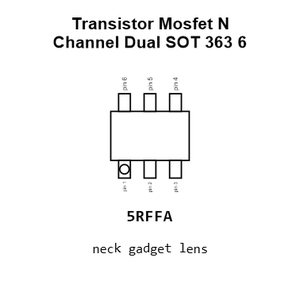

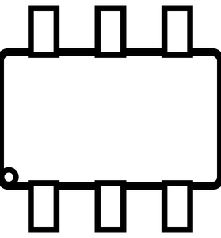

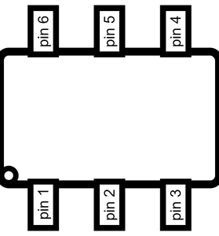

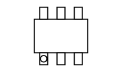

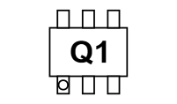

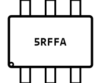

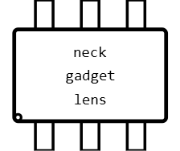

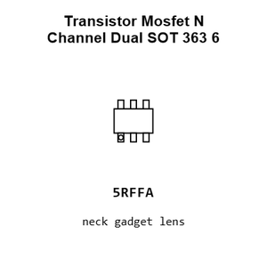

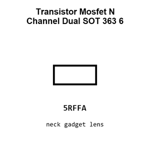

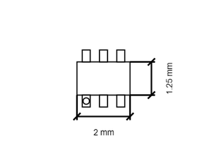

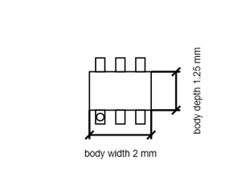

[View this part on GitHub](https://github.com/oomlout/oomp_electronic_version_5/tree/main/parts/electronic_transistor_sot_363_6_mosfet_n_channel_dual)

[Browse this category](../../navigation/electronic/transistor/sot_363_6/mosfet/n_channel/README.md)

---

This page is generated from the OOMP part definition by a Roboclick Jinja template. Edit the source taxonomy or template rather than this generated file.