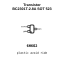
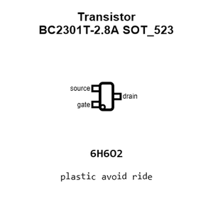
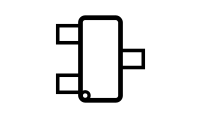
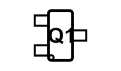
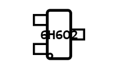
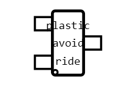
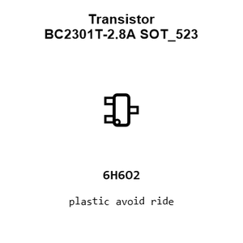
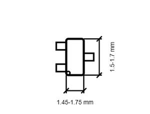
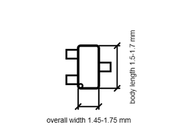

# Transistor BC2301T-2.8A SOT 523

`electronic_transistor_sot_523_mosfet_p_channel_enhancement_mode_20_volt_2_8_amp_cbi_bc2301t_2_8a`

Transistor BC2301T-2.8A SOT 523 is an OOMP electronic transistor definition. It uses the sot 523 package or form factor. Its nominal drawing size is 1.6 &#x00D7; 1.6 mm. The definition includes 3 documented pins.

## At a glance

| Detail | Value |
| --- | --- |
| OOMP ID | `electronic_transistor_sot_523_mosfet_p_channel_enhancement_mode_20_volt_2_8_amp_cbi_bc2301t_2_8a` |
| Type | Transistor |
| Package / style | sot 523 |
| Nominal size | 1.6 &#x00D7; 1.6 mm |
| Documented pins | 3 |

## Classification

| Level | Value |
| --- | --- |
| 1 | `electronic` |
| 2 | `transistor` |
| 3 | `sot_523` |
| 4 | `mosfet` |
| 5 | `p_channel` |
| 6 | `enhancement_mode` |
| 7 | `20_volt` |
| 8 | `2_8_amp` |
| 14 | `cbi` |
| 15 | `bc2301t_2_8a` |

## Nominal dimensions

| Measurement | Value |
| --- | ---: |
| Length | 1.6 mm |
| Width | 1.6 mm |

## Identifiers

| Identifier | Value |
| --- | --- |
| Manufacturer part number | `BC2301T-2.8A` |

## Pins

| Pin | Name | Type |
| ---: | --- | --- |
| 1 | gate | input |
| 2 | source | passive |
| 3 | drain | passive |

## Datasheet

[View the datasheet](data/datasheet.pdf)

## Files

[KiCad symbol, machine-solder and hand-solder footprints](data/kicad/README.md) · [Availability and source masters](data/kicad/manifest.yaml)

[View this part on GitHub](https://github.com/oomlout/oomp_electronic_version_5/tree/main/parts/electronic_transistor_sot_523_mosfet_p_channel_enhancement_mode_20_volt_2_8_amp_cbi_bc2301t_2_8a)

[Browse this category](../../navigation/electronic/transistor/sot_523/mosfet/p_channel/enhancement_mode/20_volt/2_8_amp/cbi/README.md)

---

This page is generated from the OOMP part definition by a Roboclick Jinja template. Edit the source taxonomy or template rather than this generated file.