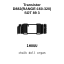
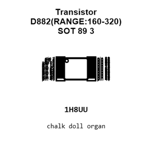
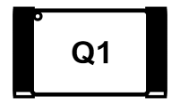
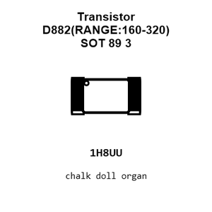
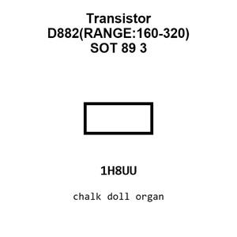
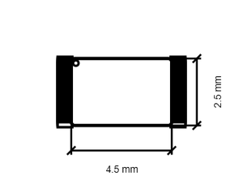
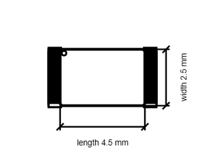

# Transistor D882(RANGE:160-320) SOT 89 3

`electronic_transistor_sot_89_3_bipolar_npn_30_volt_3_amp_jiangsu_changjing_electronics_technology_co_ltd_d882_range_160_320`

Transistor D882(RANGE:160-320) SOT 89 3 is an OOMP electronic transistor definition. It uses the sot 89 3 package or form factor. Its nominal drawing size is 4.5 &#x00D7; 2.5 mm.

## At a glance

| Detail | Value |
| --- | --- |
| OOMP ID | `electronic_transistor_sot_89_3_bipolar_npn_30_volt_3_amp_jiangsu_changjing_electronics_technology_co_ltd_d882_range_160_320` |
| Type | Transistor |
| Package / style | sot 89 3 |
| Nominal size | 4.5 &#x00D7; 2.5 mm |

## Classification

| Level | Value |
| --- | --- |
| 1 | `electronic` |
| 2 | `transistor` |
| 3 | `sot_89_3` |
| 4 | `bipolar` |
| 5 | `npn` |
| 6 | `30_volt` |
| 7 | `3_amp` |
| 14 | `jiangsu_changjing_electronics_technology_co_ltd` |
| 15 | `d882_range_160_320` |

## Nominal dimensions

| Measurement | Value |
| --- | ---: |
| Length | 4.5 mm |
| Width | 2.5 mm |

## Identifiers

| Identifier | Value |
| --- | --- |
| Manufacturer part number | `D882(RANGE:160-320)` |
| LCSC | [`C9634`](https://www.lcsc.com/product-detail/C9634.html) |
| JLCPCB | [`C9634`](https://jlcpcb.com/partdetail/10164-D882_RANGE_160_320/C9634) |

## Files

[KiCad symbol, machine-solder and hand-solder footprints](data/kicad/README.md) · [Availability and source masters](data/kicad/manifest.yaml)

[View this part on GitHub](https://github.com/oomlout/oomp_electronic_version_5/tree/main/parts/electronic_transistor_sot_89_3_bipolar_npn_30_volt_3_amp_jiangsu_changjing_electronics_technology_co_ltd_d882_range_160_320)

[Browse this category](../../navigation/electronic/transistor/sot_89_3/bipolar/npn/30_volt/3_amp/jiangsu_changjing_electronics_technology_co_ltd/README.md)

---

This page is generated from the OOMP part definition by a Roboclick Jinja template. Edit the source taxonomy or template rather than this generated file.