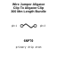
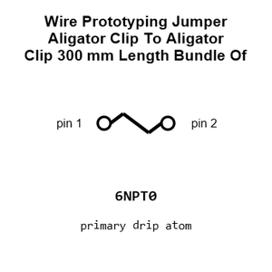
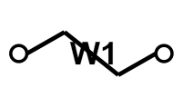
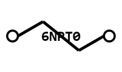
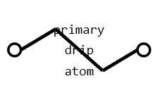
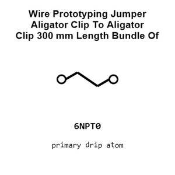
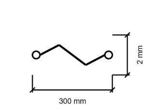
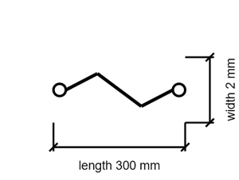

# Wire Jumper Aligator Clip To Aligator Clip PROTOTYPING

`electronic_wire_prototyping_jumper_aligator_clip_to_aligator_clip_300_mm_length_bundle_of_7`

Wire Jumper Aligator Clip To Aligator Clip PROTOTYPING is an OOMP electronic wire definition. It uses the prototyping package or form factor. Its nominal drawing size is 300 &#x00D7; 2.0 mm.

## At a glance

| Detail | Value |
| --- | --- |
| OOMP ID | `electronic_wire_prototyping_jumper_aligator_clip_to_aligator_clip_300_mm_length_bundle_of_7` |
| Type | Wire |
| Package / style | prototyping |
| Nominal size | 300 &#x00D7; 2.0 mm |

## Classification

| Level | Value |
| --- | --- |
| 1 | `electronic` |
| 2 | `wire` |
| 3 | `prototyping` |
| 4 | `jumper` |
| 5 | `aligator_clip` |
| 6 | `to_aligator_clip` |
| 7 | `300_mm_length` |
| 8 | `bundle_of_7` |

## Nominal dimensions

| Measurement | Value |
| --- | ---: |
| Length | 300 mm |
| Width | 2.0 mm |

## Files

[View this part on GitHub](https://github.com/oomlout/oomp_electronic_version_5/tree/main/parts/electronic_wire_prototyping_jumper_aligator_clip_to_aligator_clip_300_mm_length_bundle_of_7)

[Browse this category](../../navigation/electronic/wire/prototyping/jumper/aligator_clip/to_aligator_clip/300_mm_length/README.md)

---

This page is generated from the OOMP part definition by a Roboclick Jinja template. Edit the source taxonomy or template rather than this generated file.