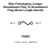
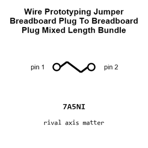
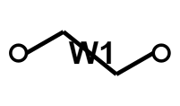
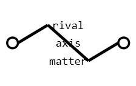
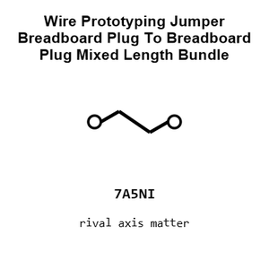
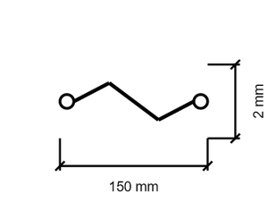
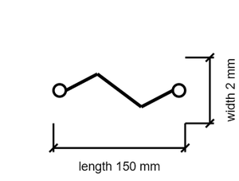

# Wire Prototyping Jumper Breadboard Plug To Breadboard Plug Mixed Length Bundle Rainbow 75 Pieces

`electronic_wire_prototyping_jumper_breadboard_plug_to_breadboard_plug_mixed_length_bundle_rainbow_75_pieces`

Wire Prototyping Jumper Breadboard Plug To Breadboard Plug Mixed Length Bundle Rainbow 75 Pieces is an OOMP electronic wire definition. It uses the prototyping package or form factor. Its nominal drawing size is 150 × 2.0 mm.

## At a glance

| Detail | Value |
| --- | --- |
| OOMP ID | `electronic_wire_prototyping_jumper_breadboard_plug_to_breadboard_plug_mixed_length_bundle_rainbow_75_pieces` |
| Type | Wire |
| Package / style | prototyping |
| Nominal size | 150 × 2.0 mm |

## Classification

| Level | Value |
| --- | --- |
| 1 | `electronic` |
| 2 | `wire` |
| 3 | `prototyping` |
| 4 | `jumper` |
| 5 | `breadboard_plug` |
| 6 | `to_breadboard_plug` |
| 7 | `mixed_length` |
| 8 | `bundle_rainbow_75_pieces` |

## Nominal dimensions

| Measurement | Value |
| --- | ---: |
| Length | 150 mm |
| Width | 2.0 mm |

## Files

[View this part on GitHub](https://github.com/oomlout/oomp_electronic_version_5/tree/main/parts/electronic_wire_prototyping_jumper_breadboard_plug_to_breadboard_plug_mixed_length_bundle_rainbow_75_pieces)

---

This page is generated from the OOMP part definition by a Roboclick Jinja template. Edit the source taxonomy or template rather than this generated file.
