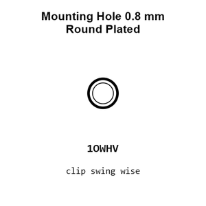
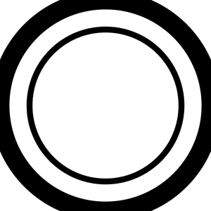
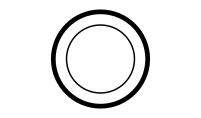
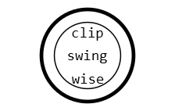
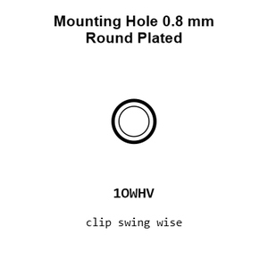
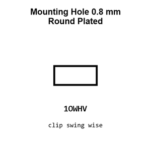
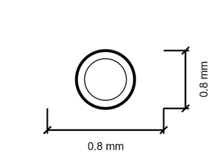
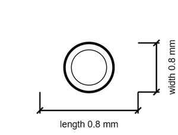

# Mounting Hole 0.8 mm Round Plated

`mechanical_mounting_hole_0_8_mm_round_plated`

Mounting Hole 0.8 mm Round Plated is an OOMP mechanical mounting hole definition. It uses the 0 8 mm package or form factor. Its nominal drawing size is 0.8 &#x00D7; 0.8 mm.

## At a glance

| Detail | Value |
| --- | --- |
| OOMP ID | `mechanical_mounting_hole_0_8_mm_round_plated` |
| Type | Mounting Hole |
| Package / style | 0 8 mm |
| Nominal size | 0.8 &#x00D7; 0.8 mm |

## Classification

| Level | Value |
| --- | --- |
| 1 | `mechanical` |
| 2 | `mounting_hole` |
| 3 | `0_8_mm` |
| 4 | `round` |
| 5 | `plated` |

## Nominal dimensions

| Measurement | Value |
| --- | ---: |
| Length | 0.8 mm |
| Width | 0.8 mm |

## Used in projects

| Project | Quantity | References | Explore |
| --- | ---: | --- | --- |
| [Project adafruit/Adafruit-LED-Backpacks Adafruit 0.56 7 Segment QT current](https://github.com/adafruit/Adafruit-LED-Backpacks/blob/master/Adafruit%200.56%207-Segment%20QT.brd) | 14 | MH1, MH2, MH3, MH4, MH5, MH6, MH7, MH8, MH9, MH10, MH11, MH12, MH13, MH14 | [Board explorer](https://oomlout.github.io/oomp_electronic_version_5/parts/oomp_project_github_adafruit_adafruit_led_backpacks_adafruit_0_56_7_segment_qt_current/board_explorer.html) · [OOMP project](https://github.com/oomlout/oomp_electronic_version_5/tree/main/parts/oomp_project_github_adafruit_adafruit_led_backpacks_adafruit_0_56_7_segment_qt_current) |
| [Project adafruit/Adafruit-LED-Backpacks Adafruit 7seg backpack current](https://github.com/adafruit/Adafruit-LED-Backpacks/blob/master/Adafruit%207seg%20backpack.brd) | 14 | MH1, MH2, MH3, MH4, MH5, MH6, MH7, MH8, MH9, MH10, MH11, MH12, MH13, MH14 | [Board explorer](https://oomlout.github.io/oomp_electronic_version_5/parts/oomp_project_github_adafruit_adafruit_led_backpacks_adafruit_7seg_backpack_current/board_explorer.html) · [OOMP project](https://github.com/oomlout/oomp_electronic_version_5/tree/main/parts/oomp_project_github_adafruit_adafruit_led_backpacks_adafruit_7seg_backpack_current) |
| [Project electrolama/pt1 current](https://github.com/electrolama/pt1) | 2 | MH5, MH6 | [Board explorer](https://oomlout.github.io/oomp_electronic_version_5/parts/oomp_project_github_electrolama_pt1_current/board_explorer.html) · [OOMP project](https://github.com/oomlout/oomp_electronic_version_5/tree/main/parts/oomp_project_github_electrolama_pt1_current) |
| [Project sparkfun/Bar_Graph_Breakout_Kit Spark Fun Bar Graph Breakout current](https://github.com/sparkfun/Bar_Graph_Breakout_Kit/blob/master/Hardware/SparkFun_Bar_Graph_Breakout.brd) | 36 | MH3, MH4, MH5, MH6, MH7, MH8, MH9, MH10, MH11, MH12, MH13, MH14, MH15, MH16, MH17, MH18, MH19, MH20, MH21, MH22, MH23, MH24, MH25, MH26, MH27, MH28, MH29, MH30, MH31, MH32, MH33, MH34, MH35, MH36, MH37, MH38 | [Board explorer](https://oomlout.github.io/oomp_electronic_version_5/parts/oomp_project_github_sparkfun_bar_graph_breakout_kit_spark_fun_bar_graph_breakout_current/board_explorer.html) · [OOMP project](https://github.com/oomlout/oomp_electronic_version_5/tree/main/parts/oomp_project_github_sparkfun_bar_graph_breakout_kit_spark_fun_bar_graph_breakout_current) |
| [Project sparkfun/Breadboard_Power_Supply_5V_3.3V Spark Fun Breadboard Power Supply 5 3.3 V current](https://github.com/sparkfun/Breadboard_Power_Supply_5V_3.3V/blob/master/Hardware/SparkFun_Breadboard_Power_Supply_5_3.3V.brd) | 2 | MH1, MH2 | [Board explorer](https://oomlout.github.io/oomp_electronic_version_5/parts/oomp_project_github_sparkfun_breadboard_power_supply_5_v_3_3_v_spark_fun_breadboard_power_supply_5_3_3_v_current/board_explorer.html) · [OOMP project](https://github.com/oomlout/oomp_electronic_version_5/tree/main/parts/oomp_project_github_sparkfun_breadboard_power_supply_5_v_3_3_v_spark_fun_breadboard_power_supply_5_3_3_v_current) |
| [Project sparkfun/MicroView_USB_Programmer Spark Fun Micro View USB current](https://github.com/sparkfun/MicroView_USB_Programmer/blob/master/Hardware/SparkFun_MicroViewUSB.brd) | 2 | MH3, MH4 | [Board explorer](https://oomlout.github.io/oomp_electronic_version_5/parts/oomp_project_github_sparkfun_micro_view_usb_programmer_spark_fun_micro_view_usb_current/board_explorer.html) · [OOMP project](https://github.com/oomlout/oomp_electronic_version_5/tree/main/parts/oomp_project_github_sparkfun_micro_view_usb_programmer_spark_fun_micro_view_usb_current) |

## Files

[KiCad symbol, machine-solder and hand-solder footprints](data/kicad/README.md) · [Availability and source masters](data/kicad/manifest.yaml)

[View this part on GitHub](https://github.com/oomlout/oomp_electronic_version_5/tree/main/parts/mechanical_mounting_hole_0_8_mm_round_plated)

[Browse this category](../../navigation/mechanical/mounting_hole/0_8_mm/round/README.md)

---

This page is generated from the OOMP part definition by a Roboclick Jinja template. Edit the source taxonomy or template rather than this generated file.