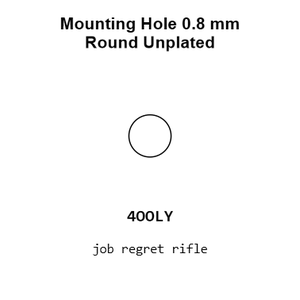
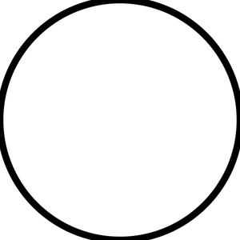
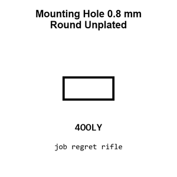
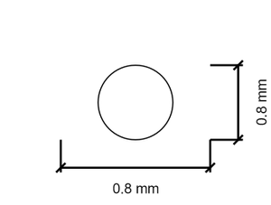
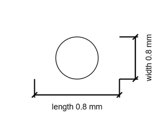

# Mounting Hole 0.8 mm Round Unplated

`mechanical_mounting_hole_0_8_mm_round_unplated`

Mounting Hole 0.8 mm Round Unplated is an OOMP mechanical mounting hole definition. It uses the 0 8 mm package or form factor. Its nominal drawing size is 0.8 &#x00D7; 0.8 mm.

## At a glance

| Detail | Value |
| --- | --- |
| OOMP ID | `mechanical_mounting_hole_0_8_mm_round_unplated` |
| Type | Mounting Hole |
| Package / style | 0 8 mm |
| Nominal size | 0.8 &#x00D7; 0.8 mm |

## Classification

| Level | Value |
| --- | --- |
| 1 | `mechanical` |
| 2 | `mounting_hole` |
| 3 | `0_8_mm` |
| 4 | `round` |
| 5 | `unplated` |

## Nominal dimensions

| Measurement | Value |
| --- | ---: |
| Length | 0.8 mm |
| Width | 0.8 mm |

## Used in projects

| Project | Quantity | References | Explore |
| --- | ---: | --- | --- |
| [Project adafruit/Adafruit-128x32-SPI-OLED-breakout-board-PCB Adafruit OLED 128x32 Mono current](https://github.com/adafruit/Adafruit-128x32-SPI-OLED-breakout-board-PCB/blob/master/Adafruit%20OLED%20128x32%20Mono.brd) | 2 | MH1, MH2 | [Board explorer](https://oomlout.github.io/oomp_electronic_version_5/parts/oomp_project_github_adafruit_adafruit_128x32_spi_oled_breakout_board_pcb_adafruit_oled_128x32_mono_current/board_explorer.html) · [OOMP project](https://github.com/oomlout/oomp_electronic_version_5/tree/main/parts/oomp_project_github_adafruit_adafruit_128x32_spi_oled_breakout_board_pcb_adafruit_oled_128x32_mono_current) |
| [Project adafruit/Adafruit-MatrixPortal-M4-PCB Adafruit Matrix Portal M4 current](https://github.com/adafruit/Adafruit-MatrixPortal-M4-PCB/blob/main/Adafruit%20MatrixPortal%20M4.brd) | 4 | MH9, MH10, MH13, MH14 | [Board explorer](https://oomlout.github.io/oomp_electronic_version_5/parts/oomp_project_github_adafruit_adafruit_matrix_portal_m4_pcb_adafruit_matrix_portal_m4_current/board_explorer.html) · [OOMP project](https://github.com/oomlout/oomp_electronic_version_5/tree/main/parts/oomp_project_github_adafruit_adafruit_matrix_portal_m4_pcb_adafruit_matrix_portal_m4_current) |
| [Project sparkfun/2D_Barcode_Scanner_Breakout 2 DBarcode Scanner current](https://github.com/sparkfun/2D_Barcode_Scanner_Breakout/blob/main/Hardware/2DBarcodeScanner.brd) | 2 | MH5, MH6 | [Board explorer](https://oomlout.github.io/oomp_electronic_version_5/parts/oomp_project_github_sparkfun_2_d_barcode_scanner_breakout_2_dbarcode_scanner_current/board_explorer.html) · [OOMP project](https://github.com/oomlout/oomp_electronic_version_5/tree/main/parts/oomp_project_github_sparkfun_2_d_barcode_scanner_breakout_2_dbarcode_scanner_current) |
| [Project sparkfun/MicroMod_Machine_Learning_Carrier Machine Learning MM Carrier current](https://github.com/sparkfun/MicroMod_Machine_Learning_Carrier/blob/master/Hardware/MachineLearning-MM-Carrier.brd) | 1 | MH1 | [Board explorer](https://oomlout.github.io/oomp_electronic_version_5/parts/oomp_project_github_sparkfun_micro_mod_machine_learning_carrier_machine_learning_mm_carrier_current/board_explorer.html) · [OOMP project](https://github.com/oomlout/oomp_electronic_version_5/tree/main/parts/oomp_project_github_sparkfun_micro_mod_machine_learning_carrier_machine_learning_mm_carrier_current) |
| [Project sparkfun/Micro_OLED_Breakout Spark Fun Micro OLED Breakout current](https://github.com/sparkfun/Micro_OLED_Breakout/blob/master/Hardware/SparkFun_Micro-OLED_Breakout.brd) | 2 | MH1, MH2 | [Board explorer](https://oomlout.github.io/oomp_electronic_version_5/parts/oomp_project_github_sparkfun_micro_oled_breakout_spark_fun_micro_oled_breakout_current/board_explorer.html) · [OOMP project](https://github.com/oomlout/oomp_electronic_version_5/tree/main/parts/oomp_project_github_sparkfun_micro_oled_breakout_spark_fun_micro_oled_breakout_current) |
| [Project sparkfun/MicroView_USB_Programmer Spark Fun Micro View USB current](https://github.com/sparkfun/MicroView_USB_Programmer/blob/master/Hardware/SparkFun_MicroViewUSB.brd) | 8 | MH1, MH2, MH5, MH6, MH7, MH10, MH11, MH12 | [Board explorer](https://oomlout.github.io/oomp_electronic_version_5/parts/oomp_project_github_sparkfun_micro_view_usb_programmer_spark_fun_micro_view_usb_current/board_explorer.html) · [OOMP project](https://github.com/oomlout/oomp_electronic_version_5/tree/main/parts/oomp_project_github_sparkfun_micro_view_usb_programmer_spark_fun_micro_view_usb_current) |
| [Project sparkfun/ProtoSnap-LilyPad_Development_Board Lily Pad Dev current](https://github.com/sparkfun/ProtoSnap-LilyPad_Development_Board/blob/master/Hardware/LilyPad-Dev-v34.brd) | 2 | MH1, MH2 | [Board explorer](https://oomlout.github.io/oomp_electronic_version_5/parts/oomp_project_github_sparkfun_proto_snap_lily_pad_development_board_lily_pad_dev_current/board_explorer.html) · [OOMP project](https://github.com/oomlout/oomp_electronic_version_5/tree/main/parts/oomp_project_github_sparkfun_proto_snap_lily_pad_development_board_lily_pad_dev_current) |
| [Project sparkfun/RedBoard_Artemis_Nano Red Board Artemis Nano current](https://github.com/sparkfun/RedBoard_Artemis_Nano/blob/master/Hardware/RedBoard-Artemis-Nano.brd) | 1 | MH1 | [Board explorer](https://oomlout.github.io/oomp_electronic_version_5/parts/oomp_project_github_sparkfun_red_board_artemis_nano_red_board_artemis_nano_current/board_explorer.html) · [OOMP project](https://github.com/oomlout/oomp_electronic_version_5/tree/main/parts/oomp_project_github_sparkfun_red_board_artemis_nano_red_board_artemis_nano_current) |
| [Project sparkfun/Simultaneous_RFID_Tag_Reader Simultaneous RFID Tag Reader current](https://github.com/sparkfun/Simultaneous_RFID_Tag_Reader/blob/master/Hardware/Simultaneous_RFID_Tag_Reader.brd) | 2 | MH3, MH4 | [Board explorer](https://oomlout.github.io/oomp_electronic_version_5/parts/oomp_project_github_sparkfun_simultaneous_rfid_tag_reader_simultaneous_rfid_tag_reader_current/board_explorer.html) · [OOMP project](https://github.com/oomlout/oomp_electronic_version_5/tree/main/parts/oomp_project_github_sparkfun_simultaneous_rfid_tag_reader_simultaneous_rfid_tag_reader_current) |
| [Project sparkfun/SparkFun_RTK_Facet Spark Fun RTK Facet Display SD current](https://github.com/sparkfun/SparkFun_RTK_Facet/blob/main/Hardware/Display/SparkFun%20RTK%20Facet%20-%20Display%20SD.brd) | 2 | MH4, MH5 | [Board explorer](https://oomlout.github.io/oomp_electronic_version_5/parts/oomp_project_github_sparkfun_spark_fun_rtk_facet_display_spark_fun_rtk_facet_display_sd_current/board_explorer.html) · [OOMP project](https://github.com/oomlout/oomp_electronic_version_5/tree/main/parts/oomp_project_github_sparkfun_spark_fun_rtk_facet_display_spark_fun_rtk_facet_display_sd_current) |
| [Project sparkfun/SparkFun_RTK_Facet Spark Fun RTK Facet Display SD current](https://github.com/sparkfun/SparkFun_RTK_Facet/blob/main/Hardware/Display/KiCad/SparkFun%20RTK%20Facet%20-%20Display%20SD.kicad_pcb) | 2 | MH4, MH5 | [Board explorer](https://oomlout.github.io/oomp_electronic_version_5/parts/oomp_project_github_sparkfun_spark_fun_rtk_facet_spark_fun_rtk_facet_display_sd_current/board_explorer.html) · [OOMP project](https://github.com/oomlout/oomp_electronic_version_5/tree/main/parts/oomp_project_github_sparkfun_spark_fun_rtk_facet_spark_fun_rtk_facet_display_sd_current) |

## Files

[KiCad symbol, machine-solder and hand-solder footprints](data/kicad/README.md) · [Availability and source masters](data/kicad/manifest.yaml)

[View this part on GitHub](https://github.com/oomlout/oomp_electronic_version_5/tree/main/parts/mechanical_mounting_hole_0_8_mm_round_unplated)

[Browse this category](../../navigation/mechanical/mounting_hole/0_8_mm/round/README.md)

---

This page is generated from the OOMP part definition by a Roboclick Jinja template. Edit the source taxonomy or template rather than this generated file.