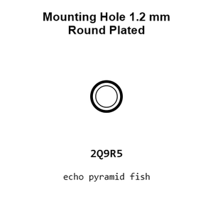
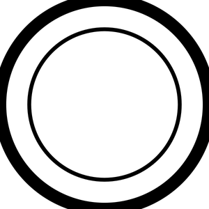
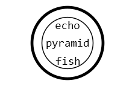
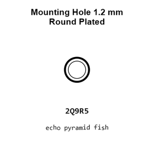
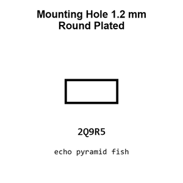
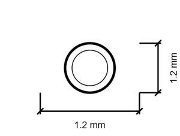
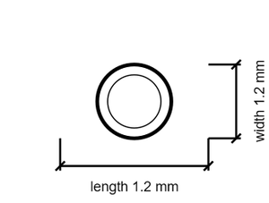

# Mounting Hole 1.2 mm Round Plated

`mechanical_mounting_hole_1_2_mm_round_plated`

Mounting Hole 1.2 mm Round Plated is an OOMP mechanical mounting hole definition. It uses the 1 2 mm package or form factor. Its nominal drawing size is 1.2 &#x00D7; 1.2 mm.

## At a glance

| Detail | Value |
| --- | --- |
| OOMP ID | `mechanical_mounting_hole_1_2_mm_round_plated` |
| Type | Mounting Hole |
| Package / style | 1 2 mm |
| Nominal size | 1.2 &#x00D7; 1.2 mm |

## Classification

| Level | Value |
| --- | --- |
| 1 | `mechanical` |
| 2 | `mounting_hole` |
| 3 | `1_2_mm` |
| 4 | `round` |
| 5 | `plated` |

## Nominal dimensions

| Measurement | Value |
| --- | ---: |
| Length | 1.2 mm |
| Width | 1.2 mm |

## Used in projects

| Project | Quantity | References | Explore |
| --- | ---: | --- | --- |
| [Project adafruit/Adafruit-Proto-Shield-PCB Adafruit Proto Shield current](https://github.com/adafruit/Adafruit-Proto-Shield-PCB/blob/master/Adafruit%20Proto%20Shield.brd) | 88 | MH1, MH2, MH3, MH4, MH5, MH6, MH7, MH8, MH9, MH10, MH11, MH12, MH13, MH14, MH15, MH16, MH17, MH18, MH19, MH20, MH21, MH22, MH23, MH24, MH30, MH31, MH32, MH33, MH34, MH35, MH36, MH37, MH38, MH39, MH40, MH41, MH42, MH43, MH44, MH45, MH46, MH47, MH48, MH49, MH50, MH51, MH52, MH53, MH54, MH55, MH61, MH62, MH63, MH64, MH65, MH66, MH67, MH68, MH69, MH70, MH71, MH72, MH73, MH74, MH82, MH83, MH84, MH85, MH86, MH87, MH88, MH89, MH90, MH91, MH92, MH93, MH94, MH95, MH96, MH97, MH98, MH99, MH100, MH101, MH102, MH103, MH104, MH105 | [Board explorer](https://oomlout.github.io/oomp_electronic_version_5/parts/oomp_project_github_adafruit_adafruit_proto_shield_pcb_adafruit_proto_shield_current/board_explorer.html) · [OOMP project](https://github.com/oomlout/oomp_electronic_version_5/tree/main/parts/oomp_project_github_adafruit_adafruit_proto_shield_pcb_adafruit_proto_shield_current) |

## Files

[KiCad symbol, machine-solder and hand-solder footprints](data/kicad/README.md) · [Availability and source masters](data/kicad/manifest.yaml)

[View this part on GitHub](https://github.com/oomlout/oomp_electronic_version_5/tree/main/parts/mechanical_mounting_hole_1_2_mm_round_plated)

[Browse this category](../../navigation/mechanical/mounting_hole/1_2_mm/round/README.md)

---

This page is generated from the OOMP part definition by a Roboclick Jinja template. Edit the source taxonomy or template rather than this generated file.