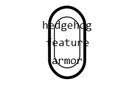
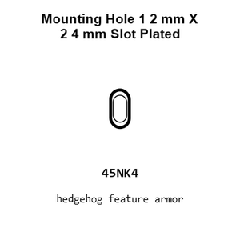
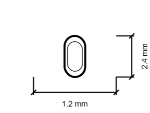
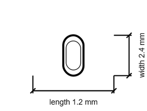

# Mounting Hole 1 2 mm X 2 4 mm Slot Plated

`mechanical_mounting_hole_1_2_mm_x_2_4_mm_slot_plated`

Mounting Hole 1 2 mm X 2 4 mm Slot Plated is an OOMP mechanical mounting hole definition. It uses the 1 2 mm x 2 4 mm package or form factor. Its nominal drawing size is 1.2 &#x00D7; 2.4 mm.

## At a glance

| Detail | Value |
| --- | --- |
| OOMP ID | `mechanical_mounting_hole_1_2_mm_x_2_4_mm_slot_plated` |
| Type | Mounting Hole |
| Package / style | 1 2 mm x 2 4 mm |
| Nominal size | 1.2 &#x00D7; 2.4 mm |

## Classification

| Level | Value |
| --- | --- |
| 1 | `mechanical` |
| 2 | `mounting_hole` |
| 3 | `1_2_mm_x_2_4_mm` |
| 4 | `slot` |
| 5 | `plated` |

## Nominal dimensions

| Measurement | Value |
| --- | ---: |
| Length | 1.2 mm |
| Width | 2.4 mm |

## Files

[View this part on GitHub](https://github.com/oomlout/oomp_electronic_version_5/tree/main/parts/mechanical_mounting_hole_1_2_mm_x_2_4_mm_slot_plated)

---

This page is generated from the OOMP part definition by a Roboclick Jinja template. Edit the source taxonomy or template rather than this generated file.