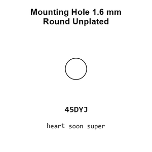
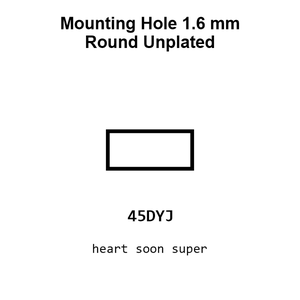
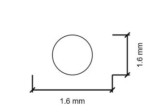
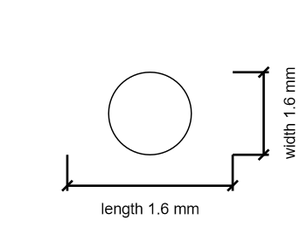

# Mounting Hole 1.6 mm Round Unplated

`mechanical_mounting_hole_1_6_mm_round_unplated`

Mounting Hole 1.6 mm Round Unplated is an OOMP mechanical mounting hole definition. It uses the 1 6 mm package or form factor. Its nominal drawing size is 1.6 &#x00D7; 1.6 mm.

## At a glance

| Detail | Value |
| --- | --- |
| OOMP ID | `mechanical_mounting_hole_1_6_mm_round_unplated` |
| Type | Mounting Hole |
| Package / style | 1 6 mm |
| Nominal size | 1.6 &#x00D7; 1.6 mm |

## Classification

| Level | Value |
| --- | --- |
| 1 | `mechanical` |
| 2 | `mounting_hole` |
| 3 | `1_6_mm` |
| 4 | `round` |
| 5 | `unplated` |

## Nominal dimensions

| Measurement | Value |
| --- | ---: |
| Length | 1.6 mm |
| Width | 1.6 mm |

## Used in projects

| Project | Quantity | References | Explore |
| --- | ---: | --- | --- |
| [Project adafruit/Adafruit-ANO-Rotary-Navigation-Encoder-Breakout-PCB Adafruit ANO Rotary Encoder Breakout current](https://github.com/adafruit/Adafruit-ANO-Rotary-Navigation-Encoder-Breakout-PCB/blob/main/Adafruit%20ANO%20Rotary%20Encoder%20Breakout.brd) | 2 | MH7, MH8 | [Board explorer](https://oomlout.github.io/oomp_electronic_version_5/parts/oomp_project_github_adafruit_adafruit_ano_rotary_navigation_encoder_breakout_pcb_adafruit_ano_rotary_encoder_breakout_current/board_explorer.html) · [OOMP project](https://github.com/oomlout/oomp_electronic_version_5/tree/main/parts/oomp_project_github_adafruit_adafruit_ano_rotary_navigation_encoder_breakout_pcb_adafruit_ano_rotary_encoder_breakout_current) |
| [Project adafruit/Adafruit-ANO-Rotary-Navigation-Encoder-to-I2C Adafruit ANO Rotary Encoder to I2 C current](https://github.com/adafruit/Adafruit-ANO-Rotary-Navigation-Encoder-to-I2C/blob/main/Adafruit%20ANO%20Rotary%20Encoder%20to%20I2C.brd) | 2 | MH7, MH8 | [Board explorer](https://oomlout.github.io/oomp_electronic_version_5/parts/oomp_project_github_adafruit_adafruit_ano_rotary_navigation_encoder_to_i2_c_adafruit_ano_rotary_encoder_to_i2_c_current/board_explorer.html) · [OOMP project](https://github.com/oomlout/oomp_electronic_version_5/tree/main/parts/oomp_project_github_adafruit_adafruit_ano_rotary_navigation_encoder_to_i2_c_adafruit_ano_rotary_encoder_to_i2_c_current) |
| [Project adafruit/Adafruit-BQ24074-PCB Adafruit BQ24074 current](https://github.com/adafruit/Adafruit-BQ24074-PCB/blob/master/Adafruit_BQ24074.brd) | 1 | MH7 | [Board explorer](https://oomlout.github.io/oomp_electronic_version_5/parts/oomp_project_github_adafruit_adafruit_bq24074_pcb_adafruit_bq24074_current/board_explorer.html) · [OOMP project](https://github.com/oomlout/oomp_electronic_version_5/tree/main/parts/oomp_project_github_adafruit_adafruit_bq24074_pcb_adafruit_bq24074_current) |
| [Project adafruit/Adafruit-METRO-328-PCB Metro THM+LDO current](https://github.com/adafruit/Adafruit-METRO-328-PCB/blob/master/Metro%20THM%2BLDO%20Rev%20B.brd) | 1 | MH7 | [Board explorer](https://oomlout.github.io/oomp_electronic_version_5/parts/oomp_project_github_adafruit_adafruit_metro_328_pcb_metro_thm_ldo_current/board_explorer.html) · [OOMP project](https://github.com/oomlout/oomp_electronic_version_5/tree/main/parts/oomp_project_github_adafruit_adafruit_metro_328_pcb_metro_thm_ldo_current) |
| [Project adafruit/Adafruit-Mini-I2C-Gamepad-PCB Gamepad Seesaw QT current](https://github.com/adafruit/Adafruit-Mini-I2C-Gamepad-PCB/blob/main/Gamepad%20Seesaw%20QT%20rev%20A.brd) | 2 | MH1, MH2 | [Board explorer](https://oomlout.github.io/oomp_electronic_version_5/parts/oomp_project_github_adafruit_adafruit_mini_i2_c_gamepad_pcb_gamepad_seesaw_qt_current/board_explorer.html) · [OOMP project](https://github.com/oomlout/oomp_electronic_version_5/tree/main/parts/oomp_project_github_adafruit_adafruit_mini_i2_c_gamepad_pcb_gamepad_seesaw_qt_current) |
| [Project sparkfun/SparkFun_Roller_Encoder_Breakout Roller Encoder Breakout current](https://github.com/sparkfun/SparkFun_Roller_Encoder_Breakout) | 1 | MH5 | [Board explorer](https://oomlout.github.io/oomp_electronic_version_5/parts/oomp_project_github_sparkfun_spark_fun_roller_encoder_breakout_roller_encoder_breakout_current/board_explorer.html) · [OOMP project](https://github.com/oomlout/oomp_electronic_version_5/tree/main/parts/oomp_project_github_sparkfun_spark_fun_roller_encoder_breakout_roller_encoder_breakout_current) |

## Files

[KiCad symbol, machine-solder and hand-solder footprints](data/kicad/README.md) · [Availability and source masters](data/kicad/manifest.yaml)

[View this part on GitHub](https://github.com/oomlout/oomp_electronic_version_5/tree/main/parts/mechanical_mounting_hole_1_6_mm_round_unplated)

[Browse this category](../../navigation/mechanical/mounting_hole/1_6_mm/round/README.md)

---

This page is generated from the OOMP part definition by a Roboclick Jinja template. Edit the source taxonomy or template rather than this generated file.