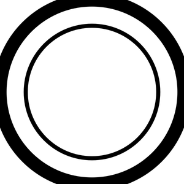
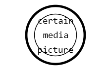
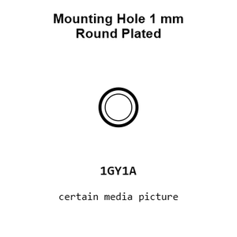
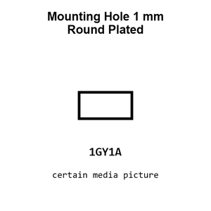
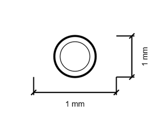
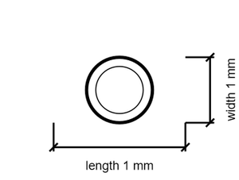

# Mounting Hole 1 mm Round Plated

`mechanical_mounting_hole_1_mm_round_plated`

Mounting Hole 1 mm Round Plated is an OOMP mechanical mounting hole definition. It uses the 1 mm package or form factor. Its nominal drawing size is 1.0 &#x00D7; 1.0 mm.

## At a glance

| Detail | Value |
| --- | --- |
| OOMP ID | `mechanical_mounting_hole_1_mm_round_plated` |
| Type | Mounting Hole |
| Package / style | 1 mm |
| Nominal size | 1.0 &#x00D7; 1.0 mm |

## Classification

| Level | Value |
| --- | --- |
| 1 | `mechanical` |
| 2 | `mounting_hole` |
| 3 | `1_mm` |
| 4 | `round` |
| 5 | `plated` |

## Nominal dimensions

| Measurement | Value |
| --- | ---: |
| Length | 1.0 mm |
| Width | 1.0 mm |

## Used in projects

| Project | Quantity | References | Explore |
| --- | ---: | --- | --- |
| [Project adafruit/Adafruit-I2C-QT-Rotary-Encoder-PCB Adafruit I2 C QT Rotary Encoder current](https://github.com/adafruit/Adafruit-I2C-QT-Rotary-Encoder-PCB/blob/main/Adafruit%20I2C%20QT%20Rotary%20Encoder.brd) | 5 | MH1, MH2, MH3, MH4, MH5 | [Board explorer](https://oomlout.github.io/oomp_electronic_version_5/parts/oomp_project_github_adafruit_adafruit_i2_c_qt_rotary_encoder_pcb_adafruit_i2_c_qt_rotary_encoder_current/board_explorer.html) · [OOMP project](https://github.com/oomlout/oomp_electronic_version_5/tree/main/parts/oomp_project_github_adafruit_adafruit_i2_c_qt_rotary_encoder_pcb_adafruit_i2_c_qt_rotary_encoder_current) |
| [Project adafruit/Adafruit-I2C-Quad-Rotary-Encoder-Breakout-PCB Adafruit I2 C Quad Rotary Encoder Breakout current](https://github.com/adafruit/Adafruit-I2C-Quad-Rotary-Encoder-Breakout-PCB/blob/main/Adafruit%20I2C%20Quad%20Rotary%20Encoder%20Breakout.brd) | 20 | MH1, MH2, MH3, MH4, MH5, MH8, MH9, MH10, MH11, MH12, MH15, MH16, MH17, MH18, MH19, MH22, MH23, MH24, MH25, MH26 | [Board explorer](https://oomlout.github.io/oomp_electronic_version_5/parts/oomp_project_github_adafruit_adafruit_i2_c_quad_rotary_encoder_breakout_pcb_adafruit_i2_c_quad_rotary_encoder_breakout_current/board_explorer.html) · [OOMP project](https://github.com/oomlout/oomp_electronic_version_5/tree/main/parts/oomp_project_github_adafruit_adafruit_i2_c_quad_rotary_encoder_breakout_pcb_adafruit_i2_c_quad_rotary_encoder_breakout_current) |
| [Project adafruit/Adafruit_Learning_System_Guides TMC2209 Camera Slider PCB current](https://github.com/adafruit/Adafruit_Learning_System_Guides/blob/main/TMC2209_Camera_Slider/PCB_Files/TMC2209_Camera_Slider_PCB_revB.brd) | 5 | MH5, MH6, MH7, MH8, MH9 | [Board explorer](https://oomlout.github.io/oomp_electronic_version_5/parts/oomp_project_github_adafruit_adafruit_learning_system_guides_tmc2209_camera_slider_pcb_current/board_explorer.html) · [OOMP project](https://github.com/oomlout/oomp_electronic_version_5/tree/main/parts/oomp_project_github_adafruit_adafruit_learning_system_guides_tmc2209_camera_slider_pcb_current) |
| [Project adafruit/Adafruit-MacroPad-RP2040-PCB Adafruit Macro Pad 2040 current](https://github.com/adafruit/Adafruit-MacroPad-RP2040-PCB/blob/main/Adafruit%20MacroPad%202040.brd) | 5 | MH1, MH2, MH3, MH4, MH5 | [Board explorer](https://oomlout.github.io/oomp_electronic_version_5/parts/oomp_project_github_adafruit_adafruit_macro_pad_rp2040_pcb_adafruit_macro_pad_2040_current/board_explorer.html) · [OOMP project](https://github.com/oomlout/oomp_electronic_version_5/tree/main/parts/oomp_project_github_adafruit_adafruit_macro_pad_rp2040_pcb_adafruit_macro_pad_2040_current) |

## Files

[KiCad symbol, machine-solder and hand-solder footprints](data/kicad/README.md) · [Availability and source masters](data/kicad/manifest.yaml)

[View this part on GitHub](https://github.com/oomlout/oomp_electronic_version_5/tree/main/parts/mechanical_mounting_hole_1_mm_round_plated)

[Browse this category](../../navigation/mechanical/mounting_hole/1_mm/round/README.md)

---

This page is generated from the OOMP part definition by a Roboclick Jinja template. Edit the source taxonomy or template rather than this generated file.