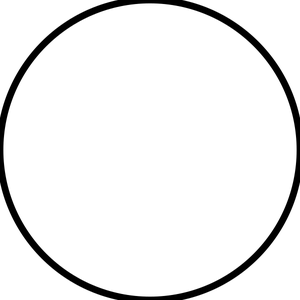
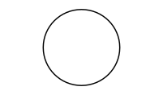
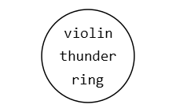
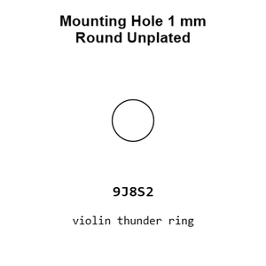
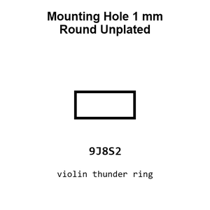
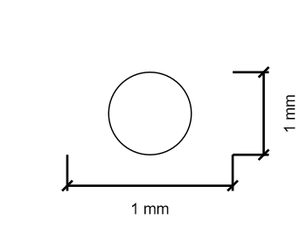
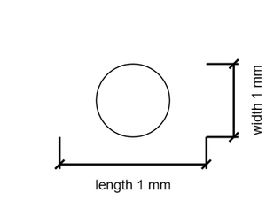

# Mounting Hole 1 mm Round Unplated

`mechanical_mounting_hole_1_mm_round_unplated`

Mounting Hole 1 mm Round Unplated is an OOMP mechanical mounting hole definition. It uses the 1 mm package or form factor. Its nominal drawing size is 1.0 &#x00D7; 1.0 mm.

## At a glance

| Detail | Value |
| --- | --- |
| OOMP ID | `mechanical_mounting_hole_1_mm_round_unplated` |
| Type | Mounting Hole |
| Package / style | 1 mm |
| Nominal size | 1.0 &#x00D7; 1.0 mm |

## Classification

| Level | Value |
| --- | --- |
| 1 | `mechanical` |
| 2 | `mounting_hole` |
| 3 | `1_mm` |
| 4 | `round` |
| 5 | `unplated` |

## Nominal dimensions

| Measurement | Value |
| --- | ---: |
| Length | 1.0 mm |
| Width | 1.0 mm |

## Used in projects

| Project | Quantity | References | Explore |
| --- | ---: | --- | --- |
| [Project adafruit/Adafruit-1.14-inch-240x135-TFT-PCB Adafruit 1.14 inch 240x135 Color TFT current](https://github.com/adafruit/Adafruit-1.14-inch-240x135-TFT-PCB/blob/master/Adafruit%201.14-inch%20240x135%20Color%20TFT.brd) | 2 | MH1, MH2 | [Board explorer](https://oomlout.github.io/oomp_electronic_version_5/parts/oomp_project_github_adafruit_adafruit_1_14_inch_240x135_tft_pcb_adafruit_1_14_inch_240x135_color_tft_current/board_explorer.html) · [OOMP project](https://github.com/oomlout/oomp_electronic_version_5/tree/main/parts/oomp_project_github_adafruit_adafruit_1_14_inch_240x135_tft_pcb_adafruit_1_14_inch_240x135_color_tft_current) |
| [Project adafruit/Adafruit-1.28-240x240-Round-Display-PCB Adafruit 1.28 240x240 Round Display current](https://github.com/adafruit/Adafruit-1.28-240x240-Round-Display-PCB/blob/main/Adafruit%201.28%20240x240%20Round%20Display.brd) | 2 | MH1, MH2 | [Board explorer](https://oomlout.github.io/oomp_electronic_version_5/parts/oomp_project_github_adafruit_adafruit_1_28_240x240_round_display_pcb_adafruit_1_28_240x240_round_display_current/board_explorer.html) · [OOMP project](https://github.com/oomlout/oomp_electronic_version_5/tree/main/parts/oomp_project_github_adafruit_adafruit_1_28_240x240_round_display_pcb_adafruit_1_28_240x240_round_display_current) |
| [Project adafruit/Adafruit-1.69in-280x240-Round-Rectangle-TFT-PCB Adafruit 1.69in 280x240 Round Rectangle TFT current](https://github.com/adafruit/Adafruit-1.69in-280x240-Round-Rectangle-TFT-PCB/blob/main/Adafruit%201.69in%20280x240%20Round%20Rectangle%20TFT.brd) | 2 | MH1, MH2 | [Board explorer](https://oomlout.github.io/oomp_electronic_version_5/parts/oomp_project_github_adafruit_adafruit_1_69in_280x240_round_rectangle_tft_pcb_adafruit_1_69in_280x240_round_rectangle_tft_current/board_explorer.html) · [OOMP project](https://github.com/oomlout/oomp_electronic_version_5/tree/main/parts/oomp_project_github_adafruit_adafruit_1_69in_280x240_round_rectangle_tft_pcb_adafruit_1_69in_280x240_round_rectangle_tft_current) |
| [Project adafruit/Adafruit-2.4-TFT-FeatherWing-PCB Adafruit 2.4in TFT Feather Wing current](https://github.com/adafruit/Adafruit-2.4-TFT-FeatherWing-PCB/blob/master/Adafruit%202.4in%20TFT%20FeatherWing%20V2.brd) | 4 | MH5, MH6, MH7, MH8 | [Board explorer](https://oomlout.github.io/oomp_electronic_version_5/parts/oomp_project_github_adafruit_adafruit_2_4_tft_feather_wing_pcb_adafruit_2_4in_tft_feather_wing_current/board_explorer.html) · [OOMP project](https://github.com/oomlout/oomp_electronic_version_5/tree/main/parts/oomp_project_github_adafruit_adafruit_2_4_tft_feather_wing_pcb_adafruit_2_4in_tft_feather_wing_current) |
| [Project adafruit/Adafruit_2.8_Inch_TFT_Shield_PCB 2.8 Inch TFT Shield current](https://github.com/adafruit/Adafruit_2.8_Inch_TFT_Shield_PCB/blob/master/tfttouchshield.brd) | 2 | MH1, MH2 | [Board explorer](https://oomlout.github.io/oomp_electronic_version_5/parts/oomp_project_github_adafruit_adafruit_2_8_inch_tft_shield_pcb_2_8_inch_tft_shield_current/board_explorer.html) · [OOMP project](https://github.com/oomlout/oomp_electronic_version_5/tree/main/parts/oomp_project_github_adafruit_adafruit_2_8_inch_tft_shield_pcb_2_8_inch_tft_shield_current) |
| [Project adafruit/Adafruit-2.8-TFT-Shield-v2-PCB Adafruit TFT 2.8in Resistive Touchshield current](https://github.com/adafruit/Adafruit-2.8-TFT-Shield-v2-PCB/blob/master/Adafruit%20TFT%202.8in%20Resistive%20Touchshield%20rev%20E.brd) | 2 | MH3, MH4 | [Board explorer](https://oomlout.github.io/oomp_electronic_version_5/parts/oomp_project_github_adafruit_adafruit_2_8_tft_shield_v2_pcb_adafruit_tft_2_8in_resistive_touchshield_current/board_explorer.html) · [OOMP project](https://github.com/oomlout/oomp_electronic_version_5/tree/main/parts/oomp_project_github_adafruit_adafruit_2_8_tft_shield_v2_pcb_adafruit_tft_2_8in_resistive_touchshield_current) |
| [Project sparkfun/SparkFun_Audio_Player_Breakout_MY1690X-16S Audio Player Breakout MY1690X-16S current](https://github.com/sparkfun/SparkFun_Audio_Player_Breakout_MY1690X-16S) | 2 | MH5, MH6 | [Board explorer](https://oomlout.github.io/oomp_electronic_version_5/parts/oomp_project_github_sparkfun_spark_fun_audio_player_breakout_my1690_x_16_s_audio_player_breakout_my1690x_16s_current/board_explorer.html) · [OOMP project](https://github.com/oomlout/oomp_electronic_version_5/tree/main/parts/oomp_project_github_sparkfun_spark_fun_audio_player_breakout_my1690_x_16_s_audio_player_breakout_my1690x_16s_current) |
| [Project sparkfun/SparkFun_Qwiic_Navigation_Switch Qwiic Navigation Switch current](https://github.com/sparkfun/SparkFun_Qwiic_Navigation_Switch) | 1 | MH6 | [Board explorer](https://oomlout.github.io/oomp_electronic_version_5/parts/oomp_project_github_sparkfun_spark_fun_qwiic_navigation_switch_qwiic_navigation_switch_current/board_explorer.html) · [OOMP project](https://github.com/oomlout/oomp_electronic_version_5/tree/main/parts/oomp_project_github_sparkfun_spark_fun_qwiic_navigation_switch_qwiic_navigation_switch_current) |

## Files

[KiCad symbol, machine-solder and hand-solder footprints](data/kicad/README.md) · [Availability and source masters](data/kicad/manifest.yaml)

[View this part on GitHub](https://github.com/oomlout/oomp_electronic_version_5/tree/main/parts/mechanical_mounting_hole_1_mm_round_unplated)

[Browse this category](../../navigation/mechanical/mounting_hole/1_mm/round/README.md)

---

This page is generated from the OOMP part definition by a Roboclick Jinja template. Edit the source taxonomy or template rather than this generated file.