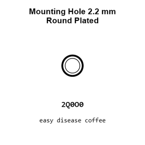
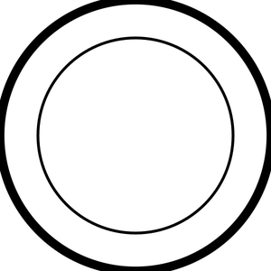
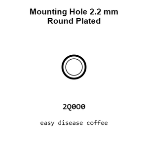
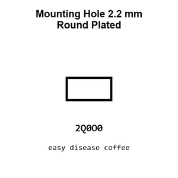
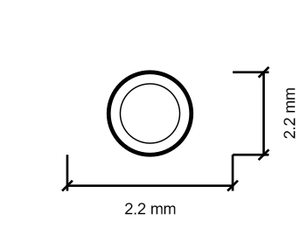
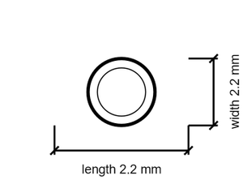

# Mounting Hole 2.2 mm Round Plated

`mechanical_mounting_hole_2_2_mm_round_plated`

Mounting Hole 2.2 mm Round Plated is an OOMP mechanical mounting hole definition. It uses the 2 2 mm package or form factor. Its nominal drawing size is 2.2 &#x00D7; 2.2 mm.

## At a glance

| Detail | Value |
| --- | --- |
| OOMP ID | `mechanical_mounting_hole_2_2_mm_round_plated` |
| Type | Mounting Hole |
| Package / style | 2 2 mm |
| Nominal size | 2.2 &#x00D7; 2.2 mm |

## Classification

| Level | Value |
| --- | --- |
| 1 | `mechanical` |
| 2 | `mounting_hole` |
| 3 | `2_2_mm` |
| 4 | `round` |
| 5 | `plated` |

## Nominal dimensions

| Measurement | Value |
| --- | ---: |
| Length | 2.2 mm |
| Width | 2.2 mm |

## Used in projects

| Project | Quantity | References | Explore |
| --- | ---: | --- | --- |
| [Project adafruit/Adafruit-A4988-Breakout-PCB Adafruit A4988 Breakout current](https://github.com/adafruit/Adafruit-A4988-Breakout-PCB/blob/main/Adafruit%20A4988%20Breakout.brd) | 4 | MH1, MH2, MH3, MH4 | [Board explorer](https://oomlout.github.io/oomp_electronic_version_5/parts/oomp_project_github_adafruit_adafruit_a4988_breakout_pcb_adafruit_a4988_breakout_current/board_explorer.html) · [OOMP project](https://github.com/oomlout/oomp_electronic_version_5/tree/main/parts/oomp_project_github_adafruit_adafruit_a4988_breakout_pcb_adafruit_a4988_breakout_current) |
| [Project adafruit/Adafruit-BME280-Breakout-PCB Adafruit BME280 current](https://github.com/adafruit/Adafruit-BME280-Breakout-PCB/blob/master/Adafruit%20BME280.brd) | 2 | MH1, MH2 | [Board explorer](https://oomlout.github.io/oomp_electronic_version_5/parts/oomp_project_github_adafruit_adafruit_bme280_breakout_pcb_adafruit_bme280_current/board_explorer.html) · [OOMP project](https://github.com/oomlout/oomp_electronic_version_5/tree/main/parts/oomp_project_github_adafruit_adafruit_bme280_breakout_pcb_adafruit_bme280_current) |
| [Project adafruit/Adafruit-BME680-PCB Adafruit BME680 Original current](https://github.com/adafruit/Adafruit-BME680-PCB/blob/master/Adafruit%20BME680%20Original.brd) | 2 | MH1, MH2 | [Board explorer](https://oomlout.github.io/oomp_electronic_version_5/parts/oomp_project_github_adafruit_adafruit_bme680_pcb_adafruit_bme680_original_current/board_explorer.html) · [OOMP project](https://github.com/oomlout/oomp_electronic_version_5/tree/main/parts/oomp_project_github_adafruit_adafruit_bme680_pcb_adafruit_bme680_original_current) |
| [Project adafruit/Adafruit-BMP280-Breakout-PCB Adafruit BMP280 current](https://github.com/adafruit/Adafruit-BMP280-Breakout-PCB/blob/master/Adafruit%20BMP280.brd) | 2 | MH1, MH2 | [Board explorer](https://oomlout.github.io/oomp_electronic_version_5/parts/oomp_project_github_adafruit_adafruit_bmp280_breakout_pcb_adafruit_bmp280_current/board_explorer.html) · [OOMP project](https://github.com/oomlout/oomp_electronic_version_5/tree/main/parts/oomp_project_github_adafruit_adafruit_bmp280_breakout_pcb_adafruit_bmp280_current) |
| [Project adafruit/Adafruit-BMP3xx-PCB Adafruit BMP388 current](https://github.com/adafruit/Adafruit-BMP3xx-PCB/blob/master/Adafruit%20BMP388.brd) | 2 | MH1, MH2 | [Board explorer](https://oomlout.github.io/oomp_electronic_version_5/parts/oomp_project_github_adafruit_adafruit_bmp3xx_pcb_adafruit_bmp388_current/board_explorer.html) · [OOMP project](https://github.com/oomlout/oomp_electronic_version_5/tree/main/parts/oomp_project_github_adafruit_adafruit_bmp3xx_pcb_adafruit_bmp388_current) |
| [Project adafruit/Adafruit-CP2102N-Friend-PCB Adafruit CP2102 N Friend current](https://github.com/adafruit/Adafruit-CP2102N-Friend-PCB/blob/main/Adafruit%20CP2102N%20Friend.brd) | 2 | MH1, MH2 | [Board explorer](https://oomlout.github.io/oomp_electronic_version_5/parts/oomp_project_github_adafruit_adafruit_cp2102_n_friend_pcb_adafruit_cp2102_n_friend_current/board_explorer.html) · [OOMP project](https://github.com/oomlout/oomp_electronic_version_5/tree/main/parts/oomp_project_github_adafruit_adafruit_cp2102_n_friend_pcb_adafruit_cp2102_n_friend_current) |
| [Project adafruit/Adafruit-High-Voltage-UPDI-Friend-PCB Adafruit High Voltage UPDI Friend current](https://github.com/adafruit/Adafruit-High-Voltage-UPDI-Friend-PCB/blob/main/Adafruit%20High%20Voltage%20UPDI%20Friend.brd) | 2 | MH3, MH4 | [Board explorer](https://oomlout.github.io/oomp_electronic_version_5/parts/oomp_project_github_adafruit_adafruit_high_voltage_updi_friend_pcb_adafruit_high_voltage_updi_friend_current/board_explorer.html) · [OOMP project](https://github.com/oomlout/oomp_electronic_version_5/tree/main/parts/oomp_project_github_adafruit_adafruit_high_voltage_updi_friend_pcb_adafruit_high_voltage_updi_friend_current) |
| [Project adafruit/Adafruit-MAX9814-AGC-Microphone-PCB Adafruit MAX9814 current](https://github.com/adafruit/Adafruit-MAX9814-AGC-Microphone-PCB/blob/master/Adafruit%20MAX9814.brd) | 2 | MH1, MH2 | [Board explorer](https://oomlout.github.io/oomp_electronic_version_5/parts/oomp_project_github_adafruit_adafruit_max9814_agc_microphone_pcb_adafruit_max9814_current/board_explorer.html) · [OOMP project](https://github.com/oomlout/oomp_electronic_version_5/tree/main/parts/oomp_project_github_adafruit_adafruit_max9814_agc_microphone_pcb_adafruit_max9814_current) |

## Files

[KiCad symbol, machine-solder and hand-solder footprints](data/kicad/README.md) · [Availability and source masters](data/kicad/manifest.yaml)

[View this part on GitHub](https://github.com/oomlout/oomp_electronic_version_5/tree/main/parts/mechanical_mounting_hole_2_2_mm_round_plated)

[Browse this category](../../navigation/mechanical/mounting_hole/2_2_mm/round/README.md)

---

This page is generated from the OOMP part definition by a Roboclick Jinja template. Edit the source taxonomy or template rather than this generated file.