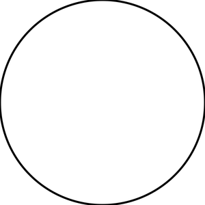
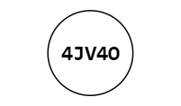
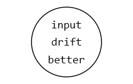
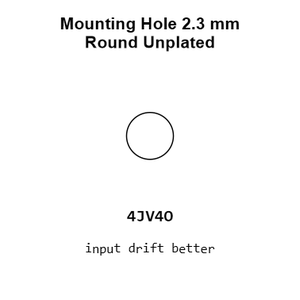
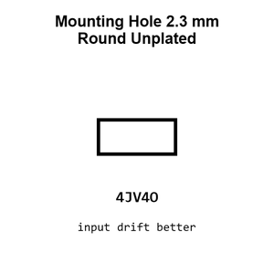
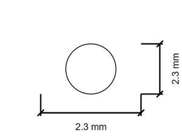
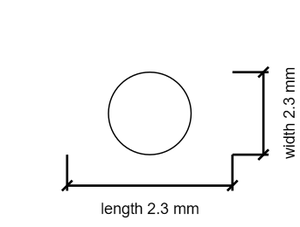

# Mounting Hole 2.3 mm Round Unplated

`mechanical_mounting_hole_2_3_mm_round_unplated`

Mounting Hole 2.3 mm Round Unplated is an OOMP mechanical mounting hole definition. It uses the 2 3 mm package or form factor. Its nominal drawing size is 2.3 &#x00D7; 2.3 mm.

## At a glance

| Detail | Value |
| --- | --- |
| OOMP ID | `mechanical_mounting_hole_2_3_mm_round_unplated` |
| Type | Mounting Hole |
| Package / style | 2 3 mm |
| Nominal size | 2.3 &#x00D7; 2.3 mm |

## Classification

| Level | Value |
| --- | --- |
| 1 | `mechanical` |
| 2 | `mounting_hole` |
| 3 | `2_3_mm` |
| 4 | `round` |
| 5 | `unplated` |

## Nominal dimensions

| Measurement | Value |
| --- | ---: |
| Length | 2.3 mm |
| Width | 2.3 mm |

## Used in projects

| Project | Quantity | References | Explore |
| --- | ---: | --- | --- |
| [Project sparkfun/AT42QT1010_Capacitive_Touch_Breakout AT42 QT1010 Capacitive Touch Breakout current](https://github.com/sparkfun/AT42QT1010_Capacitive_Touch_Breakout/blob/master/Hardware/AT42QT1010_Capacitive_Touch_Breakout.brd) | 1 | MH3 | [Board explorer](https://oomlout.github.io/oomp_electronic_version_5/parts/oomp_project_github_sparkfun_at42_qt1010_capacitive_touch_breakout_at42_qt1010_capacitive_touch_breakout_current/board_explorer.html) · [OOMP project](https://github.com/oomlout/oomp_electronic_version_5/tree/main/parts/oomp_project_github_sparkfun_at42_qt1010_capacitive_touch_breakout_at42_qt1010_capacitive_touch_breakout_current) |
| [Project sparkfun/MaKeyMaKey makey makey current](https://github.com/sparkfun/MaKeyMaKey/blob/master/Hardware/makey_makey.brd) | 6 | MH1, MH2, MH3, MH4, MH5, MH6 | [Board explorer](https://oomlout.github.io/oomp_electronic_version_5/parts/oomp_project_github_sparkfun_ma_key_ma_key_makey_makey_current/board_explorer.html) · [OOMP project](https://github.com/oomlout/oomp_electronic_version_5/tree/main/parts/oomp_project_github_sparkfun_ma_key_ma_key_makey_makey_current) |
| [Project sparkfun/OpenPIR Spark Fun Open PIR NCS36000 current](https://github.com/sparkfun/OpenPIR/blob/master/Hardware/SparkFun-OpenPIR-NCS36000.brd) | 1 | MH1 | [Board explorer](https://oomlout.github.io/oomp_electronic_version_5/parts/oomp_project_github_sparkfun_open_pir_spark_fun_open_pir_ncs36000_current/board_explorer.html) · [OOMP project](https://github.com/oomlout/oomp_electronic_version_5/tree/main/parts/oomp_project_github_sparkfun_open_pir_spark_fun_open_pir_ncs36000_current) |
| [Project sparkfun/Qwiic_Capacitive_Touch_Slider_CAP1203 CAP1203 current](https://github.com/sparkfun/Qwiic_Capacitive_Touch_Slider_CAP1203/blob/master/Hardware/CAP1203.brd) | 1 | MH1 | [Board explorer](https://oomlout.github.io/oomp_electronic_version_5/parts/oomp_project_github_sparkfun_qwiic_capacitive_touch_slider_cap1203_cap1203_current/board_explorer.html) · [OOMP project](https://github.com/oomlout/oomp_electronic_version_5/tree/main/parts/oomp_project_github_sparkfun_qwiic_capacitive_touch_slider_cap1203_cap1203_current) |
| [Project sparkfun/SparkFun_GNSS_DAN-F10N GNSS DAN-F10N current](https://github.com/sparkfun/SparkFun_GNSS_DAN-F10N) | 1 | MH1 | [Board explorer](https://oomlout.github.io/oomp_electronic_version_5/parts/oomp_project_github_sparkfun_spark_fun_gnss_dan_f10_n_gnss_dan_f10n_current/board_explorer.html) · [OOMP project](https://github.com/oomlout/oomp_electronic_version_5/tree/main/parts/oomp_project_github_sparkfun_spark_fun_gnss_dan_f10_n_gnss_dan_f10n_current) |
| [Project sparkfun/SparkFun_Qwiic_GNSS_SAM-M8Q Qwiic GNSS SAM-M8Q current](https://github.com/sparkfun/SparkFun_Qwiic_GNSS_SAM-M8Q) | 1 | MH1 | [Board explorer](https://oomlout.github.io/oomp_electronic_version_5/parts/oomp_project_github_sparkfun_spark_fun_qwiic_gnss_sam_m8_q_qwiic_gnss_sam_m8q_current/board_explorer.html) · [OOMP project](https://github.com/oomlout/oomp_electronic_version_5/tree/main/parts/oomp_project_github_sparkfun_spark_fun_qwiic_gnss_sam_m8_q_qwiic_gnss_sam_m8q_current) |
| [Project sparkfun/SparkFun_Qwiic_GNSS_SAM-M8Q Qwiic GNSS SAM-M8Q v0.1](https://github.com/sparkfun/SparkFun_Qwiic_GNSS_SAM-M8Q) | 1 | MH1 | [Board explorer](https://oomlout.github.io/oomp_electronic_version_5/parts/oomp_project_github_sparkfun_spark_fun_qwiic_gnss_sam_m8_q_qwiic_gnss_sam_m8q_v0_1/board_explorer.html) · [OOMP project](https://github.com/oomlout/oomp_electronic_version_5/tree/main/parts/oomp_project_github_sparkfun_spark_fun_qwiic_gnss_sam_m8_q_qwiic_gnss_sam_m8q_v0_1) |
| [Project sparkfun/SparkFun_RTK_Facet Spark Fun RTK Facet Display SD current](https://github.com/sparkfun/SparkFun_RTK_Facet/blob/main/Hardware/Display/SparkFun%20RTK%20Facet%20-%20Display%20SD.brd) | 1 | MH1 | [Board explorer](https://oomlout.github.io/oomp_electronic_version_5/parts/oomp_project_github_sparkfun_spark_fun_rtk_facet_display_spark_fun_rtk_facet_display_sd_current/board_explorer.html) · [OOMP project](https://github.com/oomlout/oomp_electronic_version_5/tree/main/parts/oomp_project_github_sparkfun_spark_fun_rtk_facet_display_spark_fun_rtk_facet_display_sd_current) |
| [Project sparkfun/SparkFun_RTK_Facet Spark Fun RTK Facet Display SD current](https://github.com/sparkfun/SparkFun_RTK_Facet/blob/main/Hardware/Display/KiCad/SparkFun%20RTK%20Facet%20-%20Display%20SD.kicad_pcb) | 1 | MH1 | [Board explorer](https://oomlout.github.io/oomp_electronic_version_5/parts/oomp_project_github_sparkfun_spark_fun_rtk_facet_spark_fun_rtk_facet_display_sd_current/board_explorer.html) · [OOMP project](https://github.com/oomlout/oomp_electronic_version_5/tree/main/parts/oomp_project_github_sparkfun_spark_fun_rtk_facet_spark_fun_rtk_facet_display_sd_current) |
| [Project sparkfun/SparkFun_RTK_Facet Spark Fun RTK Facet Retention Plate current](https://github.com/sparkfun/SparkFun_RTK_Facet/blob/main/Hardware/Retension/SparkFun%20RTK%20Facet%20-%20Retention%20Plate.brd) | 4 | MH1, MH2, MH3, MH4 | [Board explorer](https://oomlout.github.io/oomp_electronic_version_5/parts/oomp_project_github_sparkfun_spark_fun_rtk_facet_spark_fun_rtk_facet_retention_plate_current/board_explorer.html) · [OOMP project](https://github.com/oomlout/oomp_electronic_version_5/tree/main/parts/oomp_project_github_sparkfun_spark_fun_rtk_facet_spark_fun_rtk_facet_retention_plate_current) |

## Files

[KiCad symbol, machine-solder and hand-solder footprints](data/kicad/README.md) · [Availability and source masters](data/kicad/manifest.yaml)

[View this part on GitHub](https://github.com/oomlout/oomp_electronic_version_5/tree/main/parts/mechanical_mounting_hole_2_3_mm_round_unplated)

[Browse this category](../../navigation/mechanical/mounting_hole/2_3_mm/round/README.md)

---

This page is generated from the OOMP part definition by a Roboclick Jinja template. Edit the source taxonomy or template rather than this generated file.