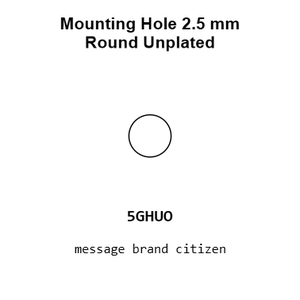
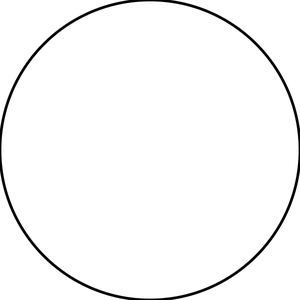
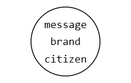
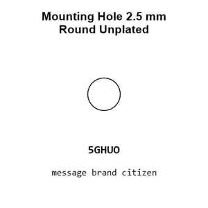
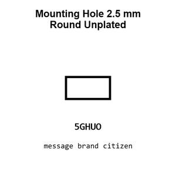
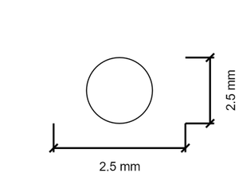
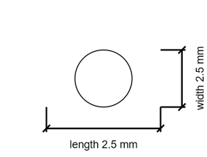

# Mounting Hole 2.5 mm Round Unplated

`mechanical_mounting_hole_2_5_mm_round_unplated`

Mounting Hole 2.5 mm Round Unplated is an OOMP mechanical mounting hole definition. It uses the 2 5 mm package or form factor. Its nominal drawing size is 2.5 &#x00D7; 2.5 mm.

## At a glance

| Detail | Value |
| --- | --- |
| OOMP ID | `mechanical_mounting_hole_2_5_mm_round_unplated` |
| Type | Mounting Hole |
| Package / style | 2 5 mm |
| Nominal size | 2.5 &#x00D7; 2.5 mm |

## Classification

| Level | Value |
| --- | --- |
| 1 | `mechanical` |
| 2 | `mounting_hole` |
| 3 | `2_5_mm` |
| 4 | `round` |
| 5 | `unplated` |

## Nominal dimensions

| Measurement | Value |
| --- | ---: |
| Length | 2.5 mm |
| Width | 2.5 mm |

## Used in projects

| Project | Quantity | References | Explore |
| --- | ---: | --- | --- |
| [Project adafruit/Adafruit-128x32-I2C-OLED-Breakout-PCB Adafruit OLED 128x32 Mono I2 C current](https://github.com/adafruit/Adafruit-128x32-I2C-OLED-Breakout-PCB/blob/master/Adafruit%20OLED%20128x32%20Mono%20I2C.brd) | 4 | MH1, MH2, MH3, MH4 | [Board explorer](https://oomlout.github.io/oomp_electronic_version_5/parts/oomp_project_github_adafruit_adafruit_128x32_i2_c_oled_breakout_pcb_adafruit_oled_128x32_mono_i2_c_current/board_explorer.html) · [OOMP project](https://github.com/oomlout/oomp_electronic_version_5/tree/main/parts/oomp_project_github_adafruit_adafruit_128x32_i2_c_oled_breakout_pcb_adafruit_oled_128x32_mono_i2_c_current) |
| [Project adafruit/Adafruit_Learning_System_Guides joy button pcb current](https://github.com/adafruit/Adafruit_Learning_System_Guides/blob/main/Joy_game_controller/joy-button-pcb.brd) | 4 | MH1, MH2, MH3, MH4 | [Board explorer](https://oomlout.github.io/oomp_electronic_version_5/parts/oomp_project_github_adafruit_adafruit_learning_system_guides_joy_button_pcb_current/board_explorer.html) · [OOMP project](https://github.com/oomlout/oomp_electronic_version_5/tree/main/parts/oomp_project_github_adafruit_adafruit_learning_system_guides_joy_button_pcb_current) |
| [Project adafruit/Adafruit-PiGRRL-PCB Pi GRRL Button PCB current](https://github.com/adafruit/Adafruit-PiGRRL-PCB/blob/master/PiGRRL-ButtonPCB.brd) | 4 | MH1, MH2, MH3, MH4 | [Board explorer](https://oomlout.github.io/oomp_electronic_version_5/parts/oomp_project_github_adafruit_adafruit_pi_grrl_pcb_pi_grrl_button_pcb_current/board_explorer.html) · [OOMP project](https://github.com/oomlout/oomp_electronic_version_5/tree/main/parts/oomp_project_github_adafruit_adafruit_pi_grrl_pcb_pi_grrl_button_pcb_current) |
| [Project adafruit/Adafruit-PiGRRL-PCB Pi GRRL Zero buttonpad current](https://github.com/adafruit/Adafruit-PiGRRL-PCB/blob/master/PiGRRL_Zero_buttonpad.brd) | 2 | MH1, MH2 | [Board explorer](https://oomlout.github.io/oomp_electronic_version_5/parts/oomp_project_github_adafruit_adafruit_pi_grrl_pcb_pi_grrl_zero_buttonpad_current/board_explorer.html) · [OOMP project](https://github.com/oomlout/oomp_electronic_version_5/tree/main/parts/oomp_project_github_adafruit_adafruit_pi_grrl_pcb_pi_grrl_zero_buttonpad_current) |
| [Project adafruit/Adafruit-Standalone-Capacitive-Sensor-PCB Adafruit AT42 QT1010 Breakout current](https://github.com/adafruit/Adafruit-Standalone-Capacitive-Sensor-PCB/blob/master/Adafruit%20AT42QT1010%20Breakout.brd) | 1 | MH1 | [Board explorer](https://oomlout.github.io/oomp_electronic_version_5/parts/oomp_project_github_adafruit_adafruit_standalone_capacitive_sensor_pcb_adafruit_at42_qt1010_breakout_current/board_explorer.html) · [OOMP project](https://github.com/oomlout/oomp_electronic_version_5/tree/main/parts/oomp_project_github_adafruit_adafruit_standalone_capacitive_sensor_pcb_adafruit_at42_qt1010_breakout_current) |

## Files

[KiCad symbol, machine-solder and hand-solder footprints](data/kicad/README.md) · [Availability and source masters](data/kicad/manifest.yaml)

[View this part on GitHub](https://github.com/oomlout/oomp_electronic_version_5/tree/main/parts/mechanical_mounting_hole_2_5_mm_round_unplated)

[Browse this category](../../navigation/mechanical/mounting_hole/2_5_mm/round/README.md)

---

This page is generated from the OOMP part definition by a Roboclick Jinja template. Edit the source taxonomy or template rather than this generated file.