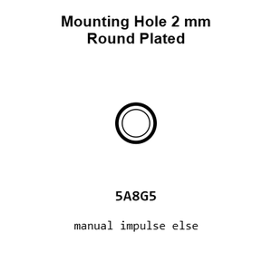
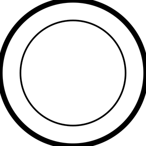
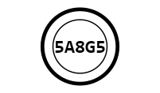
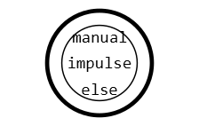
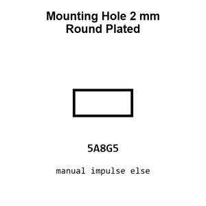
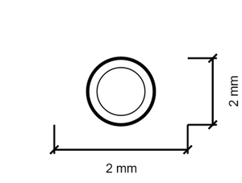
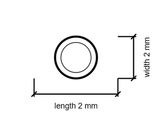

# Mounting Hole 2 mm Round Plated

`mechanical_mounting_hole_2_mm_round_plated`

Mounting Hole 2 mm Round Plated is an OOMP mechanical mounting hole definition. It uses the 2 mm package or form factor. Its nominal drawing size is 2.0 &#x00D7; 2.0 mm.

## At a glance

| Detail | Value |
| --- | --- |
| OOMP ID | `mechanical_mounting_hole_2_mm_round_plated` |
| Type | Mounting Hole |
| Package / style | 2 mm |
| Nominal size | 2.0 &#x00D7; 2.0 mm |

## Classification

| Level | Value |
| --- | --- |
| 1 | `mechanical` |
| 2 | `mounting_hole` |
| 3 | `2_mm` |
| 4 | `round` |
| 5 | `plated` |

## Nominal dimensions

| Measurement | Value |
| --- | ---: |
| Length | 2.0 mm |
| Width | 2.0 mm |

## Used in projects

| Project | Quantity | References | Explore |
| --- | ---: | --- | --- |
| [Project adafruit/Adafruit-128x32-SPI-OLED-breakout-board-PCB Adafruit OLED 128x32 Mono current](https://github.com/adafruit/Adafruit-128x32-SPI-OLED-breakout-board-PCB/blob/master/Adafruit%20OLED%20128x32%20Mono.brd) | 4 | MH3, MH4, MH5, MH6 | [Board explorer](https://oomlout.github.io/oomp_electronic_version_5/parts/oomp_project_github_adafruit_adafruit_128x32_spi_oled_breakout_board_pcb_adafruit_oled_128x32_mono_current/board_explorer.html) · [OOMP project](https://github.com/oomlout/oomp_electronic_version_5/tree/main/parts/oomp_project_github_adafruit_adafruit_128x32_spi_oled_breakout_board_pcb_adafruit_oled_128x32_mono_current) |
| [Project adafruit/Adafruit-Analog-Accelerometers-PCBs Adafruit ADXL326 current](https://github.com/adafruit/Adafruit-Analog-Accelerometers-PCBs/blob/master/Adafruit%20ADXL326.brd) | 2 | MH1, MH2 | [Board explorer](https://oomlout.github.io/oomp_electronic_version_5/parts/oomp_project_github_adafruit_adafruit_analog_accelerometers_pcbs_adafruit_adxl326_current/board_explorer.html) · [OOMP project](https://github.com/oomlout/oomp_electronic_version_5/tree/main/parts/oomp_project_github_adafruit_adafruit_analog_accelerometers_pcbs_adafruit_adxl326_current) |
| [Project adafruit/Adafruit-Analog-Accelerometers-PCBs Adafruit ADXL335 current](https://github.com/adafruit/Adafruit-Analog-Accelerometers-PCBs/blob/master/Adafruit%20ADXL335.brd) | 2 | MH1, MH2 | [Board explorer](https://oomlout.github.io/oomp_electronic_version_5/parts/oomp_project_github_adafruit_adafruit_analog_accelerometers_pcbs_adafruit_adxl335_current/board_explorer.html) · [OOMP project](https://github.com/oomlout/oomp_electronic_version_5/tree/main/parts/oomp_project_github_adafruit_adafruit_analog_accelerometers_pcbs_adafruit_adxl335_current) |
| [Project adafruit/Adafruit-BMP085-PCB Adafruit BMP085 current](https://github.com/adafruit/Adafruit-BMP085-PCB/blob/master/Adafruit_BMP085.brd) | 2 | MH1, MH2 | [Board explorer](https://oomlout.github.io/oomp_electronic_version_5/parts/oomp_project_github_adafruit_adafruit_bmp085_pcb_adafruit_bmp085_current/board_explorer.html) · [OOMP project](https://github.com/oomlout/oomp_electronic_version_5/tree/main/parts/oomp_project_github_adafruit_adafruit_bmp085_pcb_adafruit_bmp085_current) |
| [Project adafruit/Adafruit_MCP73833_PCB MCP73833 QFN current](https://github.com/adafruit/Adafruit_MCP73833_PCB/blob/master/MCP73833_QFN_v1.0.brd) | 4 | MH3, MH4, MH5, MH6 | [Board explorer](https://oomlout.github.io/oomp_electronic_version_5/parts/oomp_project_github_adafruit_adafruit_mcp73833_pcb_mcp73833_qfn_current/board_explorer.html) · [OOMP project](https://github.com/oomlout/oomp_electronic_version_5/tree/main/parts/oomp_project_github_adafruit_adafruit_mcp73833_pcb_mcp73833_qfn_current) |
| [Project adafruit/Adafruit-USB-LiIon-LiPoly-Charger-PCB Adafruit USB Li Ion Li Poly Charger current](https://github.com/adafruit/Adafruit-USB-LiIon-LiPoly-Charger-PCB/blob/master/Adafruit%20USB%20LiIon-LiPoly%20Charger.brd) | 4 | MH3, MH4, MH5, MH6 | [Board explorer](https://oomlout.github.io/oomp_electronic_version_5/parts/oomp_project_github_adafruit_adafruit_usb_li_ion_li_poly_charger_pcb_adafruit_usb_li_ion_li_poly_charger_current/board_explorer.html) · [OOMP project](https://github.com/oomlout/oomp_electronic_version_5/tree/main/parts/oomp_project_github_adafruit_adafruit_usb_li_ion_li_poly_charger_pcb_adafruit_usb_li_ion_li_poly_charger_current) |
| [Project adafruit/Adafruit-VCNL40X0-PCB VCNL4000 current](https://github.com/adafruit/Adafruit-VCNL40X0-PCB/blob/master/VCNL4000.brd) | 2 | MH1, MH2 | [Board explorer](https://oomlout.github.io/oomp_electronic_version_5/parts/oomp_project_github_adafruit_adafruit_vcnl40_x0_pcb_vcnl4000_current/board_explorer.html) · [OOMP project](https://github.com/oomlout/oomp_electronic_version_5/tree/main/parts/oomp_project_github_adafruit_adafruit_vcnl40_x0_pcb_vcnl4000_current) |
| [Project adafruit/TSL2561-breakout-board-PCB TSL2561 v0.1 current](https://github.com/adafruit/TSL2561-breakout-board-PCB/blob/master/TSL2561_v0.1.brd) | 2 | MH1, MH2 | [Board explorer](https://oomlout.github.io/oomp_electronic_version_5/parts/oomp_project_github_adafruit_tsl2561_breakout_board_pcb_tsl2561_v0_1_current/board_explorer.html) · [OOMP project](https://github.com/oomlout/oomp_electronic_version_5/tree/main/parts/oomp_project_github_adafruit_tsl2561_breakout_board_pcb_tsl2561_v0_1_current) |
| [Project sparkfun/MIDI_Shield Spark Fun MIDI Shield current](https://github.com/sparkfun/MIDI_Shield/blob/master/Hardware/SparkFun_MIDI_Shield.brd) | 4 | MH4, MH5, MH9, MH10 | [Board explorer](https://oomlout.github.io/oomp_electronic_version_5/parts/oomp_project_github_sparkfun_midi_shield_spark_fun_midi_shield_current/board_explorer.html) · [OOMP project](https://github.com/oomlout/oomp_electronic_version_5/tree/main/parts/oomp_project_github_sparkfun_midi_shield_spark_fun_midi_shield_current) |
| [Project sparkfun/Sparkpunk_Sequencer sparkpunk sequencer current](https://github.com/sparkfun/Sparkpunk_Sequencer/blob/master/hardware/sparkpunk_sequencer.brd) | 4 | MH83, MH84, MH88, MH89 | [Board explorer](https://oomlout.github.io/oomp_electronic_version_5/parts/oomp_project_github_sparkfun_sparkpunk_sequencer_sparkpunk_sequencer_current/board_explorer.html) · [OOMP project](https://github.com/oomlout/oomp_electronic_version_5/tree/main/parts/oomp_project_github_sparkfun_sparkpunk_sequencer_sparkpunk_sequencer_current) |
| [Project sparkfun/Sparkpunk sparkpunk current](https://github.com/sparkfun/Sparkpunk/blob/master/hardware/sparkpunk.brd) | 6 | MH40, MH41, MH45, MH46, MH52, MH53 | [Board explorer](https://oomlout.github.io/oomp_electronic_version_5/parts/oomp_project_github_sparkfun_sparkpunk_sparkpunk_current/board_explorer.html) · [OOMP project](https://github.com/oomlout/oomp_electronic_version_5/tree/main/parts/oomp_project_github_sparkfun_sparkpunk_sparkpunk_current) |

## Files

[KiCad symbol, machine-solder and hand-solder footprints](data/kicad/README.md) · [Availability and source masters](data/kicad/manifest.yaml)

[View this part on GitHub](https://github.com/oomlout/oomp_electronic_version_5/tree/main/parts/mechanical_mounting_hole_2_mm_round_plated)

[Browse this category](../../navigation/mechanical/mounting_hole/2_mm/round/README.md)

---

This page is generated from the OOMP part definition by a Roboclick Jinja template. Edit the source taxonomy or template rather than this generated file.