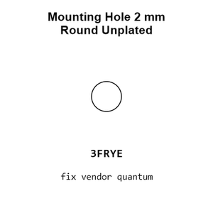
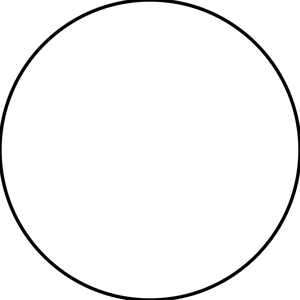
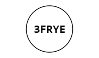
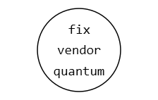
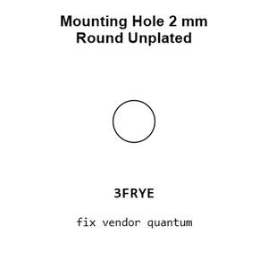
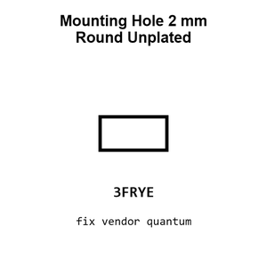
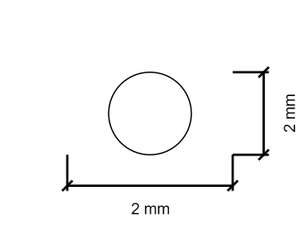
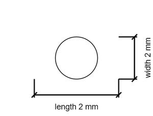

# Mounting Hole 2 mm Round Unplated

`mechanical_mounting_hole_2_mm_round_unplated`

Mounting Hole 2 mm Round Unplated is an OOMP mechanical mounting hole definition. It uses the 2 mm package or form factor. Its nominal drawing size is 2.0 &#x00D7; 2.0 mm.

## At a glance

| Detail | Value |
| --- | --- |
| OOMP ID | `mechanical_mounting_hole_2_mm_round_unplated` |
| Type | Mounting Hole |
| Package / style | 2 mm |
| Nominal size | 2.0 &#x00D7; 2.0 mm |

## Classification

| Level | Value |
| --- | --- |
| 1 | `mechanical` |
| 2 | `mounting_hole` |
| 3 | `2_mm` |
| 4 | `round` |
| 5 | `unplated` |

## Nominal dimensions

| Measurement | Value |
| --- | ---: |
| Length | 2.0 mm |
| Width | 2.0 mm |

## Used in projects

| Project | Quantity | References | Explore |
| --- | ---: | --- | --- |
| [Project adafruit/Adafruit-2.4-TFT-FeatherWing-PCB Adafruit 2.4in TFT Feather Wing current](https://github.com/adafruit/Adafruit-2.4-TFT-FeatherWing-PCB/blob/master/Adafruit%202.4in%20TFT%20FeatherWing%20V2.brd) | 4 | MH1, MH2, MH3, MH4 | [Board explorer](https://oomlout.github.io/oomp_electronic_version_5/parts/oomp_project_github_adafruit_adafruit_2_4_tft_feather_wing_pcb_adafruit_2_4in_tft_feather_wing_current/board_explorer.html) · [OOMP project](https://github.com/oomlout/oomp_electronic_version_5/tree/main/parts/oomp_project_github_adafruit_adafruit_2_4_tft_feather_wing_pcb_adafruit_2_4in_tft_feather_wing_current) |
| [Project adafruit/Adafruit-2.8-TFT-Shield-v2-PCB Adafruit TFT 2.8in Resistive Touchshield current](https://github.com/adafruit/Adafruit-2.8-TFT-Shield-v2-PCB/blob/master/Adafruit%20TFT%202.8in%20Resistive%20Touchshield%20rev%20E.brd) | 2 | MH1, MH2 | [Board explorer](https://oomlout.github.io/oomp_electronic_version_5/parts/oomp_project_github_adafruit_adafruit_2_8_tft_shield_v2_pcb_adafruit_tft_2_8in_resistive_touchshield_current/board_explorer.html) · [OOMP project](https://github.com/oomlout/oomp_electronic_version_5/tree/main/parts/oomp_project_github_adafruit_adafruit_2_8_tft_shield_v2_pcb_adafruit_tft_2_8in_resistive_touchshield_current) |
| [Project adafruit/Adafruit-2.8-TFT-Shield-v2-PCB Adafruit tftcaptouchshield current](https://github.com/adafruit/Adafruit-2.8-TFT-Shield-v2-PCB/blob/master/Adafruit%20tftcaptouchshield%20rev%20C.brd) | 2 | MH1, MH2 | [Board explorer](https://oomlout.github.io/oomp_electronic_version_5/parts/oomp_project_github_adafruit_adafruit_2_8_tft_shield_v2_pcb_adafruit_tftcaptouchshield_current/board_explorer.html) · [OOMP project](https://github.com/oomlout/oomp_electronic_version_5/tree/main/parts/oomp_project_github_adafruit_adafruit_2_8_tft_shield_v2_pcb_adafruit_tftcaptouchshield_current) |
| [Project adafruit/Adafruit-2.8-TFT-Shield-v2-PCB Adafruit tfttouchshield current](https://github.com/adafruit/Adafruit-2.8-TFT-Shield-v2-PCB/blob/master/Adafruit%20tfttouchshield%20v2.2.brd) | 2 | MH1, MH2 | [Board explorer](https://oomlout.github.io/oomp_electronic_version_5/parts/oomp_project_github_adafruit_adafruit_2_8_tft_shield_v2_pcb_adafruit_tfttouchshield_current/board_explorer.html) · [OOMP project](https://github.com/oomlout/oomp_electronic_version_5/tree/main/parts/oomp_project_github_adafruit_adafruit_2_8_tft_shield_v2_pcb_adafruit_tfttouchshield_current) |
| [Project adafruit/Adafruit-DC-Stepper-Motor-HAT-PCB Adafruit Motor Bonnet current](https://github.com/adafruit/Adafruit-DC-Stepper-Motor-HAT-PCB/blob/master/Adafruit%20Motor%20Bonnet%20Rev%20B.brd) | 2 | MH3, MH4 | [Board explorer](https://oomlout.github.io/oomp_electronic_version_5/parts/oomp_project_github_adafruit_adafruit_dc_stepper_motor_hat_pcb_adafruit_motor_bonnet_current/board_explorer.html) · [OOMP project](https://github.com/oomlout/oomp_electronic_version_5/tree/main/parts/oomp_project_github_adafruit_adafruit_dc_stepper_motor_hat_pcb_adafruit_motor_bonnet_current) |
| [Project adafruit/Adafruit-I2S-Audio-Bonnet-for-Raspberry-Pi-PCB Adafruit I2 S Audio UDA1334 Bonnet current](https://github.com/adafruit/Adafruit-I2S-Audio-Bonnet-for-Raspberry-Pi-PCB/blob/master/Adafruit%20I2S%20Audio%20UDA1334%20Bonnet.brd) | 2 | MH5, MH6 | [Board explorer](https://oomlout.github.io/oomp_electronic_version_5/parts/oomp_project_github_adafruit_adafruit_i2_s_audio_bonnet_for_raspberry_pi_pcb_adafruit_i2_s_audio_uda1334_bonnet_current/board_explorer.html) · [OOMP project](https://github.com/oomlout/oomp_electronic_version_5/tree/main/parts/oomp_project_github_adafruit_adafruit_i2_s_audio_bonnet_for_raspberry_pi_pcb_adafruit_i2_s_audio_uda1334_bonnet_current) |
| [Project adafruit/Adafruit-IS31FL3731-CharliePlex-LED-Breakout-PCB Adafruit IS31 FL3731 Charlie Plex Grid current](https://github.com/adafruit/Adafruit-IS31FL3731-CharliePlex-LED-Breakout-PCB/blob/master/Adafruit%20IS31FL3731%20CharliePlex%20Grid.brd) | 2 | MH1, MH2 | [Board explorer](https://oomlout.github.io/oomp_electronic_version_5/parts/oomp_project_github_adafruit_adafruit_is31_fl3731_charlie_plex_led_breakout_pcb_adafruit_is31_fl3731_charlie_plex_grid_current/board_explorer.html) · [OOMP project](https://github.com/oomlout/oomp_electronic_version_5/tree/main/parts/oomp_project_github_adafruit_adafruit_is31_fl3731_charlie_plex_led_breakout_pcb_adafruit_is31_fl3731_charlie_plex_grid_current) |
| [Project adafruit/Adafruit-LED-Backpacks Adafruit 0.54 Alphanumeric current](https://github.com/adafruit/Adafruit-LED-Backpacks/blob/master/Adafruit%200.54%20Alphanumeric%20v0.1.brd) | 4 | MH1, MH2, MH3, MH4 | [Board explorer](https://oomlout.github.io/oomp_electronic_version_5/parts/oomp_project_github_adafruit_adafruit_led_backpacks_adafruit_0_54_alphanumeric_current/board_explorer.html) · [OOMP project](https://github.com/oomlout/oomp_electronic_version_5/tree/main/parts/oomp_project_github_adafruit_adafruit_led_backpacks_adafruit_0_54_alphanumeric_current) |
| [Project adafruit/Adafruit-LED-Backpacks Adafruit 0.54 Alphanumeric STEMMA QT current](https://github.com/adafruit/Adafruit-LED-Backpacks/blob/master/Adafruit%200.54%20Alphanumeric%20STEMMA%20QT.brd) | 4 | MH1, MH2, MH3, MH4 | [Board explorer](https://oomlout.github.io/oomp_electronic_version_5/parts/oomp_project_github_adafruit_adafruit_led_backpacks_adafruit_0_54_alphanumeric_stemma_qt_current/board_explorer.html) · [OOMP project](https://github.com/oomlout/oomp_electronic_version_5/tree/main/parts/oomp_project_github_adafruit_adafruit_led_backpacks_adafruit_0_54_alphanumeric_stemma_qt_current) |
| [Project adafruit/Adafruit-LED-Backpacks Adafruit 0.56 7 Segment QT current](https://github.com/adafruit/Adafruit-LED-Backpacks/blob/master/Adafruit%200.56%207-Segment%20QT.brd) | 4 | MH15, MH16, MH17, MH18 | [Board explorer](https://oomlout.github.io/oomp_electronic_version_5/parts/oomp_project_github_adafruit_adafruit_led_backpacks_adafruit_0_56_7_segment_qt_current/board_explorer.html) · [OOMP project](https://github.com/oomlout/oomp_electronic_version_5/tree/main/parts/oomp_project_github_adafruit_adafruit_led_backpacks_adafruit_0_56_7_segment_qt_current) |
| [Project adafruit/Adafruit-LED-Backpacks Adafruit 16x8 Monochrome LED Backpack current](https://github.com/adafruit/Adafruit-LED-Backpacks/blob/master/Adafruit%2016x8%20Monochrome%20LED%20Backpack.brd) | 4 | MH1, MH2, MH3, MH4 | [Board explorer](https://oomlout.github.io/oomp_electronic_version_5/parts/oomp_project_github_adafruit_adafruit_led_backpacks_adafruit_16x8_monochrome_led_backpack_current/board_explorer.html) · [OOMP project](https://github.com/oomlout/oomp_electronic_version_5/tree/main/parts/oomp_project_github_adafruit_adafruit_led_backpacks_adafruit_16x8_monochrome_led_backpack_current) |
| [Project adafruit/Adafruit-LED-Backpacks Adafruit 1.2in 7 segment current](https://github.com/adafruit/Adafruit-LED-Backpacks/blob/master/Adafruit%201.2in%207-segment.brd) | 4 | MH1, MH2, MH3, MH4 | [Board explorer](https://oomlout.github.io/oomp_electronic_version_5/parts/oomp_project_github_adafruit_adafruit_led_backpacks_adafruit_1_2in_7_segment_current/board_explorer.html) · [OOMP project](https://github.com/oomlout/oomp_electronic_version_5/tree/main/parts/oomp_project_github_adafruit_adafruit_led_backpacks_adafruit_1_2in_7_segment_current) |
| [Project adafruit/Adafruit-LED-Backpacks Adafruit 1.2inch 8x8 backpack current](https://github.com/adafruit/Adafruit-LED-Backpacks/blob/master/Adafruit%201.2inch%208x8%20backpack.brd) | 4 | MH1, MH2, MH3, MH4 | [Board explorer](https://oomlout.github.io/oomp_electronic_version_5/parts/oomp_project_github_adafruit_adafruit_led_backpacks_adafruit_1_2inch_8x8_backpack_current/board_explorer.html) · [OOMP project](https://github.com/oomlout/oomp_electronic_version_5/tree/main/parts/oomp_project_github_adafruit_adafruit_led_backpacks_adafruit_1_2inch_8x8_backpack_current) |
| [Project adafruit/Adafruit-LED-Backpacks Adafruit 7seg backpack current](https://github.com/adafruit/Adafruit-LED-Backpacks/blob/master/Adafruit%207seg%20backpack.brd) | 4 | MH15, MH16, MH17, MH18 | [Board explorer](https://oomlout.github.io/oomp_electronic_version_5/parts/oomp_project_github_adafruit_adafruit_led_backpacks_adafruit_7seg_backpack_current/board_explorer.html) · [OOMP project](https://github.com/oomlout/oomp_electronic_version_5/tree/main/parts/oomp_project_github_adafruit_adafruit_led_backpacks_adafruit_7seg_backpack_current) |
| [Project adafruit/Adafruit-LED-Backpacks Adafruit bicolor 8x8 current](https://github.com/adafruit/Adafruit-LED-Backpacks/blob/master/Adafruit%20bicolor%208x8.brd) | 4 | MH1, MH2, MH3, MH4 | [Board explorer](https://oomlout.github.io/oomp_electronic_version_5/parts/oomp_project_github_adafruit_adafruit_led_backpacks_adafruit_bicolor_8x8_current/board_explorer.html) · [OOMP project](https://github.com/oomlout/oomp_electronic_version_5/tree/main/parts/oomp_project_github_adafruit_adafruit_led_backpacks_adafruit_bicolor_8x8_current) |
| [Project adafruit/Adafruit-LED-Backpacks Adafruit Bicolor 8x8 HT16 K33 STEMMA current](https://github.com/adafruit/Adafruit-LED-Backpacks/blob/master/Adafruit%20Bicolor%208x8%20HT16K33%20STEMMA.brd) | 4 | MH1, MH2, MH3, MH4 | [Board explorer](https://oomlout.github.io/oomp_electronic_version_5/parts/oomp_project_github_adafruit_adafruit_led_backpacks_adafruit_bicolor_8x8_ht16_k33_stemma_current/board_explorer.html) · [OOMP project](https://github.com/oomlout/oomp_electronic_version_5/tree/main/parts/oomp_project_github_adafruit_adafruit_led_backpacks_adafruit_bicolor_8x8_ht16_k33_stemma_current) |
| [Project adafruit/Adafruit-LED-Backpacks Adafruit min8x8 backpack current](https://github.com/adafruit/Adafruit-LED-Backpacks/blob/master/Adafruit%20min8x8%20backpack.brd) | 4 | MH1, MH2, MH3, MH4 | [Board explorer](https://oomlout.github.io/oomp_electronic_version_5/parts/oomp_project_github_adafruit_adafruit_led_backpacks_adafruit_min8x8_backpack_current/board_explorer.html) · [OOMP project](https://github.com/oomlout/oomp_electronic_version_5/tree/main/parts/oomp_project_github_adafruit_adafruit_led_backpacks_adafruit_min8x8_backpack_current) |
| [Project adafruit/Adafruit-NeoTrellis-4x4-PCB Adafruit Neo Trellis 4x4 current](https://github.com/adafruit/Adafruit-NeoTrellis-4x4-PCB/blob/master/Adafruit%20NeoTrellis%204x4.brd) | 4 | MH11, MH12, MH13, MH14 | [Board explorer](https://oomlout.github.io/oomp_electronic_version_5/parts/oomp_project_github_adafruit_adafruit_neo_trellis_4x4_pcb_adafruit_neo_trellis_4x4_current/board_explorer.html) · [OOMP project](https://github.com/oomlout/oomp_electronic_version_5/tree/main/parts/oomp_project_github_adafruit_adafruit_neo_trellis_4x4_pcb_adafruit_neo_trellis_4x4_current) |
| [Project electrolama/pt1 current](https://github.com/electrolama/pt1) | 3 | MH7, MH8, MH9 | [Board explorer](https://oomlout.github.io/oomp_electronic_version_5/parts/oomp_project_github_electrolama_pt1_current/board_explorer.html) · [OOMP project](https://github.com/oomlout/oomp_electronic_version_5/tree/main/parts/oomp_project_github_electrolama_pt1_current) |

## Files

[KiCad symbol, machine-solder and hand-solder footprints](data/kicad/README.md) · [Availability and source masters](data/kicad/manifest.yaml)

[View this part on GitHub](https://github.com/oomlout/oomp_electronic_version_5/tree/main/parts/mechanical_mounting_hole_2_mm_round_unplated)

[Browse this category](../../navigation/mechanical/mounting_hole/2_mm/round/README.md)

---

This page is generated from the OOMP part definition by a Roboclick Jinja template. Edit the source taxonomy or template rather than this generated file.