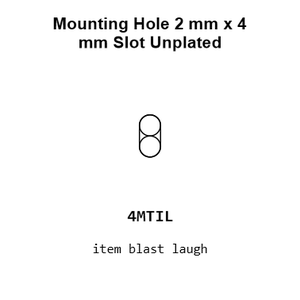
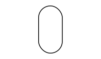
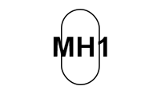
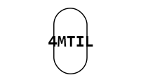
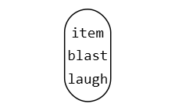
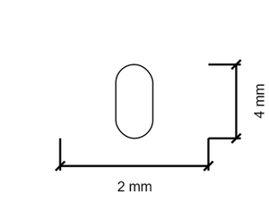
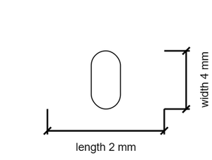

# Mounting Hole 2 mm x 4 mm Slot Unplated

`mechanical_mounting_hole_2_mm_x_4_mm_slot_unplated`

Mounting Hole 2 mm x 4 mm Slot Unplated is an OOMP mechanical mounting hole definition. It uses the 2 mm x 4 mm package or form factor. Its nominal drawing size is 2.0 &#x00D7; 4.0 mm.

## At a glance

| Detail | Value |
| --- | --- |
| OOMP ID | `mechanical_mounting_hole_2_mm_x_4_mm_slot_unplated` |
| Type | Mounting Hole |
| Package / style | 2 mm x 4 mm |
| Nominal size | 2.0 &#x00D7; 4.0 mm |

## Classification

| Level | Value |
| --- | --- |
| 1 | `mechanical` |
| 2 | `mounting_hole` |
| 3 | `2_mm_x_4_mm` |
| 4 | `slot` |
| 5 | `unplated` |

## Nominal dimensions

| Measurement | Value |
| --- | ---: |
| Length | 2.0 mm |
| Width | 4.0 mm |

## Files

[View this part on GitHub](https://github.com/oomlout/oomp_electronic_version_5/tree/main/parts/mechanical_mounting_hole_2_mm_x_4_mm_slot_unplated)

[Browse this category](../../navigation/mechanical/mounting_hole/2_mm_x_4_mm/slot/README.md)

---

This page is generated from the OOMP part definition by a Roboclick Jinja template. Edit the source taxonomy or template rather than this generated file.