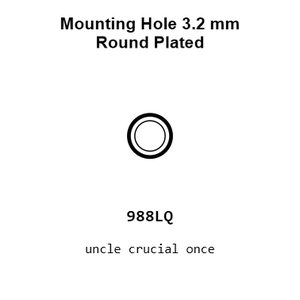
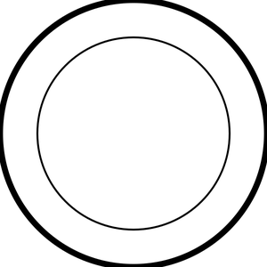
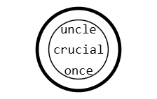
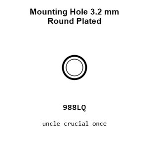
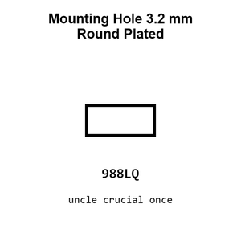
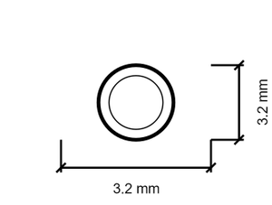
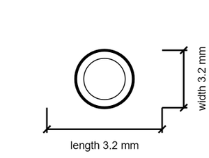

# Mounting Hole 3.2 mm Round Plated

`mechanical_mounting_hole_3_2_mm_round_plated`

Mounting Hole 3.2 mm Round Plated is an OOMP mechanical mounting hole definition. It uses the 3 2 mm package or form factor. Its nominal drawing size is 3.2 &#x00D7; 3.2 mm.

## At a glance

| Detail | Value |
| --- | --- |
| OOMP ID | `mechanical_mounting_hole_3_2_mm_round_plated` |
| Type | Mounting Hole |
| Package / style | 3 2 mm |
| Nominal size | 3.2 &#x00D7; 3.2 mm |

## Classification

| Level | Value |
| --- | --- |
| 1 | `mechanical` |
| 2 | `mounting_hole` |
| 3 | `3_2_mm` |
| 4 | `round` |
| 5 | `plated` |

## Nominal dimensions

| Measurement | Value |
| --- | ---: |
| Length | 3.2 mm |
| Width | 3.2 mm |

## Used in projects

| Project | Quantity | References | Explore |
| --- | ---: | --- | --- |
| [Project adafruit/Adafruit-Circuit-Playground-Express-PCB Adafruit Circuit Playground Express current](https://github.com/adafruit/Adafruit-Circuit-Playground-Express-PCB/blob/master/Adafruit%20Circuit%20Playground%20Express.brd) | 14 | MH3, MH4, MH5, MH6, MH7, MH8, MH9, MH10, MH11, MH12, MH15, MH16, MH17, MH18 | [Board explorer](https://oomlout.github.io/oomp_electronic_version_5/parts/oomp_project_github_adafruit_adafruit_circuit_playground_express_pcb_adafruit_circuit_playground_express_current/board_explorer.html) · [OOMP project](https://github.com/oomlout/oomp_electronic_version_5/tree/main/parts/oomp_project_github_adafruit_adafruit_circuit_playground_express_pcb_adafruit_circuit_playground_express_current) |
| [Project adafruit/Adafruit-Gemma-M0-PCB Adafruit Gemma M0 current](https://github.com/adafruit/Adafruit-Gemma-M0-PCB/blob/master/Adafruit%20Gemma%20M0.brd) | 6 | MH1, MH2, MH3, MH4, MH7, MH8 | [Board explorer](https://oomlout.github.io/oomp_electronic_version_5/parts/oomp_project_github_adafruit_adafruit_gemma_m0_pcb_adafruit_gemma_m0_current/board_explorer.html) · [OOMP project](https://github.com/oomlout/oomp_electronic_version_5/tree/main/parts/oomp_project_github_adafruit_adafruit_gemma_m0_pcb_adafruit_gemma_m0_current) |
| [Project adafruit/Adafruit-MPR121-PCB Adafruit MPR121 Q QT Gator Breakout current](https://github.com/adafruit/Adafruit-MPR121-PCB/blob/master/Adafruit%20MPR121Q%20QT%20Gator%20Breakout.brd) | 12 | MH1, MH2, MH3, MH4, MH5, MH6, MH7, MH8, MH9, MH10, MH11, MH12 | [Board explorer](https://oomlout.github.io/oomp_electronic_version_5/parts/oomp_project_github_adafruit_adafruit_mpr121_pcb_adafruit_mpr121_q_qt_gator_breakout_current/board_explorer.html) · [OOMP project](https://github.com/oomlout/oomp_electronic_version_5/tree/main/parts/oomp_project_github_adafruit_adafruit_mpr121_pcb_adafruit_mpr121_q_qt_gator_breakout_current) |

## Files

[KiCad symbol, machine-solder and hand-solder footprints](data/kicad/README.md) · [Availability and source masters](data/kicad/manifest.yaml)

[View this part on GitHub](https://github.com/oomlout/oomp_electronic_version_5/tree/main/parts/mechanical_mounting_hole_3_2_mm_round_plated)

[Browse this category](../../navigation/mechanical/mounting_hole/3_2_mm/round/README.md)

---

This page is generated from the OOMP part definition by a Roboclick Jinja template. Edit the source taxonomy or template rather than this generated file.