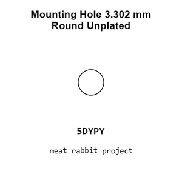
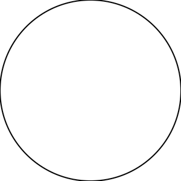
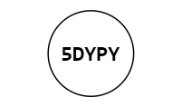
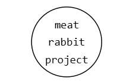
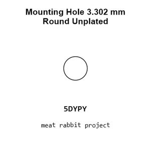
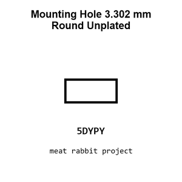
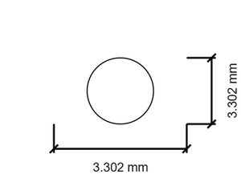
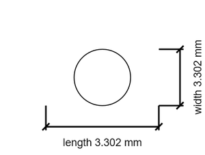

# Mounting Hole 3.302 mm Round Unplated

`mechanical_mounting_hole_3_302_mm_round_unplated`

Mounting Hole 3.302 mm Round Unplated is an OOMP mechanical mounting hole definition. It uses the 3 302 mm package or form factor. Its nominal drawing size is 3.302 &#x00D7; 3.302 mm.

## At a glance

| Detail | Value |
| --- | --- |
| OOMP ID | `mechanical_mounting_hole_3_302_mm_round_unplated` |
| Type | Mounting Hole |
| Package / style | 3 302 mm |
| Nominal size | 3.302 &#x00D7; 3.302 mm |

## Classification

| Level | Value |
| --- | --- |
| 1 | `mechanical` |
| 2 | `mounting_hole` |
| 3 | `3_302_mm` |
| 4 | `round` |
| 5 | `unplated` |

## Nominal dimensions

| Measurement | Value |
| --- | ---: |
| Length | 3.302 mm |
| Width | 3.302 mm |

## Used in projects

| Project | Quantity | References | Explore |
| --- | ---: | --- | --- |
| [Project sparkfun/ADXL345_Breakout ADXL345 Breakout current](https://github.com/sparkfun/ADXL345_Breakout/tree/master/Hardware) | 2 | MH1, MH2 | [Board explorer](https://oomlout.github.io/oomp_electronic_version_5/parts/oomp_project_github_sparkfun_adxl345_breakout_adxl345_breakout_current/board_explorer.html) · [OOMP project](https://github.com/oomlout/oomp_electronic_version_5/tree/main/parts/oomp_project_github_sparkfun_adxl345_breakout_adxl345_breakout_current) |
| [Project sparkfun/SparkFun_u-blox_NEO-F10N u-blox NEO-F10N current](https://github.com/sparkfun/SparkFun_u-blox_NEO-F10N) | 4 | MH3, MH4, MH5, MH6 | [Board explorer](https://oomlout.github.io/oomp_electronic_version_5/parts/oomp_project_github_sparkfun_spark_fun_u_blox_neo_f10_n_ublox_neo_f10n_current/board_explorer.html) · [OOMP project](https://github.com/oomlout/oomp_electronic_version_5/tree/main/parts/oomp_project_github_sparkfun_spark_fun_u_blox_neo_f10_n_ublox_neo_f10n_current) |

## Files

[KiCad symbol, machine-solder and hand-solder footprints](data/kicad/README.md) · [Availability and source masters](data/kicad/manifest.yaml)

[View this part on GitHub](https://github.com/oomlout/oomp_electronic_version_5/tree/main/parts/mechanical_mounting_hole_3_302_mm_round_unplated)

[Browse this category](../../navigation/mechanical/mounting_hole/3_302_mm/round/README.md)

---

This page is generated from the OOMP part definition by a Roboclick Jinja template. Edit the source taxonomy or template rather than this generated file.