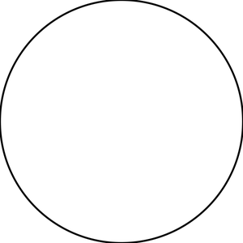
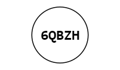
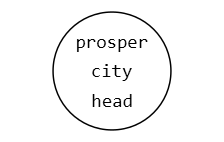
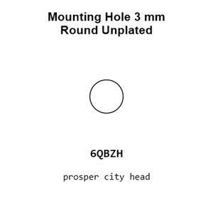
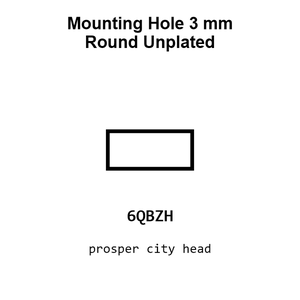
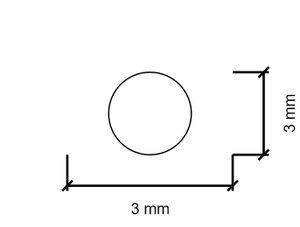
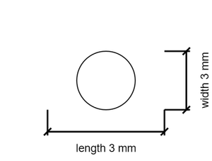

# Mounting Hole 3 mm Round Unplated

`mechanical_mounting_hole_3_mm_round_unplated`

Mounting Hole 3 mm Round Unplated is an OOMP mechanical mounting hole definition. It uses the 3 mm package or form factor. Its nominal drawing size is 3.0 &#x00D7; 3.0 mm.

## At a glance

| Detail | Value |
| --- | --- |
| OOMP ID | `mechanical_mounting_hole_3_mm_round_unplated` |
| Type | Mounting Hole |
| Package / style | 3 mm |
| Nominal size | 3.0 &#x00D7; 3.0 mm |

## Classification

| Level | Value |
| --- | --- |
| 1 | `mechanical` |
| 2 | `mounting_hole` |
| 3 | `3_mm` |
| 4 | `round` |
| 5 | `unplated` |

## Nominal dimensions

| Measurement | Value |
| --- | ---: |
| Length | 3.0 mm |
| Width | 3.0 mm |

## Used in projects

| Project | Quantity | References | Explore |
| --- | ---: | --- | --- |
| [Project adafruit/Adafruit-Menta-PCB Menta current](https://github.com/adafruit/Adafruit-Menta-PCB/blob/master/menta.brd) | 4 | MH1, MH2, MH3, MH4 | [Board explorer](https://oomlout.github.io/oomp_electronic_version_5/parts/oomp_project_github_adafruit_adafruit_menta_pcb_menta_current/board_explorer.html) · [OOMP project](https://github.com/oomlout/oomp_electronic_version_5/tree/main/parts/oomp_project_github_adafruit_adafruit_menta_pcb_menta_current) |
| [Project adafruit/Adafruit-NeoKey-CHOC-Breakout-PCB Adafruit Neo Key CHOC Socket Breakout current](https://github.com/adafruit/Adafruit-NeoKey-CHOC-Breakout-PCB/blob/main/Adafruit%20NeoKey%20CHOC%20Socket%20Breakout.brd) | 2 | MH3, MH4 | [Board explorer](https://oomlout.github.io/oomp_electronic_version_5/parts/oomp_project_github_adafruit_adafruit_neo_key_choc_breakout_pcb_adafruit_neo_key_choc_socket_breakout_current/board_explorer.html) · [OOMP project](https://github.com/oomlout/oomp_electronic_version_5/tree/main/parts/oomp_project_github_adafruit_adafruit_neo_key_choc_breakout_pcb_adafruit_neo_key_choc_socket_breakout_current) |
| [Project adafruit/Adafruit-PA1010D-Mini-GPS-PCB Adafruit PA1010 D Mini GPS current](https://github.com/adafruit/Adafruit-PA1010D-Mini-GPS-PCB/blob/master/Adafruit%20PA1010D%20Mini%20GPS.brd) | 1 | MH7 | [Board explorer](https://oomlout.github.io/oomp_electronic_version_5/parts/oomp_project_github_adafruit_adafruit_pa1010_d_mini_gps_pcb_adafruit_pa1010_d_mini_gps_current/board_explorer.html) · [OOMP project](https://github.com/oomlout/oomp_electronic_version_5/tree/main/parts/oomp_project_github_adafruit_adafruit_pa1010_d_mini_gps_pcb_adafruit_pa1010_d_mini_gps_current) |
| [Project adafruit/Adafruit-Perma-Proto-PCB adafruit minty permaproto current](https://github.com/adafruit/Adafruit-Perma-Proto-PCB/blob/master/adafruit%20minty%20permaproto.brd) | 4 | MH1, MH2, MH3, MH4 | [Board explorer](https://oomlout.github.io/oomp_electronic_version_5/parts/oomp_project_github_adafruit_adafruit_perma_proto_pcb_adafruit_minty_permaproto_current/board_explorer.html) · [OOMP project](https://github.com/oomlout/oomp_electronic_version_5/tree/main/parts/oomp_project_github_adafruit_adafruit_perma_proto_pcb_adafruit_minty_permaproto_current) |
| [Project adafruit/Adafruit-Triple-LED-Matrix-Bonnet-PCB Adafruit Triple LED Matrix Bonnet current](https://github.com/adafruit/Adafruit-Triple-LED-Matrix-Bonnet-PCB/blob/main/Adafruit%20Triple%20LED%20Matrix%20Bonnet.brd) | 4 | MH5, MH6, MH7, MH8 | [Board explorer](https://oomlout.github.io/oomp_electronic_version_5/parts/oomp_project_github_adafruit_adafruit_triple_led_matrix_bonnet_pcb_adafruit_triple_led_matrix_bonnet_current/board_explorer.html) · [OOMP project](https://github.com/oomlout/oomp_electronic_version_5/tree/main/parts/oomp_project_github_adafruit_adafruit_triple_led_matrix_bonnet_pcb_adafruit_triple_led_matrix_bonnet_current) |
| [Project adafruit/Adafruit-Ultimate-GPS Adafruit Ultimate GPS current](https://github.com/adafruit/Adafruit-Ultimate-GPS/blob/master/Adafruit%20Ultimate%20GPS.brd) | 1 | MH1 | [Board explorer](https://oomlout.github.io/oomp_electronic_version_5/parts/oomp_project_github_adafruit_adafruit_ultimate_gps_adafruit_ultimate_gps_current/board_explorer.html) · [OOMP project](https://github.com/oomlout/oomp_electronic_version_5/tree/main/parts/oomp_project_github_adafruit_adafruit_ultimate_gps_adafruit_ultimate_gps_current) |
| [Project adafruit/Adafruit-Ultimate-GPS Adafruit Ultimate GPS Featherwing current](https://github.com/adafruit/Adafruit-Ultimate-GPS/blob/master/Adafruit%20Ultimate%20GPS%20Featherwing.brd) | 1 | MH7 | [Board explorer](https://oomlout.github.io/oomp_electronic_version_5/parts/oomp_project_github_adafruit_adafruit_ultimate_gps_adafruit_ultimate_gps_featherwing_current/board_explorer.html) · [OOMP project](https://github.com/oomlout/oomp_electronic_version_5/tree/main/parts/oomp_project_github_adafruit_adafruit_ultimate_gps_adafruit_ultimate_gps_featherwing_current) |
| [Project adafruit/Adafruit-Ultimate-GPS Adafruit Ultimate GPS Flora current](https://github.com/adafruit/Adafruit-Ultimate-GPS/blob/master/Adafruit%20Ultimate%20GPS%20Flora.brd) | 1 | MH7 | [Board explorer](https://oomlout.github.io/oomp_electronic_version_5/parts/oomp_project_github_adafruit_adafruit_ultimate_gps_adafruit_ultimate_gps_flora_current/board_explorer.html) · [OOMP project](https://github.com/oomlout/oomp_electronic_version_5/tree/main/parts/oomp_project_github_adafruit_adafruit_ultimate_gps_adafruit_ultimate_gps_flora_current) |
| [Project adafruit/Adafruit-Ultimate-GPS Adafruit Ultimate GPS Hat current](https://github.com/adafruit/Adafruit-Ultimate-GPS/blob/master/Adafruit%20Ultimate%20GPS%20Hat.brd) | 1 | MH5 | [Board explorer](https://oomlout.github.io/oomp_electronic_version_5/parts/oomp_project_github_adafruit_adafruit_ultimate_gps_adafruit_ultimate_gps_hat_current/board_explorer.html) · [OOMP project](https://github.com/oomlout/oomp_electronic_version_5/tree/main/parts/oomp_project_github_adafruit_adafruit_ultimate_gps_adafruit_ultimate_gps_hat_current) |
| [Project adafruit/Adafruit-Ultimate-GPS Adafruit Ultimate GPS Shield current](https://github.com/adafruit/Adafruit-Ultimate-GPS/blob/master/Adafruit%20Ultimate%20GPS%20Shield.brd) | 1 | MH3 | [Board explorer](https://oomlout.github.io/oomp_electronic_version_5/parts/oomp_project_github_adafruit_adafruit_ultimate_gps_adafruit_ultimate_gps_shield_current/board_explorer.html) · [OOMP project](https://github.com/oomlout/oomp_electronic_version_5/tree/main/parts/oomp_project_github_adafruit_adafruit_ultimate_gps_adafruit_ultimate_gps_shield_current) |
| [Project adafruit/Adafruit-Ultimate-GPS Adafruit Ultimate GPS USB C current](https://github.com/adafruit/Adafruit-Ultimate-GPS/blob/master/Adafruit%20Ultimate%20GPS%20USB-C.brd) | 1 | MH1 | [Board explorer](https://oomlout.github.io/oomp_electronic_version_5/parts/oomp_project_github_adafruit_adafruit_ultimate_gps_adafruit_ultimate_gps_usb_c_current/board_explorer.html) · [OOMP project](https://github.com/oomlout/oomp_electronic_version_5/tree/main/parts/oomp_project_github_adafruit_adafruit_ultimate_gps_adafruit_ultimate_gps_usb_c_current) |
| [Project adafruit/Adafruit-Ultimate-GPS Adafruit Ultimate GPS USB Micro B current](https://github.com/adafruit/Adafruit-Ultimate-GPS/blob/master/Adafruit%20Ultimate%20GPS%20USB%20Micro%20B.brd) | 1 | MH1 | [Board explorer](https://oomlout.github.io/oomp_electronic_version_5/parts/oomp_project_github_adafruit_adafruit_ultimate_gps_adafruit_ultimate_gps_usb_micro_b_current/board_explorer.html) · [OOMP project](https://github.com/oomlout/oomp_electronic_version_5/tree/main/parts/oomp_project_github_adafruit_adafruit_ultimate_gps_adafruit_ultimate_gps_usb_micro_b_current) |
| [Project adafruit/Adafruit-Ultimate-GPS-HAT-PCB Adafruit Ultimate GPS HAT current](https://github.com/adafruit/Adafruit-Ultimate-GPS-HAT-PCB/blob/master/Adafruit%20Ultimate%20GPS%20HAT.brd) | 1 | MH5 | [Board explorer](https://oomlout.github.io/oomp_electronic_version_5/parts/oomp_project_github_adafruit_adafruit_ultimate_gps_hat_pcb_adafruit_ultimate_gps_hat_current/board_explorer.html) · [OOMP project](https://github.com/oomlout/oomp_electronic_version_5/tree/main/parts/oomp_project_github_adafruit_adafruit_ultimate_gps_hat_pcb_adafruit_ultimate_gps_hat_current) |
| [Project sparkfun/Benchtop_Power_Board_Kit Benchtop Power Supply current](https://github.com/sparkfun/Benchtop_Power_Board_Kit/blob/master/Hardware/Benchtop%20Power%20Supply.brd) | 2 | MH1, MH2 | [Board explorer](https://oomlout.github.io/oomp_electronic_version_5/parts/oomp_project_github_sparkfun_benchtop_power_board_kit_benchtop_power_supply_current/board_explorer.html) · [OOMP project](https://github.com/oomlout/oomp_electronic_version_5/tree/main/parts/oomp_project_github_sparkfun_benchtop_power_board_kit_benchtop_power_supply_current) |
| [Project sparkfun/BigTime Big Time current](https://github.com/sparkfun/BigTime/blob/master/Hardware/BigTime.brd) | 4 | MH3, MH4, MH5, MH6 | [Board explorer](https://oomlout.github.io/oomp_electronic_version_5/parts/oomp_project_github_sparkfun_big_time_big_time_current/board_explorer.html) · [OOMP project](https://github.com/oomlout/oomp_electronic_version_5/tree/main/parts/oomp_project_github_sparkfun_big_time_big_time_current) |
| [Project sparkfun/MiP_Proto-Back Mi P Proto Back current](https://github.com/sparkfun/MiP_Proto-Back/blob/master/Hardware/MiP_Proto-Back.brd) | 4 | MH5, MH6, MH7, MH8 | [Board explorer](https://oomlout.github.io/oomp_electronic_version_5/parts/oomp_project_github_sparkfun_mi_p_proto_back_mi_p_proto_back_current/board_explorer.html) · [OOMP project](https://github.com/oomlout/oomp_electronic_version_5/tree/main/parts/oomp_project_github_sparkfun_mi_p_proto_back_mi_p_proto_back_current) |
| [Project sparkfun/Simon-Says Simon Says PTH current](https://github.com/sparkfun/Simon-Says/blob/master/Hardware/Simon-PTH.brd) | 8 | MH1, MH2, MH3, MH4, MH5, MH6, MH7, MH8 | [Board explorer](https://oomlout.github.io/oomp_electronic_version_5/parts/oomp_project_github_sparkfun_simon_says_simon_says_pth_current/board_explorer.html) · [OOMP project](https://github.com/oomlout/oomp_electronic_version_5/tree/main/parts/oomp_project_github_sparkfun_simon_says_simon_says_pth_current) |
| [Project sparkfun/SparkFun_Artemis_Global_Tracker Spark Fun Artemis Global Tracker current](https://github.com/sparkfun/SparkFun_Artemis_Global_Tracker/blob/main/Hardware/SparkFun_Artemis_Global_Tracker.brd) | 2 | MH3, MH4 | [Board explorer](https://oomlout.github.io/oomp_electronic_version_5/parts/oomp_project_github_sparkfun_spark_fun_artemis_global_tracker_spark_fun_artemis_global_tracker_current/board_explorer.html) · [OOMP project](https://github.com/oomlout/oomp_electronic_version_5/tree/main/parts/oomp_project_github_sparkfun_spark_fun_artemis_global_tracker_spark_fun_artemis_global_tracker_current) |

## Files

[KiCad symbol, machine-solder and hand-solder footprints](data/kicad/README.md) · [Availability and source masters](data/kicad/manifest.yaml)

[View this part on GitHub](https://github.com/oomlout/oomp_electronic_version_5/tree/main/parts/mechanical_mounting_hole_3_mm_round_unplated)

[Browse this category](../../navigation/mechanical/mounting_hole/3_mm/round/README.md)

---

This page is generated from the OOMP part definition by a Roboclick Jinja template. Edit the source taxonomy or template rather than this generated file.