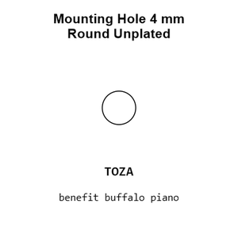
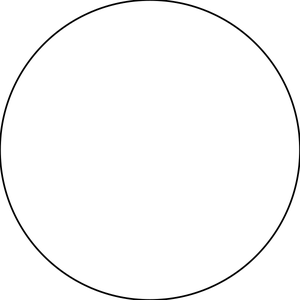
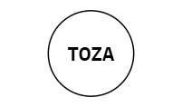
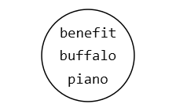
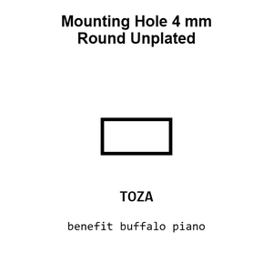
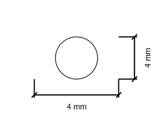
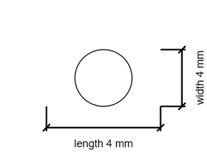

# Mounting Hole 4 mm Round Unplated

`mechanical_mounting_hole_4_mm_round_unplated`

Mounting Hole 4 mm Round Unplated is an OOMP mechanical mounting hole definition. It uses the 4 mm package or form factor. Its nominal drawing size is 4.0 &#x00D7; 4.0 mm.

## At a glance

| Detail | Value |
| --- | --- |
| OOMP ID | `mechanical_mounting_hole_4_mm_round_unplated` |
| Type | Mounting Hole |
| Package / style | 4 mm |
| Nominal size | 4.0 &#x00D7; 4.0 mm |

## Classification

| Level | Value |
| --- | --- |
| 1 | `mechanical` |
| 2 | `mounting_hole` |
| 3 | `4_mm` |
| 4 | `round` |
| 5 | `unplated` |

## Nominal dimensions

| Measurement | Value |
| --- | ---: |
| Length | 4.0 mm |
| Width | 4.0 mm |

## Used in projects

| Project | Quantity | References | Explore |
| --- | ---: | --- | --- |
| [Project adafruit/Adafruit-ANO-Rotary-Navigation-Encoder-Breakout-PCB Adafruit ANO Rotary Encoder Breakout current](https://github.com/adafruit/Adafruit-ANO-Rotary-Navigation-Encoder-Breakout-PCB/blob/main/Adafruit%20ANO%20Rotary%20Encoder%20Breakout.brd) | 4 | MH5, MH6, MH9, MH10 | [Board explorer](https://oomlout.github.io/oomp_electronic_version_5/parts/oomp_project_github_adafruit_adafruit_ano_rotary_navigation_encoder_breakout_pcb_adafruit_ano_rotary_encoder_breakout_current/board_explorer.html) · [OOMP project](https://github.com/oomlout/oomp_electronic_version_5/tree/main/parts/oomp_project_github_adafruit_adafruit_ano_rotary_navigation_encoder_breakout_pcb_adafruit_ano_rotary_encoder_breakout_current) |
| [Project adafruit/Adafruit-ANO-Rotary-Navigation-Encoder-to-I2C Adafruit ANO Rotary Encoder to I2 C current](https://github.com/adafruit/Adafruit-ANO-Rotary-Navigation-Encoder-to-I2C/blob/main/Adafruit%20ANO%20Rotary%20Encoder%20to%20I2C.brd) | 4 | MH5, MH6, MH9, MH10 | [Board explorer](https://oomlout.github.io/oomp_electronic_version_5/parts/oomp_project_github_adafruit_adafruit_ano_rotary_navigation_encoder_to_i2_c_adafruit_ano_rotary_encoder_to_i2_c_current/board_explorer.html) · [OOMP project](https://github.com/oomlout/oomp_electronic_version_5/tree/main/parts/oomp_project_github_adafruit_adafruit_ano_rotary_navigation_encoder_to_i2_c_adafruit_ano_rotary_encoder_to_i2_c_current) |
| [Project adafruit/Adafruit-NeoKey-Snap-Apart-PCB Neo Key 5x6 Ortho Snap Apart current](https://github.com/adafruit/Adafruit-NeoKey-Snap-Apart-PCB/blob/main/NeoKey%205x6%20Ortho%20Snap-Apart.brd) | 18 | MH101, MH106, MH111, MH116, MH121, MH126, MH161, MH166, MH171, MH176, MH181, MH186, MH221, MH226, MH231, MH236, MH241, MH246 | [Board explorer](https://oomlout.github.io/oomp_electronic_version_5/parts/oomp_project_github_adafruit_adafruit_neo_key_snap_apart_pcb_neo_key_5x6_ortho_snap_apart_current/board_explorer.html) · [OOMP project](https://github.com/oomlout/oomp_electronic_version_5/tree/main/parts/oomp_project_github_adafruit_adafruit_neo_key_snap_apart_pcb_neo_key_5x6_ortho_snap_apart_current) |

## Files

[KiCad symbol, machine-solder and hand-solder footprints](data/kicad/README.md) · [Availability and source masters](data/kicad/manifest.yaml)

[View this part on GitHub](https://github.com/oomlout/oomp_electronic_version_5/tree/main/parts/mechanical_mounting_hole_4_mm_round_unplated)

[Browse this category](../../navigation/mechanical/mounting_hole/4_mm/round/README.md)

---

This page is generated from the OOMP part definition by a Roboclick Jinja template. Edit the source taxonomy or template rather than this generated file.