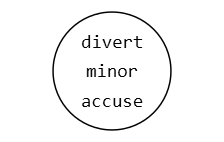
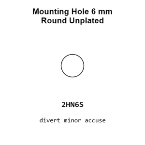
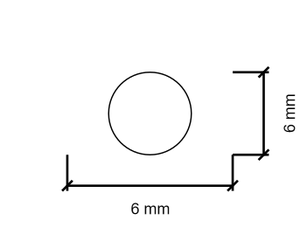
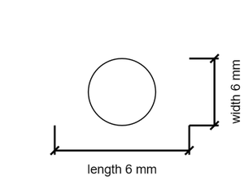

# Mounting Hole 6 mm Round Unplated

`mechanical_mounting_hole_6_mm_round_unplated`

Mounting Hole 6 mm Round Unplated is an OOMP mechanical mounting hole definition. It uses the 6 mm package or form factor. Its nominal drawing size is 6.0 &#x00D7; 6.0 mm.

## At a glance

| Detail | Value |
| --- | --- |
| OOMP ID | `mechanical_mounting_hole_6_mm_round_unplated` |
| Type | Mounting Hole |
| Package / style | 6 mm |
| Nominal size | 6.0 &#x00D7; 6.0 mm |

## Classification

| Level | Value |
| --- | --- |
| 1 | `mechanical` |
| 2 | `mounting_hole` |
| 3 | `6_mm` |
| 4 | `round` |
| 5 | `unplated` |

## Nominal dimensions

| Measurement | Value |
| --- | ---: |
| Length | 6.0 mm |
| Width | 6.0 mm |

## Files

[KiCad symbol, machine-solder and hand-solder footprints](data/kicad/README.md) · [Availability and source masters](data/kicad/manifest.yaml)

[View this part on GitHub](https://github.com/oomlout/oomp_electronic_version_5/tree/main/parts/mechanical_mounting_hole_6_mm_round_unplated)

[Browse this category](../../navigation/mechanical/mounting_hole/6_mm/round/README.md)

---

This page is generated from the OOMP part definition by a Roboclick Jinja template. Edit the source taxonomy or template rather than this generated file.